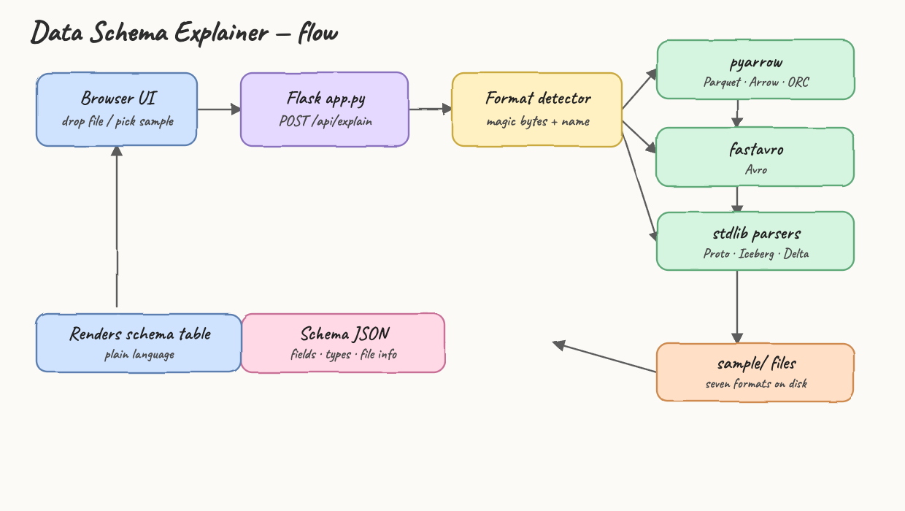
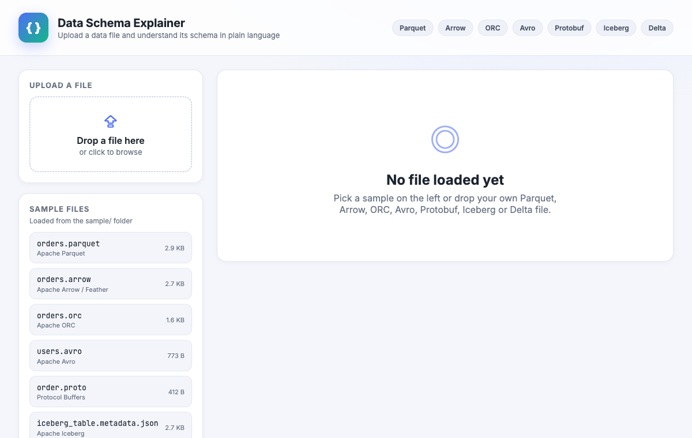
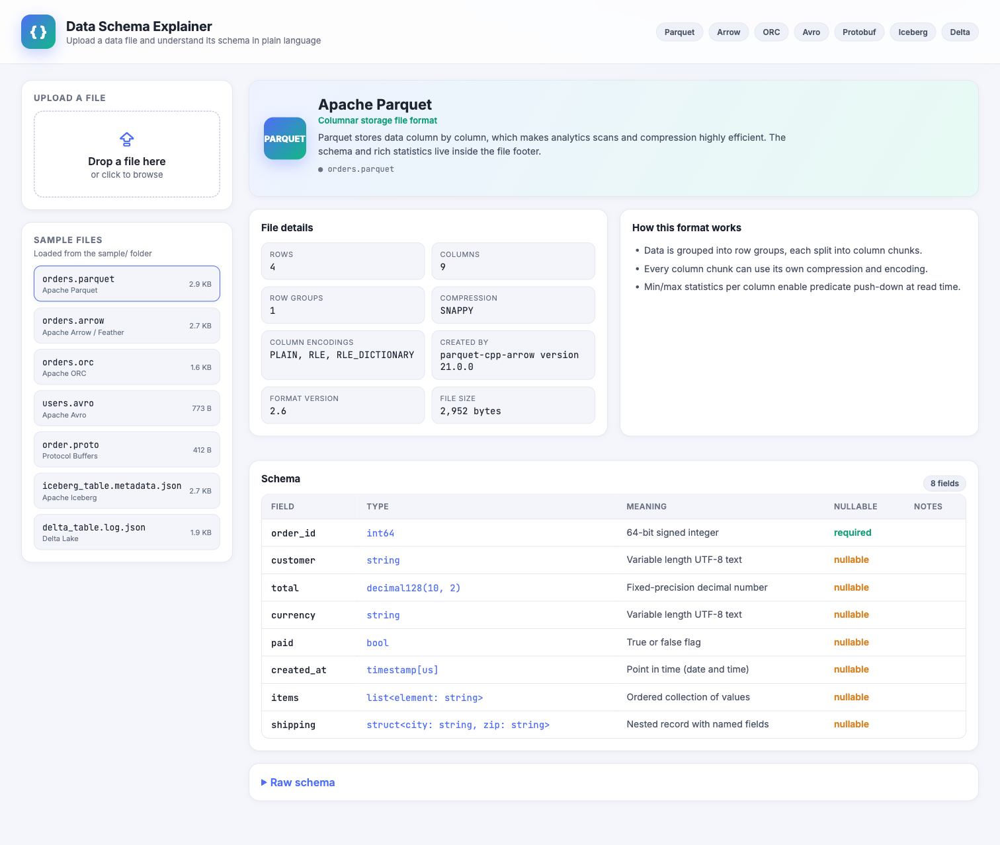
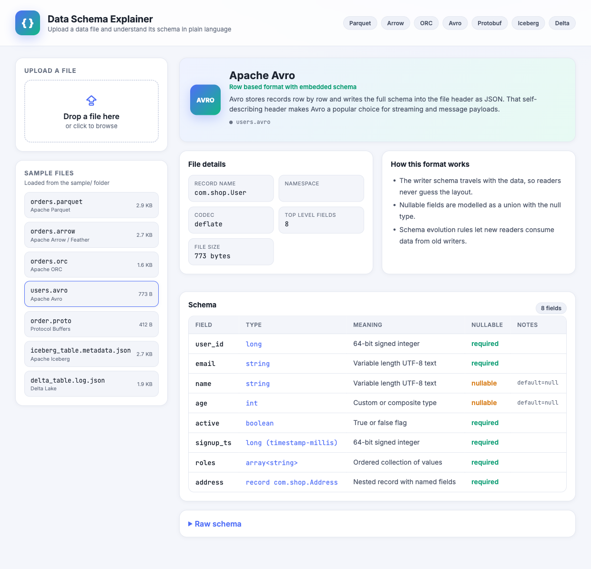
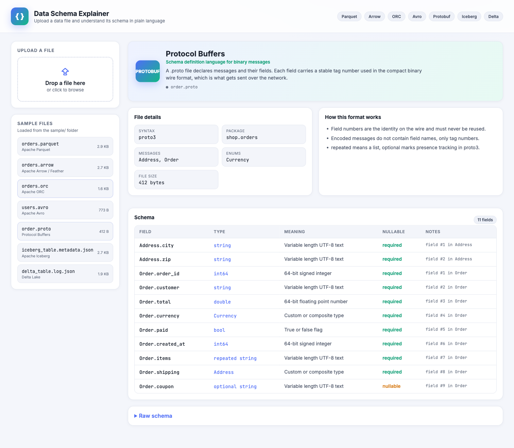

# Data Schema Explainer

Upload a data file and the website explains its schema and structure in plain language.
It reads the bytes of the file, detects the format, pulls out every field with its type,
nullability and notes, and describes how that storage format actually works.

Supported formats: **Parquet, Arrow / Feather, ORC, Avro, Protocol Buffers, Iceberg, Delta Lake**.

## Flow



The browser sends a file to `POST /api/explain`. A format detector looks at the magic bytes
and the file name, routes the bytes to the right parser, and returns one JSON shape that the
UI renders as a schema table plus file details.

| Stage | What happens |
| --- | --- |
| Browser UI | Drop a file or click a sample |
| Flask `app.py` | Receives the upload, calls the explainer |
| Format detector | Magic bytes (`PAR1`, `ARROW1`, `ORC`, `Obj\x01`) and file name |
| Parsers | `pyarrow` for Parquet / Arrow / ORC, `fastavro` for Avro, standard-library parsing for Protobuf / Iceberg / Delta |
| Schema JSON | Fields, types, plain-language meaning, file-level info |
| Browser UI | Renders the schema table and the file details |

## Is it generic or hardcoded?

It is generic. Nothing about the schema is hardcoded. The sample files are only shortcuts
in the sidebar; every result comes from parsing the actual uploaded bytes.

A file that is **not** a sample, uploaded through the same endpoint, is read entirely from its
own content:

```
uploaded (not a sample): weather_stations.parquet
detected format        : Apache Parquet
compression reported   : ZSTD
rows reported          : 2
fields parsed from raw bytes:
   station_id    int32                -> 32-bit signed integer
   city          string               -> Variable length UTF-8 text
   temp_c        float                -> 32-bit floating point number
   humidity      int16                -> 16-bit signed integer
   recorded_at   timestamp[ms]        -> Point in time (date and time)
   tags          list<element: string> -> Ordered collection of values
```

Drag any of your own Parquet, Arrow, ORC, Avro, `.proto`, Iceberg `metadata.json` or Delta
`_delta_log` JSON onto the page and it will be explained the same way.

## What each format reports

| Format | Schema source | File details surfaced |
| --- | --- | --- |
| Parquet | Footer schema | rows, columns, row groups, compression, encodings, writer |
| Arrow / Feather | IPC schema | rows, columns, record batches, schema metadata |
| ORC | Type tree | rows, stripes, compression, row index stride, file version |
| Avro | Embedded JSON schema | record name, namespace, codec, field count |
| Protocol Buffers | `.proto` text | syntax, package, messages, enums, field tag numbers |
| Iceberg | `metadata.json` | format version, table uuid, partitioning, snapshots, properties |
| Delta Lake | `_delta_log` actions | table id, provider, partition columns, data files, protocol versions |

## Run the website

Uses podman and podman-compose.

```
./start.sh
```

Open http://localhost:8080

```
./stop.sh
```

`start.sh` builds the image, starts the container and waits until the site answers.
`stop.sh` tears it down.

### Test it

With the site running:

```
./test.sh
```

```
GET /api/samples
  samples endpoint OK
  orders.parquet                   -> Apache Parquet           8 fields
  orders.arrow                     -> Apache Arrow / Feather   8 fields
  orders.orc                       -> Apache ORC               8 fields
  users.avro                       -> Apache Avro              8 fields
  order.proto                      -> Protocol Buffers         11 fields
  iceberg_table.metadata.json      -> Apache Iceberg           8 fields
  delta_table.log.json             -> Delta Lake               8 fields
all formats explained
```

### Run without containers

```
python3 -m venv .venv
.venv/bin/pip install -r requirements.txt
.venv/bin/python app.py
```

## Sample files

Generated into `sample/` by `generate_samples.py`. They share one orders dataset so you can
compare how the same schema looks across formats.

| File | Format |
| --- | --- |
| `sample/orders.parquet` | Apache Parquet |
| `sample/orders.arrow` | Apache Arrow / Feather |
| `sample/orders.orc` | Apache ORC |
| `sample/users.avro` | Apache Avro |
| `sample/order.proto` | Protocol Buffers |
| `sample/iceberg_table.metadata.json` | Apache Iceberg |
| `sample/delta_table.log.json` | Delta Lake |

Regenerate them with:

```
.venv/bin/python generate_samples.py
```

## Screens

Landing page with the upload area and the sample list:



A Parquet file explained: file details, how the format works, and the field-by-field schema:



Avro, a row format that carries its schema inside the file, with nullable union fields:



Iceberg, a table format whose `metadata.json` holds the schema, partitioning and snapshots:



## Project layout

```
app.py                 Flask server and routes
explain.py             format detection and per-format explainers
generate_samples.py    writes the files in sample/
static/                index.html, style.css, app.js
sample/                seven sample files, one per format
Containerfile          python image
podman-compose.yml     service definition
start.sh stop.sh test.sh
printscreens/          diagram and screenshots
```
