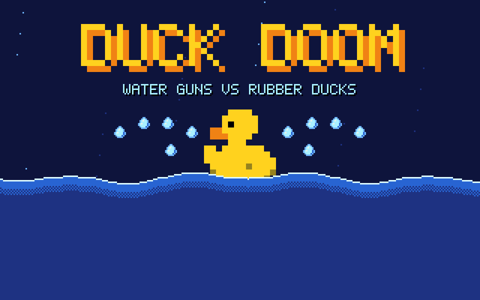
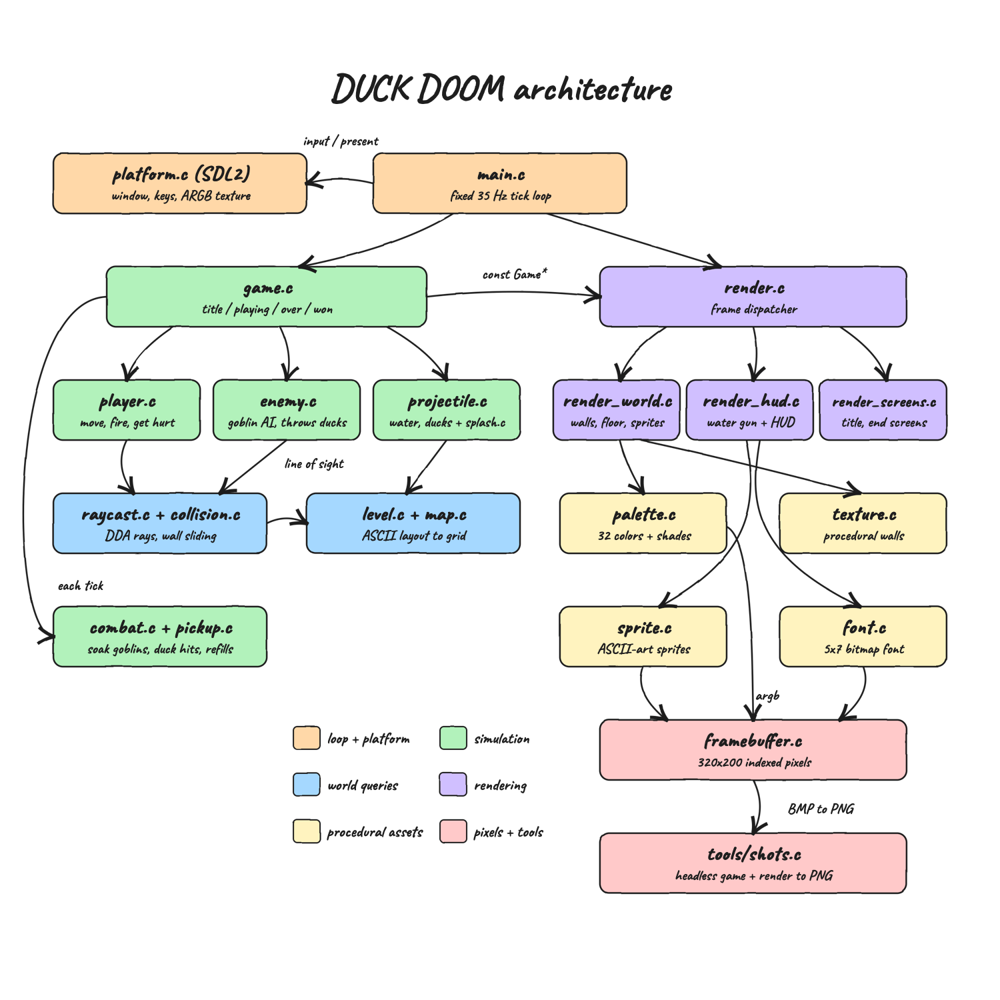
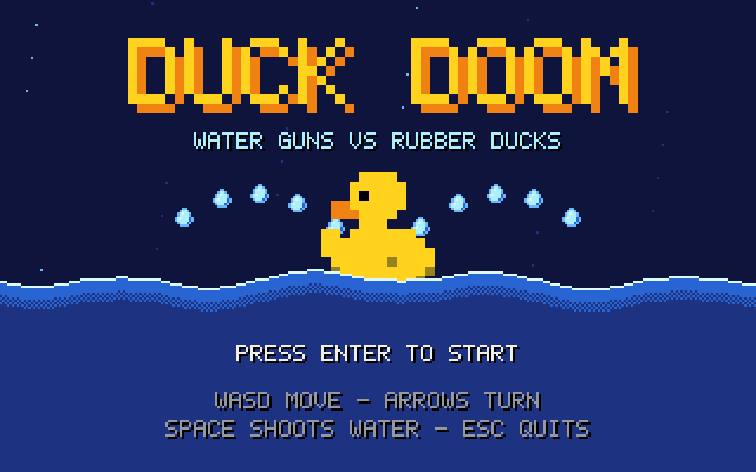
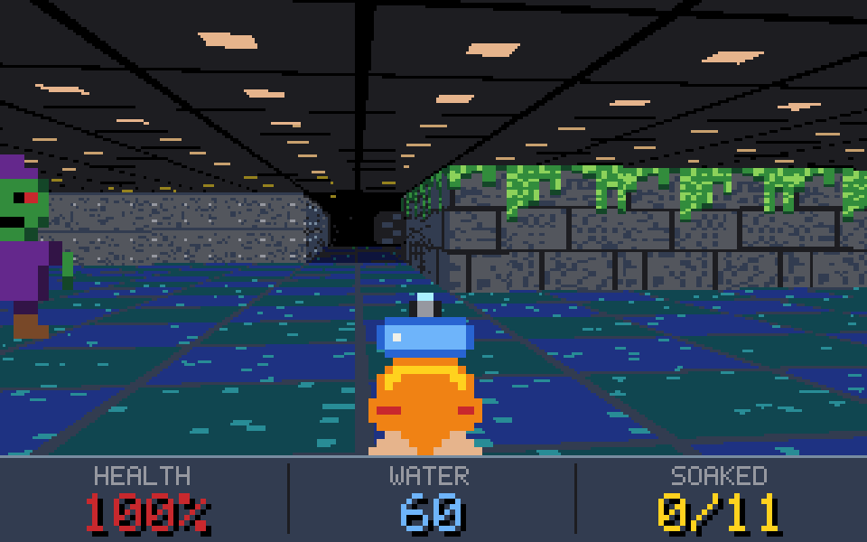
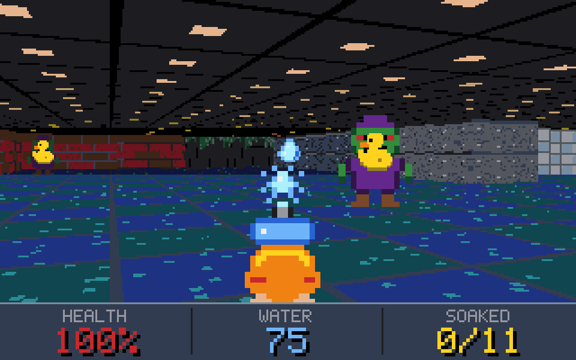
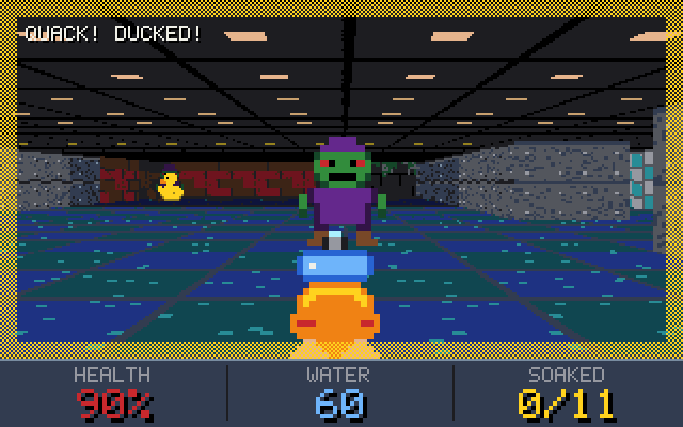
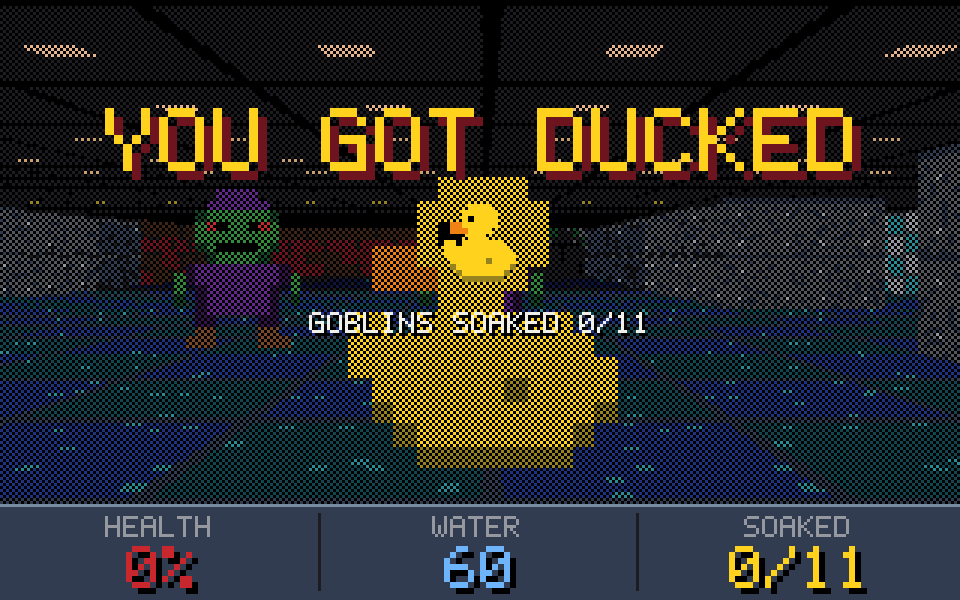
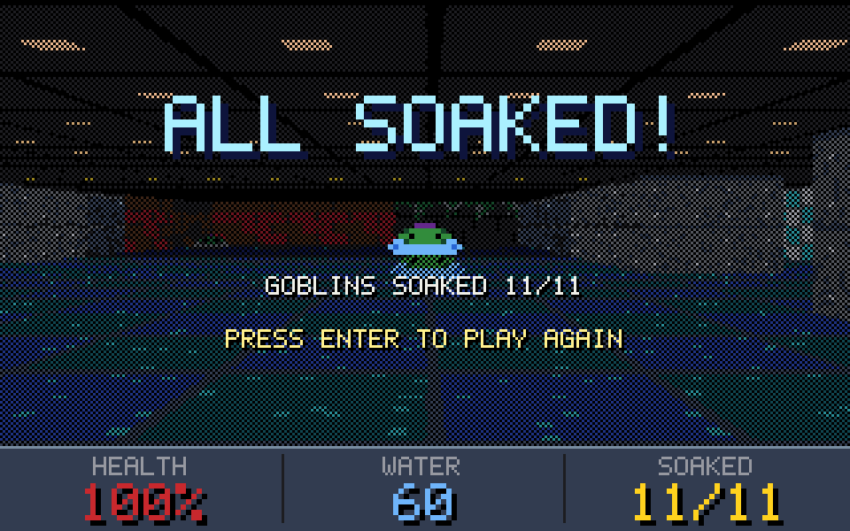

<p align="center"></p>

# DUCK DOOM

DUCK DOOM is an 8-bit first-person shooter in the style of DOOM, written in plain C99. There is no C++, and SDL2 is the only library.
You walk through a flooded bathhouse with a water gun and soak the Bath Goblins.
They fight back by throwing yellow rubber ducks at your face.
Soak all 11 goblins to win. Take too many ducks and you get DUCKED.

## How it Works?

1. `main.c` runs a fixed 35 Hz tick loop (the DOOM tic rate). Each tick, `game_update` advances the simulation with the current `Input`.
2. The level is an ASCII grid (`level.c`). Walls are texture ids, and `P`, `E`, `W`, `H` mark the player, goblins, water refills and health kits.
3. Goblins that can see you (a DDA ray in `raycast.c`) walk closer, wind up, and throw a duck aimed at your position.
4. Water drops and ducks are projectiles. `combat.c` checks hits: 3 drops soak a goblin, and each duck takes 10 health.
5. `render_world.c` casts one ray per screen column for textured walls, floor-casts the floor and ceiling, and draws sprites back to front against a depth buffer.
6. Everything is drawn into a 320x200 buffer of 32-color palette indexes. Distance shading uses a color map that snaps back to the palette, so the 8-bit look holds at every distance.
7. `platform.c` is the only file that touches SDL2. It converts the palette indexes to ARGB and scales the image to the window without smoothing.

## Architecture

<p align="center"></p>

The simulation (green and blue) never includes SDL or the renderer. The renderer (purple) only reads a `const Game*`.
This split is why the unit tests and `tools/shots.c` can run the real game with no window.

## Features

* **Water gun**: holding SPACE fires water drops every 7 ticks. Each drop costs 1 water, so running dry is a real risk.
* **Rubber duck throwers**: goblins wind up for 12 ticks before throwing, which gives you a moment to dodge.
* **Water stuns**: soaking a goblin cancels its windup, so aggressive play is rewarded.
* **Line of sight AI**: goblins only chase and throw when a ray reaches you, so walls are real cover.
* **Pickups**: buckets add 25 water and kits add 25 health. A pickup is left on the floor if you are already full, so it isn't wasted.
* **DOOM-style renderer**: textured walls, floor and ceiling casting, billboard sprites and a depth buffer, all in software.
* **8-bit palette shading**: 32 colors with an 8-level shade table. Far things get darker while keeping the palette look.
* **Procedural art**: textures are built from code and sprites are ASCII art in C strings. The build has zero asset files.
* **HUD and feedback**: health, water and goblins soaked, plus messages, a yellow flash when a duck hits you, a bobbing gun and a muzzle splash.
* **Title, game over and victory screens**: press ENTER to start or restart, and the game resets cleanly.

## Stack

* **C99**: the requirement. It is strict, portable and fast enough for a software raycaster.
* **SDL2**: a small cross-platform window, keyboard and texture API. It is the only dependency, used by one file.
* **make**: one Makefile builds the game, the tests and the screenshot tool.
* **clang sanitizers**: the tests run with AddressSanitizer and UBSan to catch memory bugs in the C code.
* **sips / qlmanage (macOS)**: convert the headless BMP frames and the SVG diagram to PNG for this README.

## Contracts

There is no network API. The contracts are the C headers between modules:

| Header | Contract |
|---|---|
| `input.h` | `Input` flags: forward, back, strafe, turn, fire, start. This is the only thing the platform gives the game |
| `game.h` | `game_init`, `game_load_level`, `game_start`, `game_update(Game*, const Input*)` |
| `render.h` | `render_frame(Framebuffer*, const Game*)`. It is read-only over the game state |
| `platform.h` | `platform_create`, `platform_poll`, `platform_present(argb)`, `platform_destroy` |
| `level.h` | `level_parse(Level*, rows, count)` rejects ragged rows, open borders, unknown tiles, and anything other than exactly one player start |

Level legend: `#` brick, `T` bathroom tile, `M` metal, `G` mossy stone, `.` floor, `P` player, `E` goblin, `W` water bucket, `H` health kit.

## Key data structures and design decisions

* **`Framebuffer`**: `uint8_t[320*200]` palette indexes instead of RGB. Shading becomes a table lookup, and the 8-bit look can't drift.
* **Shade table**: `palette.c` precomputes `shade[level][color]` as the nearest palette color at reduced brightness, like DOOM's COLORMAP.
* **Fixed pools**: `ProjectilePool` (96), `SplashPool` (32), and enemies and pickups (32 each) are plain arrays. There is no malloc in the game loop.
* **`Map`**: a flat `cells[32*32]` grid. Anything out of bounds counts as solid, so rays always stop.
* **Enemy state machine**: `IDLE -> CHASE -> WINDUP -> THROW`, `HURT` on a hit, `DEAD` when soaked. `enemy_update` returns an action and `game.c` spawns the duck, so enemies don't know about projectiles.
* **Seeded xorshift RNG**: kept inside `Game`, so tests and screenshots replay the same way every time.
* **Fixed timestep**: the simulation always moves in 1/35 s steps, and rendering runs as fast as vsync allows.
* **Sprites as strings**: `SPRITE_DEF` takes the height from the array size, and a test checks every row width.

## How to run

Requirements: a C compiler, make and SDL2 (`./scripts/setup.sh` installs SDL2 with Homebrew when it is missing).

```bash
./scripts/setup.sh
make run
```

Controls: `W/S` or `UP/DOWN` move, `A/D` strafe, `LEFT/RIGHT` or `Q/E` turn, `SPACE` shoots water, `ENTER` starts, `ESC` quits.

Tests (31 tests, 352 checks, AddressSanitizer + UBSan):

```bash
./scripts/test-all.sh
```

```
level
  default_level_is_playable
  open_border_is_rejected_so_rays_never_leave_the_map
  ...
render
  goblin_straight_ahead_is_drawn_at_the_crosshair
  every_screen_renders_with_the_hud_in_place
352 checks, 0 failures
```

Regenerate the screenshots below from the real engine:

```bash
make shots
```

## Printscreens

The screenshots are real frames from the game engine. `tools/shots.c` runs `game_update` and `render_frame` headless with scripted input and a fixed seed, then saves the framebuffer at 3x scale. The victory frame marks the goblins as soaked through `enemy_soak` instead of playing through the whole level.

### Title



The rubber duck bobs on animated waves while water drops arc around it. The prompt blinks and the controls are listed below.

### Exploring



The start of the long southern hall. It shows the mossy stone walls with green drips, metal walls in the distance, the wet tile floor with casting, the lamp-panel ceiling, and a goblin stepping in from the left. The HUD shows full health, 60 water and 0/11 soaked.

### Battle



The water gun is firing: a stream of drops flies forward and the muzzle splash is visible. A goblin in its purple robe stands in the middle of the room while a yellow rubber duck flies at the player. Another duck is already on its way from the far brick wall. The water count went up to 75 because the player grabbed a bucket.

### Duck hit



A duck just hit the player. The yellow dithered border flashes, the message reads "QUACK! DUCKED!", and health dropped to 90%. The next duck is already coming from the left.

### Game over



Health reached 0%. The world stays visible behind a dithered overlay with "YOU GOT DUCKED", the soaked count and a blinking prompt to play again.

### Victory



All 11 goblins are soaked into puddles. "ALL SOAKED!" shows the final count, and ENTER starts a fresh run.

## Scripts

All scripts live in `scripts/` and run from any directory of the repository.

| Script | What it does |
|---|---|
| `./scripts/setup.sh` | Checks the compiler, installs SDL2 when missing, builds the game and the tests |
| `./scripts/start-all.sh` | Builds if needed and starts the game window in the background, with its pid and log |
| `./scripts/status.sh` | Shows whether the game is UP or DOWN, with its pid |
| `./scripts/test-all.sh` | Runs every unit test |
| `./scripts/stop-all.sh` | Stops the game |

DUCK DOOM is a native SDL2 window with no network services, so there is no `ports.env`, `ui.sh` or `sql-console.sh`.
The pid and log are written to `.run/`.

```bash
./scripts/setup.sh
./scripts/start-all.sh
./scripts/status.sh
./scripts/stop-all.sh
```
