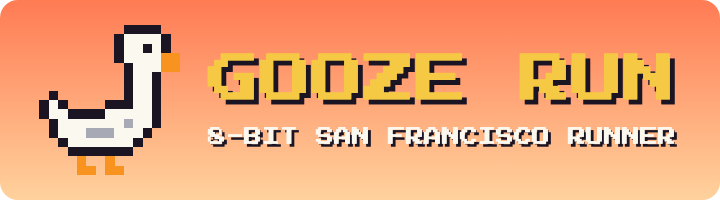
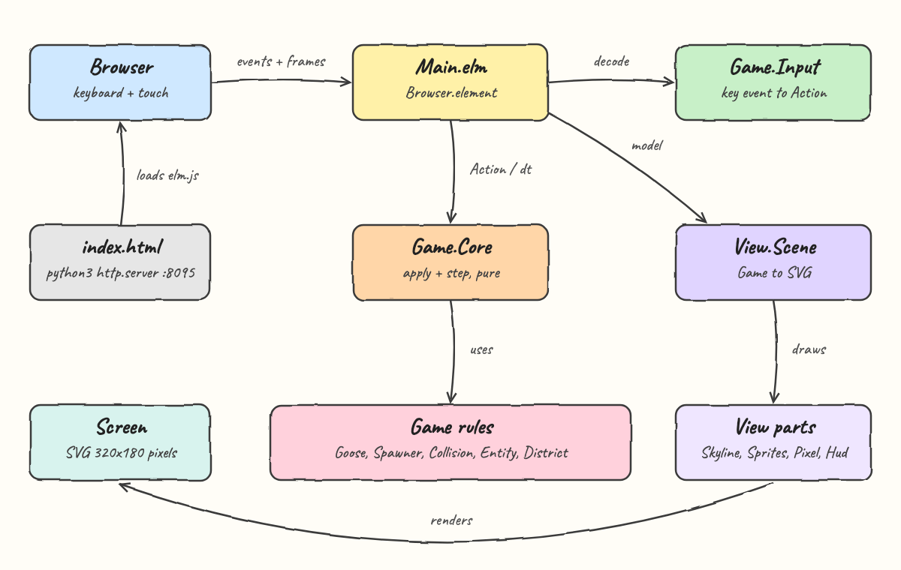
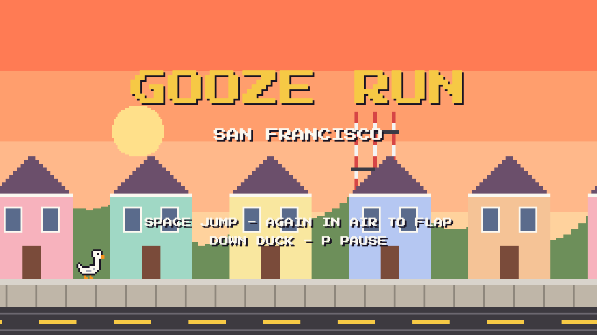
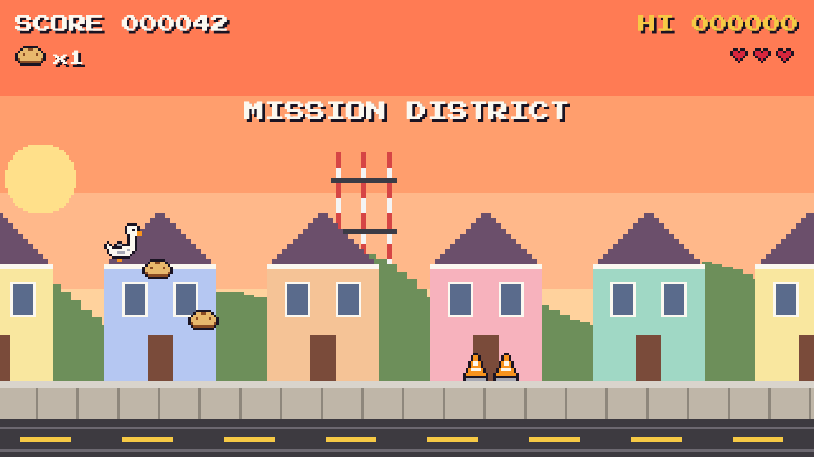
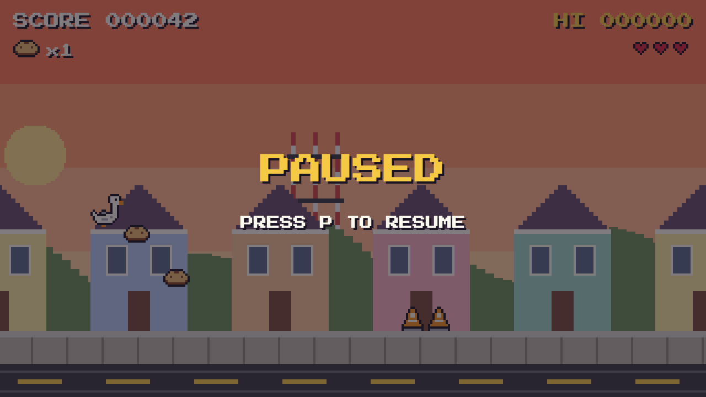
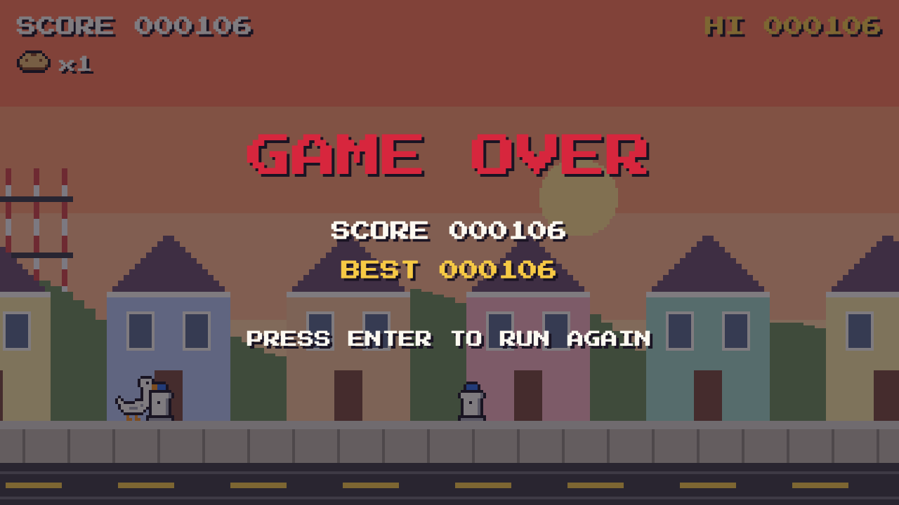
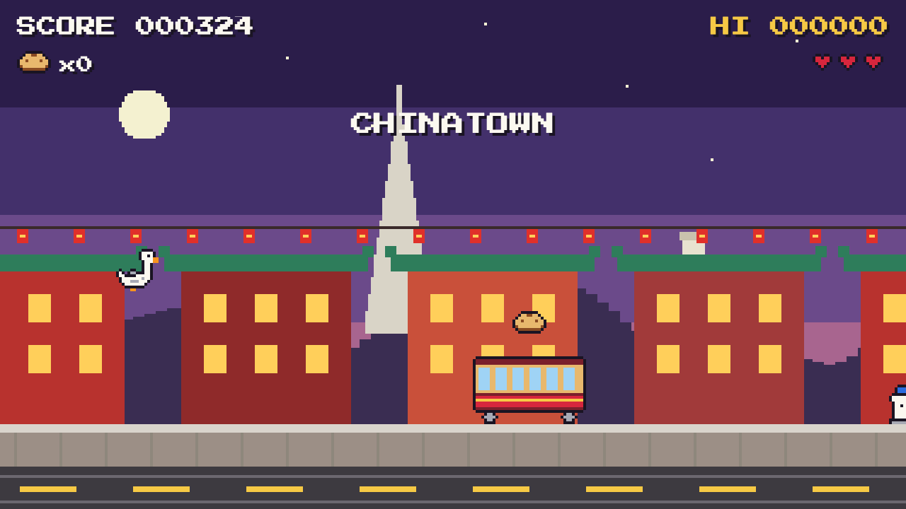
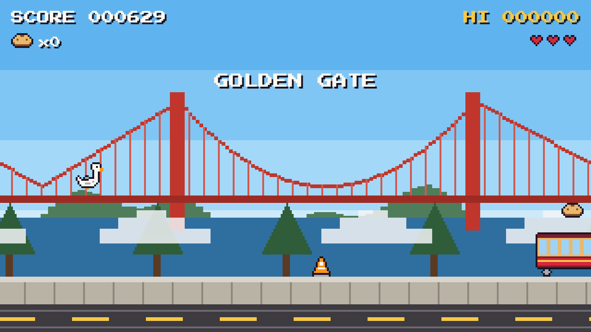

<p align="center"></p>

# Gooze Run

Gooze Run is an 8-bit endless runner written in Elm, in the spirit of Sonic and Super Mario Run. A white goose runs through San Francisco (Mission District, Chinatown and the Golden Gate Bridge), jumping fire hydrants and traffic cones, ducking seagulls, riding on top of cable cars and collecting sourdough bread.

## How it Works

1. `Main.elm` is a `Browser.element` that subscribes to animation frames and keyboard events.
2. Key events are decoded by `Game.Input` into an `Action` (`Jump`, `JumpReleased`, `Duck`, `Pause`, `Confirm`). Auto-repeat is ignored.
3. `Game.Core.apply` turns an action into a new `Game`, and `Game.Core.step dt` advances the world one frame.
4. Each step moves the street, spawns the next pattern ahead of the goose, applies gravity, then resolves touches.
5. Touching bread collects it, falling onto a seagull stomps it, standing on a cable car roof is safe, and anything else costs a life.
6. The run speeds up over time and the district changes every 3000 pixels.
7. `View.Scene` renders the model into a 320x180 SVG. Every sprite is a list of strings where each character is a colored pixel.
8. Parallax layers scroll at different speeds and are cached with `Svg.Lazy`, so only the moving sprites are diffed each frame.

## Architecture

<p align="center"></p>

Everything under `Game.*` is pure Elm with no rendering, so the rules are tested without a browser. Everything under `View.*` only reads the model and draws it.

```
src/
  Main.elm              program wiring: frames, keys, update
  Game/Config.elm       every tuning number in one place
  Game/Input.elm        key to Action, ignores key repeat
  Game/Core.elm         screens, apply, step, touch rules, score
  Game/Goose.elm        jump, flap, jump cut, gravity, duck, hurt
  Game/Entity.elm       obstacle and pickup kinds, sizes, movement
  Game/Collision.elm    axis aligned boxes
  Game/Spawner.elm      seeded random street patterns
  Game/District.elm     Mission, Chinatown, Golden Gate by distance
  View/Scene.elm        composes the frame
  View/Skyline.elm      sky, landmarks, houses, sidewalk, parallax
  View/Sprites.elm      8-bit sprite sheets as strings
  View/Pixel.elm        string rows to merged SVG rects
  View/Hud.elm          score, bread, hearts, best, district banner
  View/Overlay.elm      title, pause, game over
  View/Text.elm         pixel font labels with drop shadow
tests/                  elm-test suites for rules, input and world
public/index.html       page that boots Elm with a random seed
scripts/                setup, start, stop, status, test, ui
```

## Features

* **Auto-run with variable jump**: tap for a short hop, hold for a high jump, like Mario.
* **Double jump flap**: a second press in the air flaps once more, so a goose can recover from a bad jump.
* **Duck**: hold down to slip under seagulls flying at goose height.
* **Stomp seagulls**: land on a seagull from above for 50 points and a bounce.
* **Cable car platforms**: the roof is a platform with bread on top, and the side still hurts.
* **Sourdough bread**: 10 points each, and every 25 gives an extra life, up to 5.
* **Lives and invincibility**: 3 hearts and 1.5 seconds of blinking after a hit, so one obstacle cannot drain every life.
* **Three SF districts**: Mission with Sutro Tower and painted ladies, Chinatown at night with the Transamerica Pyramid, and the Golden Gate Bridge with fog.
* **Speed ramp**: speed grows from 110 to 260 px/s and gaps widen with it, so the game stays fair.
* **Best score**: kept for the session and shown on the HUD and game over screen.
* **Pause**: `P` or `Escape` freezes the world and stops the frame subscription.
* **Touch**: pointer down and up map to jump and release, so it plays on phones.

## Stack

* **Elm 0.19.1**: pure functional core and no runtime exceptions.
* **elm/svg**: pixel-perfect rendering with `crispEdges`, no canvas library or JS interop needed.
* **elm/random**: seeded street generation, so the tests are reproducible.
* **elm-explorations/test + elm-test**: unit tests for the game rules.
* **Press Start 2P**: 8-bit font from Google Fonts, falling back to monospace.
* **python3 http.server**: serves the static build with nothing to install.

## Contracts

There is no backend or REST API. The contract is the controls and the flags passed to Elm.

| Input | Action |
|---|---|
| `Space`, `ArrowUp`, `W`, tap | Jump, press again in the air to flap |
| Release jump key, lift finger | Cut the jump short |
| `ArrowDown`, `S` (hold) | Duck |
| `P`, `Escape` | Pause and resume |
| `Enter` | Start, resume, run again |

`Elm.Main.init({ flags: Int })` takes the random seed for the street.

## Key Data Structures and Design Decisions

* **`Game`** record: screen (`Title | Playing | Paused | GameOver`), goose, entities, distance, speed, bread, stomps, lives, best, seed, nextSpawn.
* **`Goose`** record: height above ground `y`, vertical speed `vy`, jumps used, grounded, ducking, hurt timer.
* **`Entity`** is `{ kind, x, y }` in world coordinates. Screen position is `x - distance`, so the goose never moves on x.
* **Sprites as strings**: `"..kwwk.."` reads like pixel art in code. `View.Pixel` merges runs of one color into a single `rect` to keep the DOM small.
* **Heights point up**: `y` is height above the ground, so physics reads naturally and only the view flips it.
* **Patterns instead of single obstacles**: the spawner picks a weighted pattern (hydrant, cones, seagull, cable car with bread, bread arc) plus a gap that scales with speed.
* **Pure step function**: `step : Float -> Game -> Game` with delta clamped to 50 ms, so a background tab cannot teleport the goose through obstacles.
* **Restart delay**: game over ignores input for 0.8 s, so a held jump does not skip the final score.

## How to Run

Requirements: `elm`, `node`/`npm` and `python3`.

```bash
./scripts/setup.sh
./scripts/start-all.sh
./scripts/ui.sh
```

Open http://localhost:8095 and press space.

Run the tests:

```bash
./scripts/test-all.sh
```

```
elm-test 0.19.1-revision17
--------------------------
Running 36 tests.

TEST RUN PASSED
Passed:   36
Failed:   0
```

## Printscreens

### Title screen



The title screen in the Mission District at sunset. The street scrolls slowly behind the title while the goose runs in place, and the controls are listed at the bottom.

### Running in the Mission



A run just started. The goose is jumping through a bread arc. The HUD shows score, bread count, the best score and three hearts. The district banner appears when a new district begins, and a pair of traffic cones is coming.

### Paused



`P` dims the scene and freezes the world until `P` or `Enter` is pressed again.

### Game over



All lives are gone. The final score is recorded as the best score, and after a short delay the game asks for `Enter` to run again. SF fire hydrants are white with blue caps.

### Chinatown



The second district, at night, with the Transamerica Pyramid, Coit Tower, a moon, red lanterns and pagoda roofs. A red cable car carries a sourdough loaf on its roof.

### Golden Gate



The third district, with the Golden Gate Bridge over the bay, Karl the Fog and pine trees. After Golden Gate the tour loops back to the Mission.

## Scripts

All scripts live in `scripts/` and run from any directory of the repository.

| Script | What it does |
|---|---|
| `./scripts/setup.sh` | Installs dependencies and prepares the app |
| `./scripts/start-all.sh` | Starts every service and prints the full link of each one |
| `./scripts/status.sh` | Shows every service port as UP or DOWN |
| `./scripts/test-all.sh` | Runs every test suite |
| `./scripts/ui.sh` | Opens the UI in the browser |
| `./scripts/stop-all.sh` | Stops every service |

Ports are declared in `scripts/ports.env` (`game=8095`).

```bash
./scripts/setup.sh
./scripts/start-all.sh
./scripts/status.sh
./scripts/ui.sh
./scripts/stop-all.sh
```
