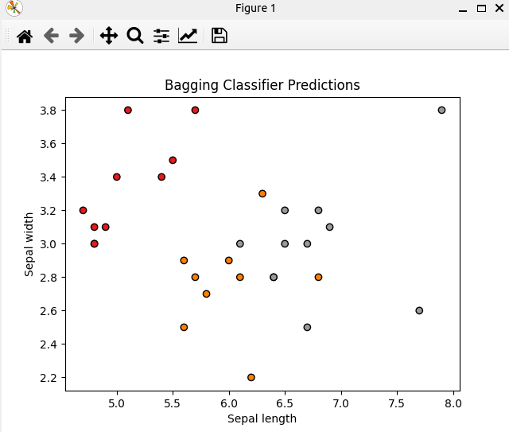

### Result
* Ensenble methods
* Bagging
* Bagging: Bagging stands for bootstrap aggregation. It combines multiple learners in a way to reduce the variance of estimates. For example, Random Forest is a type of bagging algorithm.
* Iris Dataset

