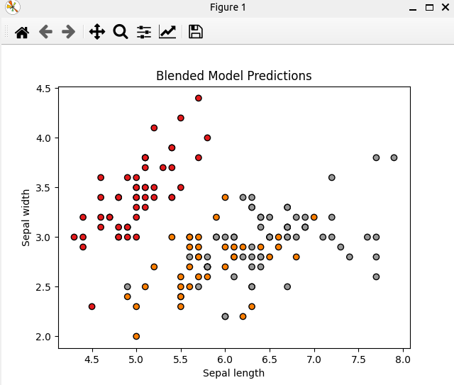

### Result
* Ensemble methods
* Blending
Blending: Blending is a similar approach to stacking. Multiple models are trained to predict the same outcome, these predictions are combined, and then another model is trained to make a final prediction. The difference between stacking and blending is that in blending, the dataset used to train the meta-model is not the complete training dataset.
* Iris dataset

