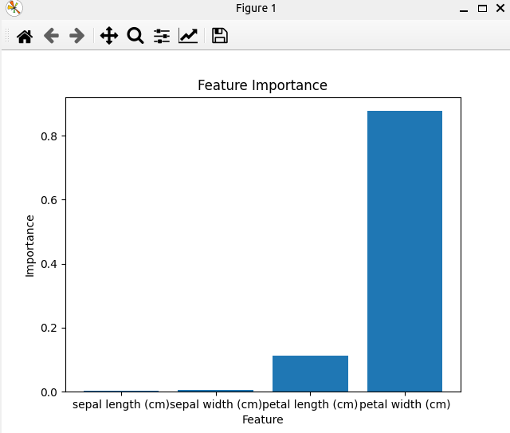

### Result
* Ensenble methods
* k-fold cross validation
* k-fold: K-fold cross-validation is a resampling procedure used to evaluate machine learning models on a limited data sample.The procedure has a single parameter called k that refers to the number of groups that a given data sample is to be split into.
* boosting
* Iris Dataset

Cross-validation score: 0.9133333333333333