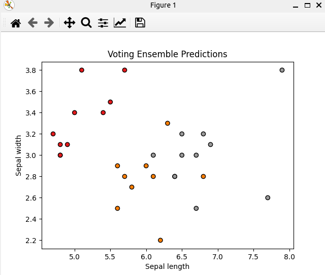

### Result
* Ensenble methods
* Voting
* Voting: Voting can be done in multiple ways, for example by taking the majority vote of the predictions for classification problems or the average for regression problems. The idea is to combine conceptually different machine learning classifiers and use a majority vote or the average predicted probabilities (soft vote) to predict the class labels.
* Iris dataset

