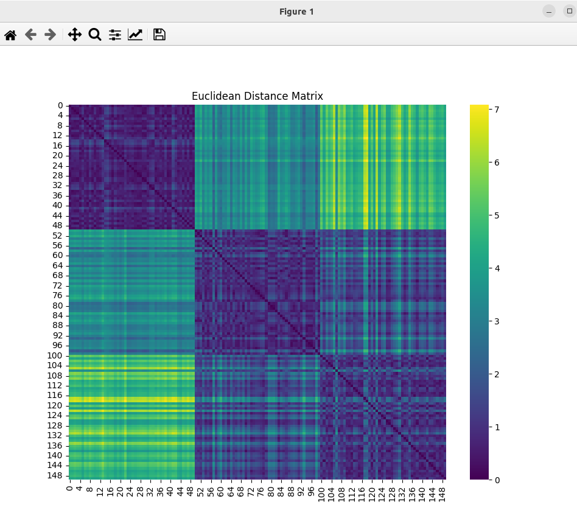

### Result
* Euclidean distance
* Eculean distance works by taking the square root of the sum of the squared differences between the two vectors
* Euclidean distance is used in the K-means algorith
* Iris Dataset
* Applications for Euclidean distance include:
  * KNN
  * PCA
  * DBSCAN
  * SVM
  * Hierarchical clustering 

