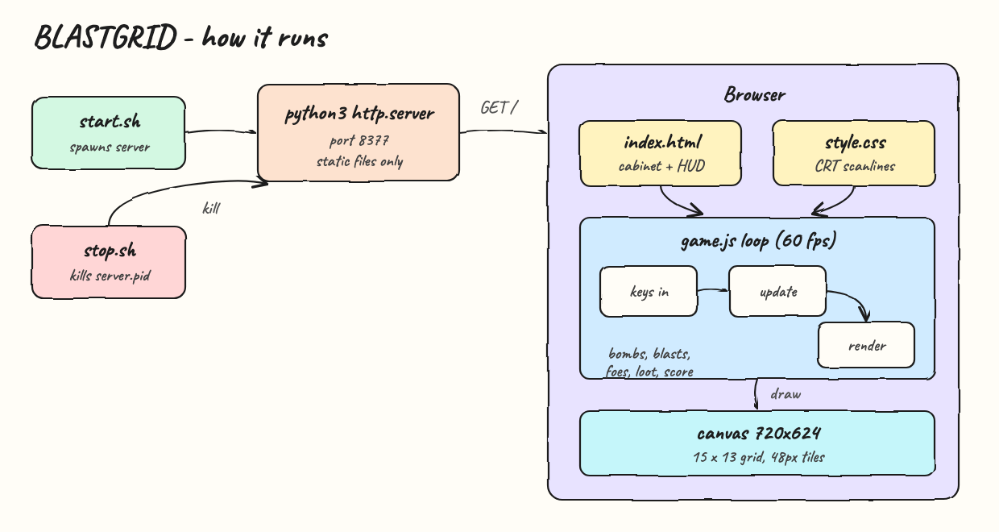
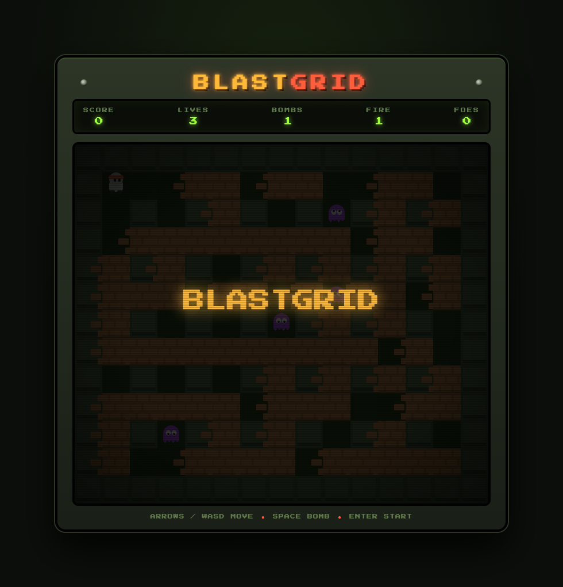
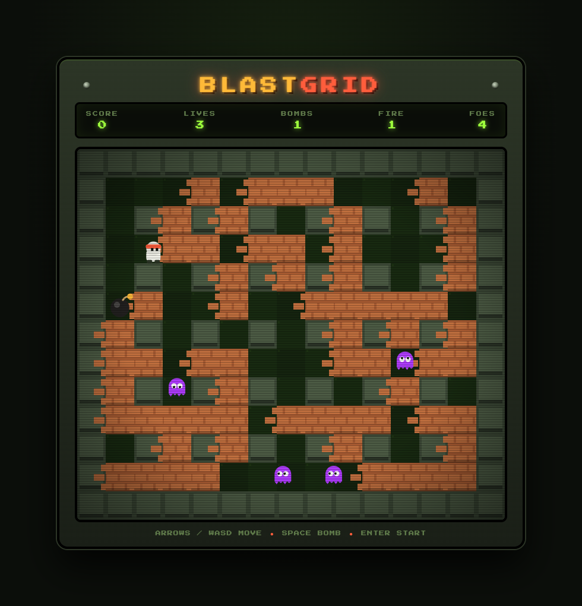
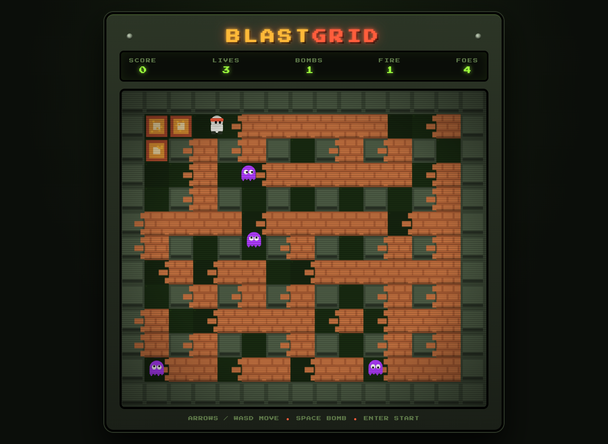

# BLASTGRID

A Bomberman-like arcade game that runs in the browser. Pure HTML, CSS and JavaScript on a canvas, zero libraries, served as static files. Drop bombs, blast bricks, collect power-ups and clear all four foes to win.

## Run

```bash
./start.sh
```

Open http://localhost:8377 and press ENTER.

```bash
./stop.sh
```

## Controls

| Key | Action |
|---|---|
| Arrows / WASD | Move |
| Space | Drop bomb |
| Enter | Start / restart |

## Rules

- The board is a 15x13 grid: indestructible walls, destructible bricks, open floor.
- Bombs detonate after ~2 seconds in a cross-shaped blast that breaks bricks and chains into other bombs.
- Some bricks hide loot: extra bomb capacity, bigger blast radius, or more speed.
- Touching a foe or a blast costs a life; you have 3, with a short blink of invulnerability after each spawn.
- Blast all 4 foes to win. Bricks are worth 10 points, loot 50, foes 100.

## Architecture



`start.sh` launches a `python3 http.server` on port 8377 and writes `server.pid`; `stop.sh` kills that pid. The browser loads `index.html` (the arcade cabinet shell and HUD), `style.css` (CRT scanlines, glow, marquee) and `game.js`, which runs a 60 fps `requestAnimationFrame` loop: read held keys, update bombs, blasts, foes, loot and score, then render everything to a 720x624 canvas.

## Screenshots

### Title



The attract screen: the board is generated and visible behind the dimmed overlay, foes already wander it, and the HUD shows the starting 3 lives.

### Gameplay



Mid-run: the player (white sprite, red headband, top left) has dropped a bomb (black ball with a lit fuse) and is walking clear of it. The HUD tracks score, lives, bomb capacity, blast range and remaining foes; the purple ghosts roam the corridors.

### Explosion



The bomb detonating: the cross-shaped blast paints the cells it covers in layered orange and amber, breaks adjacent bricks, and the score ticks up while the player watches from a safe tile.

## Files

| File | Purpose |
|---|---|
| `index.html` | Cabinet shell, HUD, canvas |
| `style.css` | CRT arcade look |
| `game.js` | Game loop, physics, AI, rendering |
| `start.sh` / `stop.sh` | Serve / stop on port 8377 |
| `architecture.svg` / `architecture.png` | Hand-drawn flow diagram |
