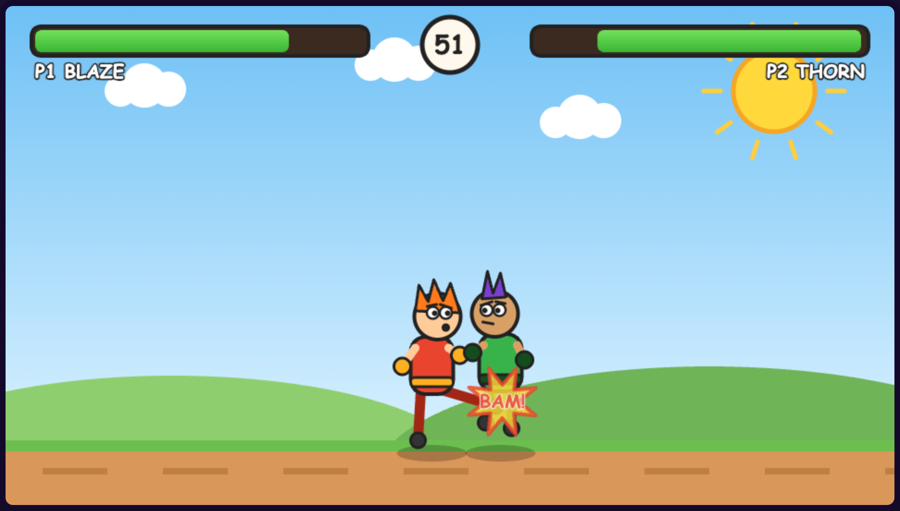

# Fable Fighters

A 2-player cartoon fighting game in the browser. Pure HTML5 canvas, zero dependencies, single file. Pick your fighter, land punches and kicks, drain the other player's health bar before the 60 second timer runs out.



Blaze landing a kick on Thorn.

## Characters

| Fighter | Style | Speed | Kick Power |
|---------|-------|-------|------------|
| BLAZE | Spiky hothead | 4.6 | 12 |
| FROST | Hooded iceman | 5.4 | 10 |
| VOLT | Lightning fast | 6.2 | 9 |
| THORN | Slow heavy hitter | 4.0 | 14 |

## Controls

| Action | Player 1 | Player 2 |
|--------|----------|----------|
| Move | A / D | Left / Right |
| Jump | W | Up |
| Punch | F | K |
| Kick | G | L |
| Lock character | F | K |
| Rematch | Enter | Enter |

## Run

```bash
./start.sh
```

Open http://localhost:8123

```bash
./stop.sh
```
