# Game Stand

A web manager for every video game I finished, counted by console. The catalog was imported
from my Trello "Video Game" card: 113 finished games across PS5 (PS4 aggregated as PS5),
Nintendo Switch and Steam/PC, keeping the original finish year and finish order from the board.

Built with Python 3 and Flask only. No JS framework, no database: one `games.json` file,
one `config.json` file and real box art on disk.

## Architecture

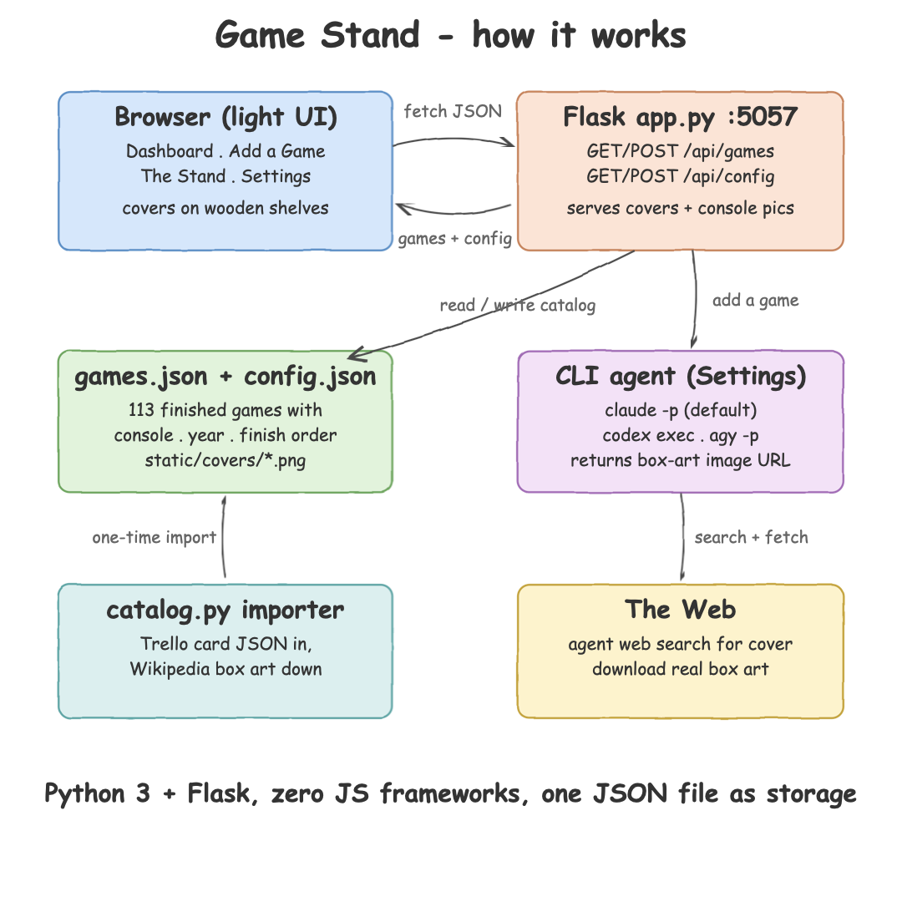

- `catalog.py` is the one-time importer: it holds the 113 games from the Trello card
  (name, console, finish year, finish order) and downloads the real box art from the
  Wikipedia page-image API into `static/covers/`, plus real console pictures into
  `static/consoles/`. Games without usable art get a generated SVG cover.
- `app.py` is the Flask server: it serves the UI and a small JSON API
  (`GET/POST /api/games`, `GET/POST /api/config`).
- Adding a game shells out to the configured CLI agent (`claude -p` by default,
  `codex exec` or `agy -p`) which searches the web and returns a direct box-art URL;
  the server downloads it and appends the game to the catalog with the next finish order.

## Run it

```bash
./start.sh
```

Open http://127.0.0.1:5057 and stop it later with `./stop.sh`.

## Dashboard

Welcome view with the total counter and one card per console: a real picture of the
machine, how many games I finished on it and its share of the collection, plus the
latest finishes with year. Clicking a console card jumps straight to The Stand
filtered by that console.

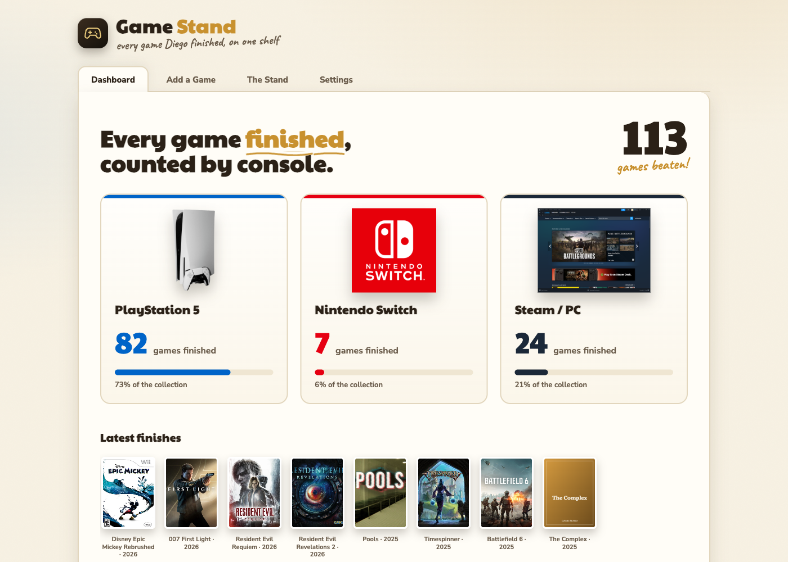

The Steam shelf, opened by clicking the Steam card on the dashboard:

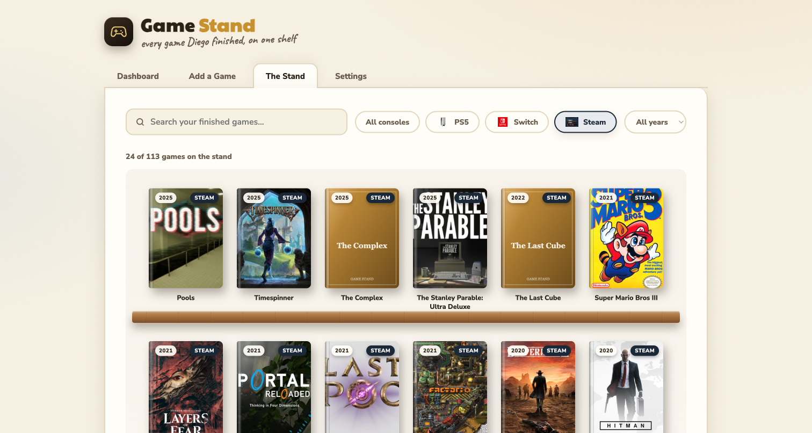

## Add a Game

Type the title, pick the console (PS5, Switch or Steam) and the configured CLI agent
hunts the real cover on the web. Below, `claude -p` found and downloaded the Hades
box art by itself:

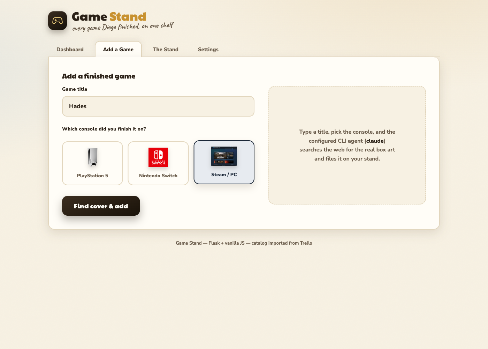

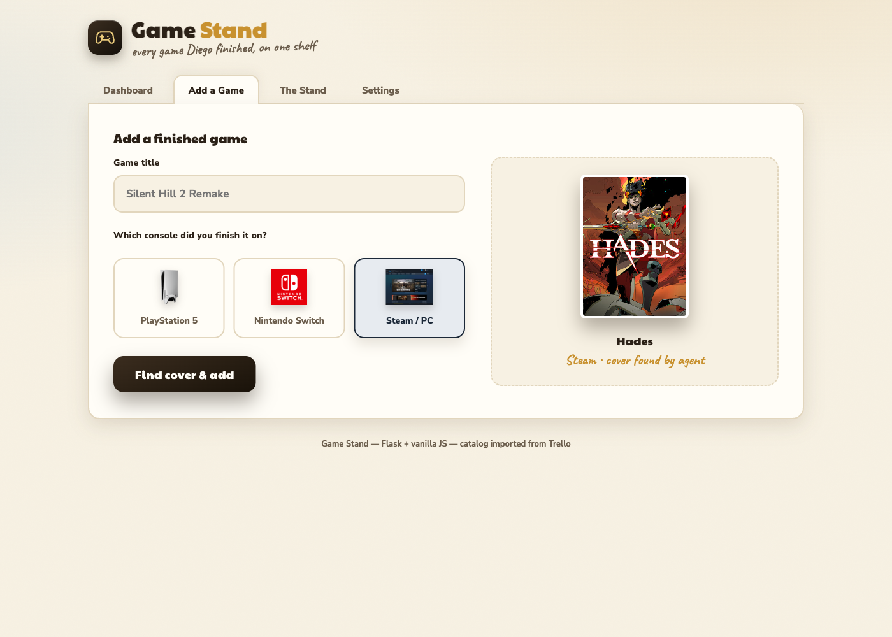

## The Stand

All finished games standing on wooden shelves like a book stand, newest finish first.
Every cover carries the console badge and the finish year. Filter by typing in the
search box, clicking a console logo or picking a year.

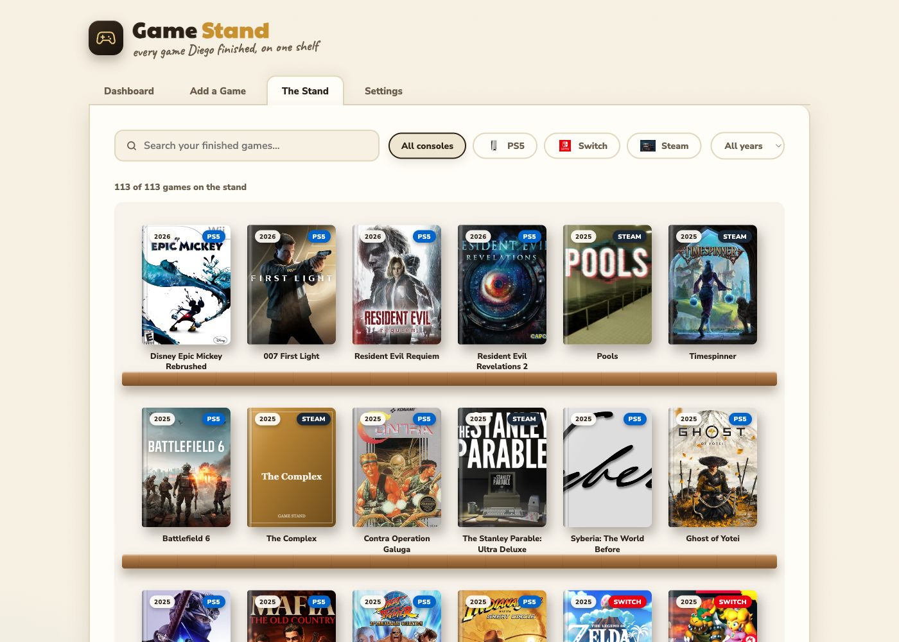

Moving the mouse across a shelf magnifies the covers around the cursor like the
macOS dock, lifting the closest one off the plank:

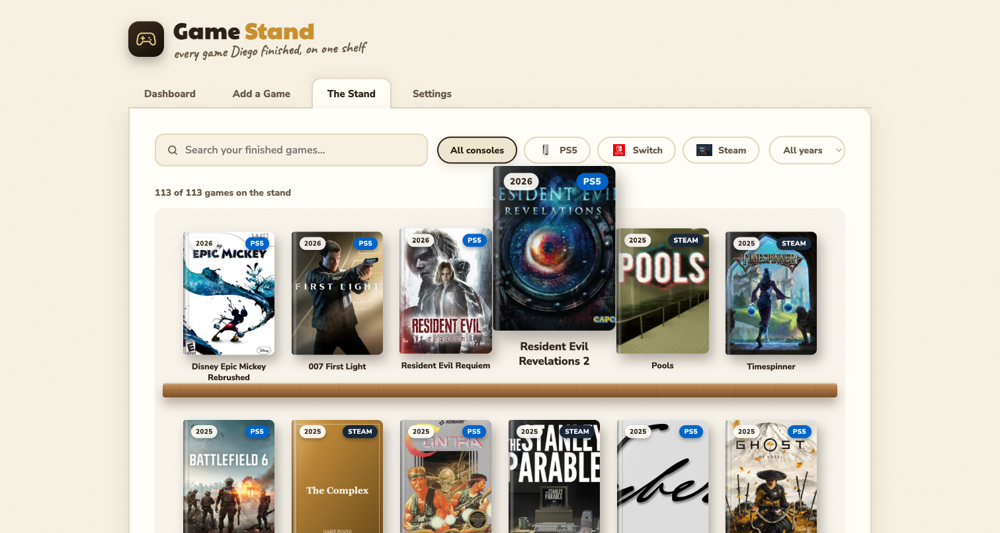

Clicking a cover opens a modal with the game info: console, finish year, finish
order and cover file.

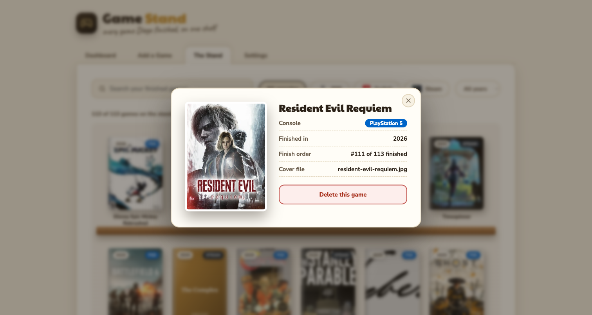

The modal is also where games are deleted. The red button must be clicked three
times before the game and its cover are really removed:

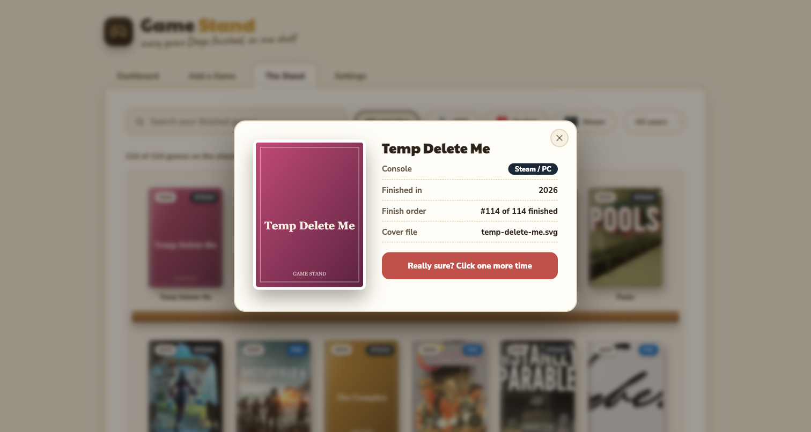

Console filter showing only Nintendo Switch games:

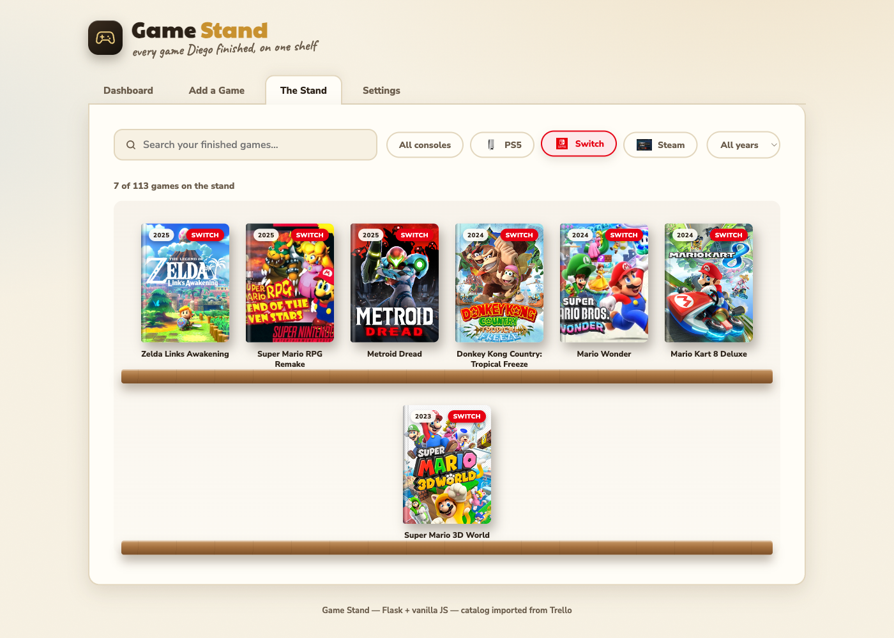

Year filter showing only what I finished in 2024:

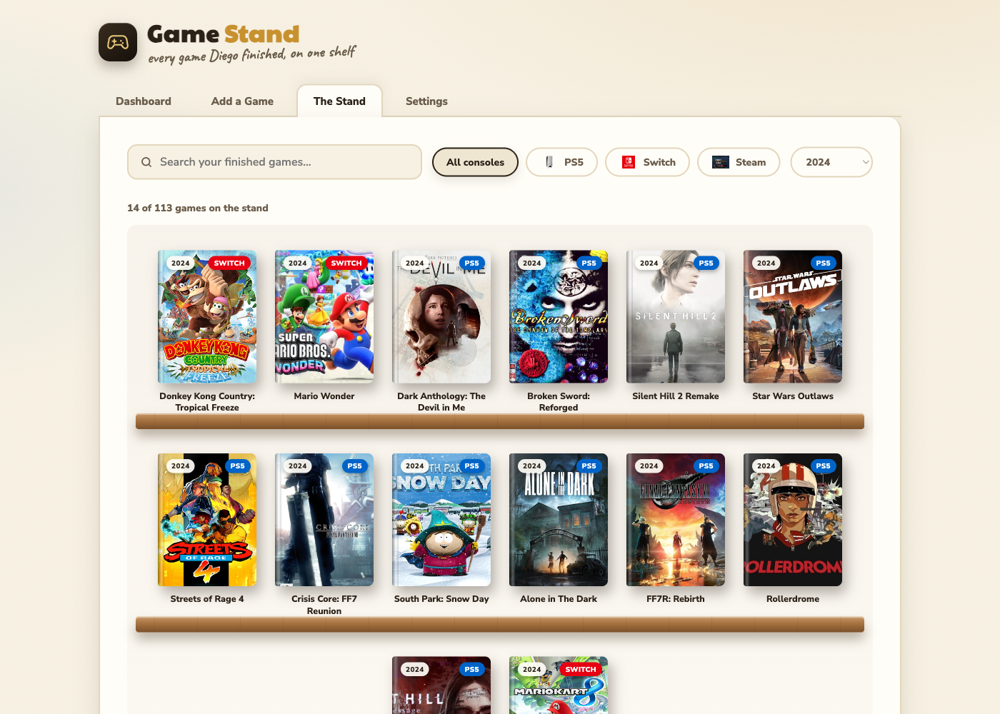

## W.I.P

The games I started but did not beat yet. Same idea as the library: type a title, pick
PS5, Switch or Steam and the CLI agent hunts the real box art. The shelf below has its own
search box and console filters, and every case carries a `PLAYING` badge instead of a year.

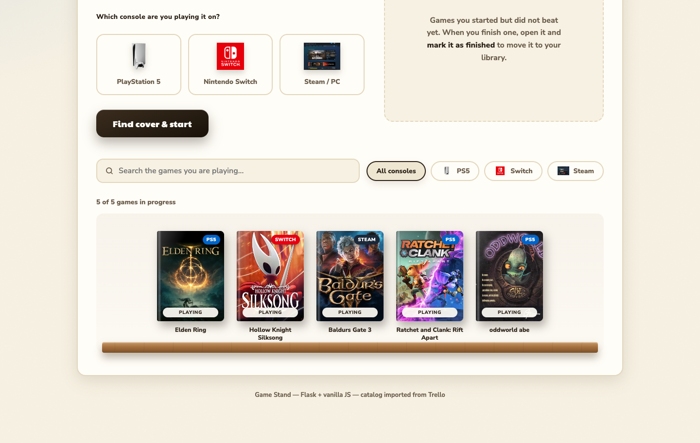

Clicking a case opens it with two actions. **Mark as finished** moves the game to the
library with the current year and the next finish order, then jumps to The Stand.
**Remove from W.I.P** drops it and deletes the cover. Both ask for confirmation on a
second click before anything happens.

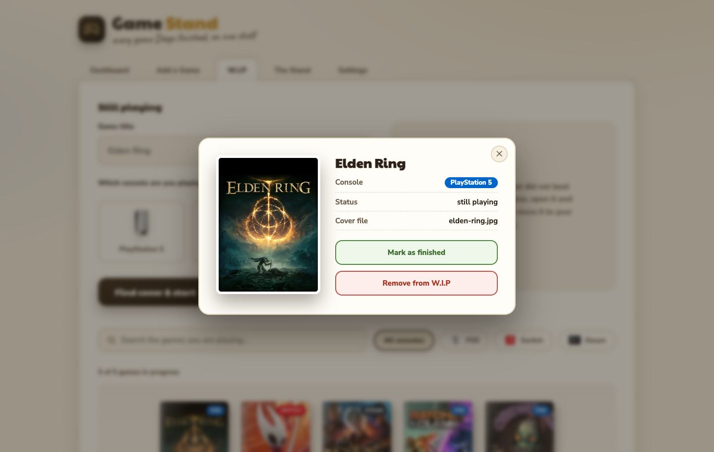

In-progress games live in `wip.json` and carry no `year` or `order` — those are only
assigned when the game is marked as finished.

## Settings

Choose which CLI agent finds the covers: Claude Code (default), Codex or Agy.
The choice is persisted in `config.json`.

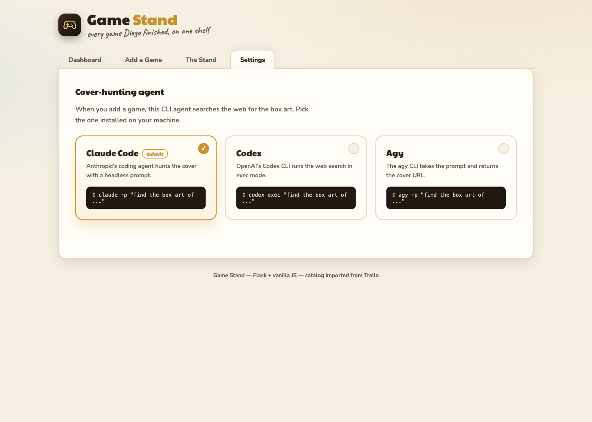

## Data shape

```json
{
  "id": "ghost-of-yotei",
  "name": "Ghost of Yotei",
  "console": "PS5",
  "year": 2025,
  "order": 105,
  "cover": "covers/ghost-of-yotei.png"
}
```

`year` is the year I finished the game, taken from the year separators of the Trello
checklist (games older than 2020 use the check dates from the card activity).
`order` preserves the position of the game in the Trello list, so the stand can always
show the collection in the exact order the games were beaten.
