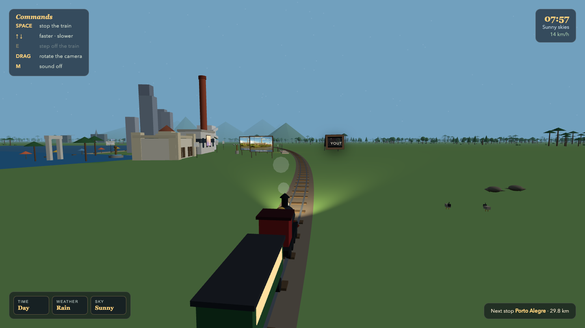

# Trem do Rio Grande

A 3D web train ride across Rio Grande do Sul, Brazil. You ride a steam train on a loop through six stops, each with landmarks of the real place. Time passes, day turns into night, rain comes and goes. You can stop the train anywhere, step off and walk the towns on foot.

## Run

```
./start.sh
```

Open http://localhost:8098 and click to board.

```
./stop.sh
```

## Controls

- SPACE stops and starts the train
- E steps off the train when it is stopped, and boards again when you are next to it
- WASD walks, SHIFT runs, mouse looks around while walking

## The route

- Porto Alegre: the Gasômetro powerhouse with its brick chimney, downtown towers, the Mercado Público, the Laçador and the Guaíba water
- Gramado: alpine chalets, hydrangeas and the Palácio dos Festivais with its red carpet and Kikito trophies
- Canela: the stone Cathedral of Our Lady of Lourdes and the Caracol Falls among araucaria pines
- São Miguel das Missões: the red sandstone ruins of the Jesuit-Guarani mission, a UNESCO World Heritage site
- Uruguaiana: the international bridge over the Uruguay River to Paso de los Libres, Argentina, with cattle on the pampa
- Sant'Ana do Livramento: the Parque Internacional obelisk on the open border square shared with Rivera, Uruguay

A full day passes every 4 minutes: sunrise, noon, sunset with an orange sky, then stars, lit station lamps and the locomotive headlight at night. Rain showers roll in and out on their own.

## Screenshot



The train arriving at Porto Alegre in the early afternoon. On the left, the white Gasômetro building with its brick chimney, the downtown towers and the blue Guaíba. The top panel tells the story of the place you are passing, the top right shows the in-game clock and the weather, the bottom right shows the next stop and the distance left, and the bottom center shows the keys you can use right now. Ahead of the locomotive, the green hills of the Serra Gaúcha on the way to Gramado.

## Stack

Plain HTML and JavaScript with Three.js served locally, no build step.
