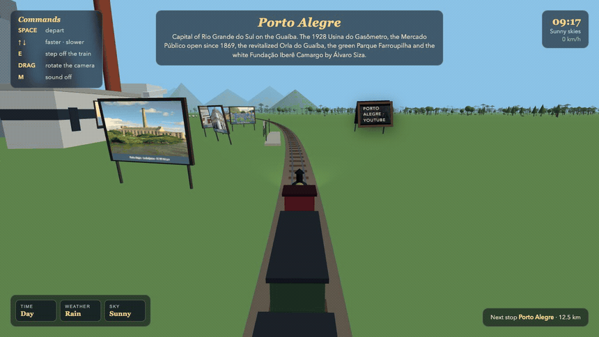

# Trem do Rio Grande

A 3D web train ride across Rio Grande do Sul, Brazil. You ride a steam train on a loop through seven stops, each with five real landmarks built in 3D and signed by name. Time passes, day turns into night, rain comes and goes, the engine chugs and whistles. You can stop the train anywhere, step off and walk among the landmarks on foot.

## Run

```
./start.sh
```

Open http://localhost:8098 and click to board.

```
./stop.sh
```

## Controls

All commands are always listed in the panel on the top left corner of the screen.

- SPACE stops and starts the train, with a steam whistle on departure
- ARROW UP and ARROW DOWN speed the train up and slow it down
- E steps off the train when it is stopped, and boards again when you are next to it
- Mouse drag rotates the camera around the train while riding
- WASD walks, SHIFT runs, mouse looks around while walking
- M turns the sound off and on

## The route

Every landmark stands in the scenery with its own signpost, so you can walk up and read what it is.

- Porto Alegre: the Usina do Gasômetro with its brick chimney, the Mercado Público of 1869, the Orla do Guaíba waterfront with umbrellas and a sports court, Parque Farroupilha with its fountain and monument, the white Fundação Iberê Camargo, downtown towers and the Laçador
- Gramado: the basalt Igreja Matriz São Pedro, the Palácio dos Festivais with its red carpet and Kikitos, Lago Negro with a swan pedal boat among pines, the Mini Mundo miniature park, the zig-zag Rua Torta, chalets and hydrangeas
- Canela: the Gothic Catedral de Pedra, the Cascata do Caracol falling into its canyon, the glass Skyglass platform over the edge, Alpen Park with its alpine coaster and zipline, and the horseshoe river of Parque da Ferradura
- São Miguel das Missões: the red sandstone Ruínas de São Miguel Arcanjo, the Som e Luz benches and light towers, the Museu das Missões on its columns, the Fonte Missioneira and the Santuário do Caaró
- Uruguaiana: the Ponte Getúlio Vargas over the Uruguay River to Argentina, the cable-stayed Ponte da Integração, the Catedral de Sant'Ana, the Praça Barão do Rio Branco and the tri-border Ilha Brasileira, with cattle on the pampa
- Chuí: the Avenida Internacional split between Brazil and Uruguay with both flags, the duty free shops, the Farol do Chuí, the Forte de São Miguel and the star-shaped Fortaleza de Santa Teresa
- Torres: the basalt cliffs of Parque da Guarita, the lighthouse on Morro do Farol, the sea lions of Ilha dos Lobos, Praia da Cal and the Ponte Pênsil over the Mampituba river into the Atlantic

## Pictures on the walls

Each stop has a framed picture mounted on one of its buildings, painted with the landmark of that same city: the Guaíba sunset behind the Gasômetro in Porto Alegre, a Serra chalet with hydrangeas in Gramado, the Cascata do Caracol in Canela, the red sandstone arches of the Missões, the pampa with cattle and a wire fence in Uruguaiana, the Farol do Chuí, and the basalt towers of Torres. They are drawn on canvas in the browser, no image files.

## The pampa

Between the stops the land is alive. Flat-topped araucária pines rise over the Serra, tufts of pampas grass sway across the campo, and the fields are worked with wire fences and slowly turning farm windmills. Riding through it you pass herds of cattle, flocks of sheep, crioulo horses, rheas (emas), capybaras and the quero-quero birds of Rio Grande do Sul, scattered across the pampa and kept clear of the track and the towns.

## Sound

The engine chugs in rhythm with the wheels, a whistle blows on every departure and rain hisses when a shower rolls in. Everything is synthesized in the browser with WebAudio, no audio files, and M silences it all.

A full day passes every 4 minutes: sunrise, noon, sunset with an orange sky, then stars, lit station lamps and the locomotive headlight at night. Rain showers roll in and out on their own.

## Ride



Riding the train into Porto Alegre and watching the city video play on the station billboard, then rolling on through the pampa toward Gramado.

## Screenshot


The train approaching Porto Alegre in the morning. On the left, the Gasômetro, downtown towers, the Guaíba waterfront and landmark photo boards fill the city. The command panel lists every available action, the top right shows the in-game clock, weather and train speed, the bottom right shows the next stop and distance, and the bottom left controls the time, weather and sky. Animals cross the pampa beside the track while the locomotive headlight and smoke lead the train into the city.

## Stack

Plain HTML and JavaScript with Three.js served locally, no build step.
