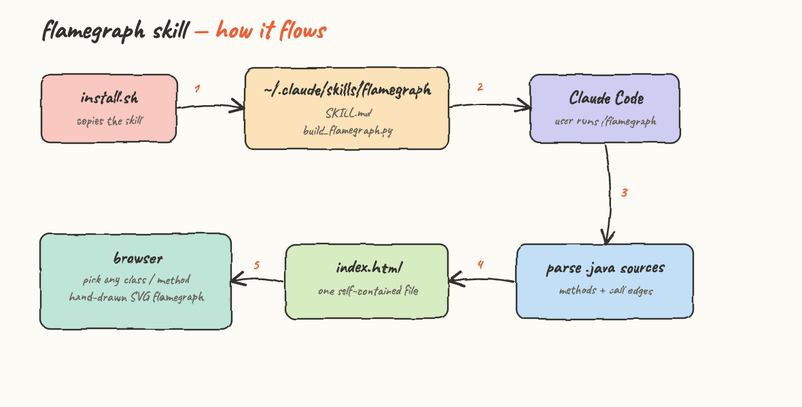
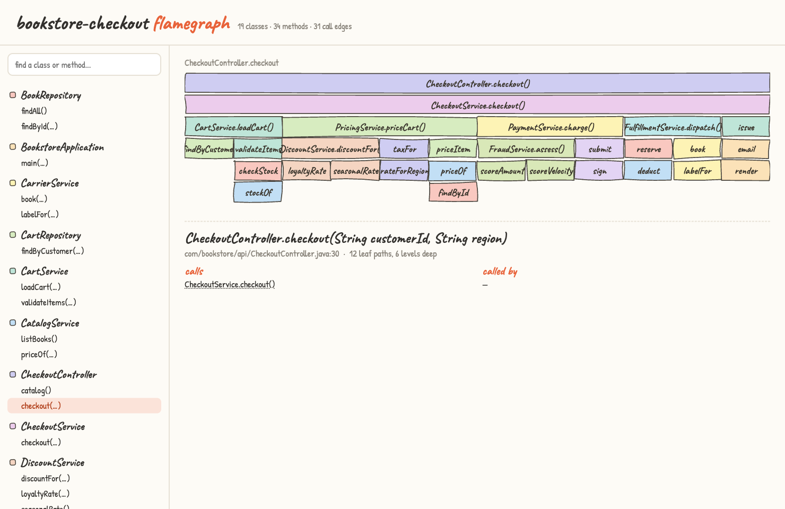
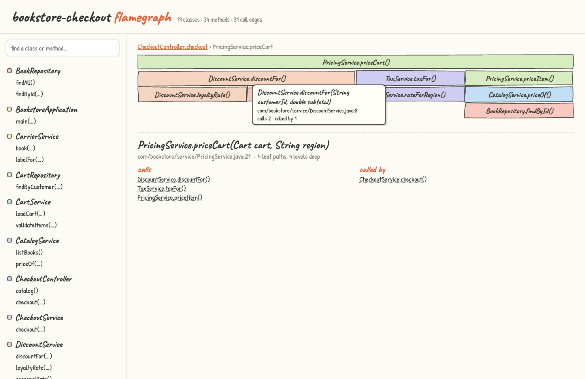
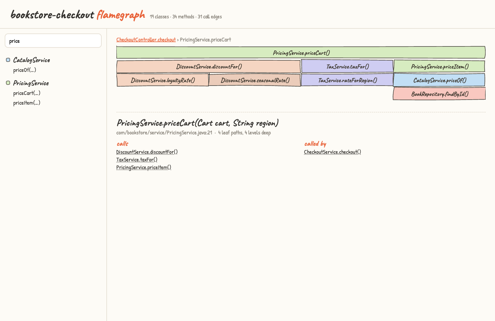

# flamegraph — a Claude Code agent skill

A Claude Code skill that turns any Java codebase into an interactive **function call-graph flamegraph**.
It parses the sources, extracts every method and the calls between them, and renders a light-theme website
where you pick any class or method and watch its call tree bloom as a **hand-drawn SVG flamegraph** —
wobbly frames, pastel fills per class, handwriting fonts.

## How it flows



1. `install.sh` copies the skill into the global Claude Code directory
2. The skill lives at `~/.claude/skills/flamegraph` as `SKILL.md` plus `build_flamegraph.py`
3. Inside any Java project you run `/flamegraph` and Claude Code picks the skill up
4. `build_flamegraph.py` walks the `.java` sources and resolves the call graph from field, parameter, and local-variable types
5. It writes one self-contained `index.html` — open it in a browser, no server or build step required

## Install

```bash
./install.sh
```

Restart Claude Code and run `/flamegraph` in any Java project.

## Uninstall

```bash
./uninstall.sh
```

## Running the generator directly

The skill is a single Python script with zero dependencies:

```bash
python3 ~/.claude/skills/flamegraph/build_flamegraph.py <java-src-dir> <out-dir> [title]
```

Against the sample project in this repo:

```bash
python3 skill/build_flamegraph.py sample/src/main/java flamegraph-site bookstore-checkout
open flamegraph-site/index.html
```

## The website



The left panel lists every class with its methods, each class tagged with the pastel color its frames use
in the chart. Selecting `CheckoutController.checkout` roots the flamegraph at the HTTP endpoint and the
whole checkout flow unfolds underneath it: cart loading, pricing, payment, fulfillment, and receipt issuing,
six levels deep down to the repositories. Frame width is proportional to the number of distinct call paths
below it, and the detail panel underneath shows the signature, `file:line`, direct calls, and callers.



Clicking any frame re-roots the chart into it — here `PricingService.priceCart` — and the breadcrumb trail
at the top walks back up. Hovering a frame pops a tooltip with the full signature, the source location, and
the fan-out / fan-in counts. Recursive cycles are pruned and marked with `↺`.



The search box filters classes and methods live, so jumping from `priceCart` to `priceOf` to
`BookRepository.findById` takes two keystrokes and a click.

## The sample project

`sample/` is a **Java 25, Spring Boot 4.0.6** bookstore checkout service: 19 classes, 34 methods, and
31 call edges across a controller, ten services, and three in-memory repositories.

```bash
cd sample
mvn spring-boot:run
```

```bash
curl http://localhost:8080/catalog
curl -X POST "http://localhost:8080/checkout?customerId=diego&region=CA"
```

Verified output:

```json
{"orderId":"807f2175-f88b-49ef-b33e-1e9af9bd7c1c","customerId":"diego","total":176.43875,"trackingCode":"TRK-95580520","issuedAt":"2026-06-12T17:39:52.681325Z"}
```

The checkout call chain is intentionally deep so the flamegraph has something to show:
`CheckoutController.checkout` → `CheckoutService.checkout` → cart validation against stock, per-item
pricing with discount and tax, fraud-scored payment through a gateway client, inventory reservation with
carrier booking, and finally a receipt emailed through the notification service.

## How the call graph is built

The generator is static analysis over source text, standard library only:

- strips strings and comments, then finds method declarations and matches their brace-delimited bodies
- tracks declared types of fields, parameters, and local variables
- resolves `owner.method()` calls through those types, bare `method()` calls to the same class, and `Class.method()` statics
- emits the graph as JSON embedded in `index.html`, where the flamegraph is laid out and sketched client-side

Dynamic dispatch resolves only when the declared type itself defines the method — it is a map of what the
code says, not a profiler trace.

## Layout

```
install.sh                  installs the skill globally
uninstall.sh                removes it
skill/SKILL.md              the agent skill definition
skill/build_flamegraph.py   parser + site generator
sample/                     Java 25 + Spring Boot 4.0.6 bookstore checkout
flamegraph-site/index.html  generated site for the sample
printscreens/               diagram and site captures
```
