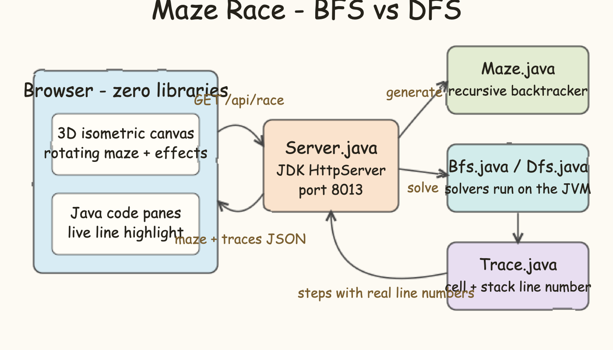
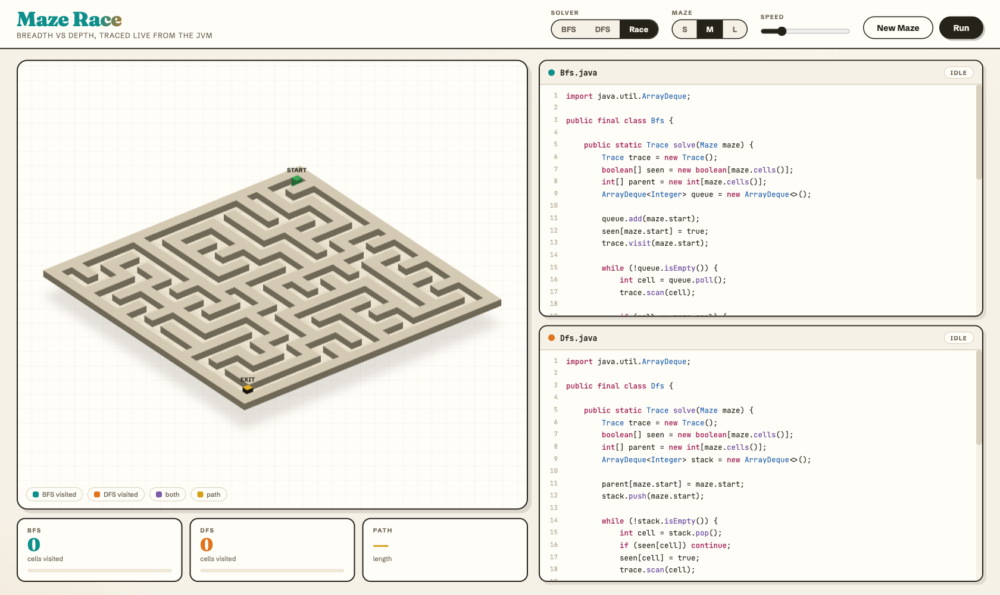
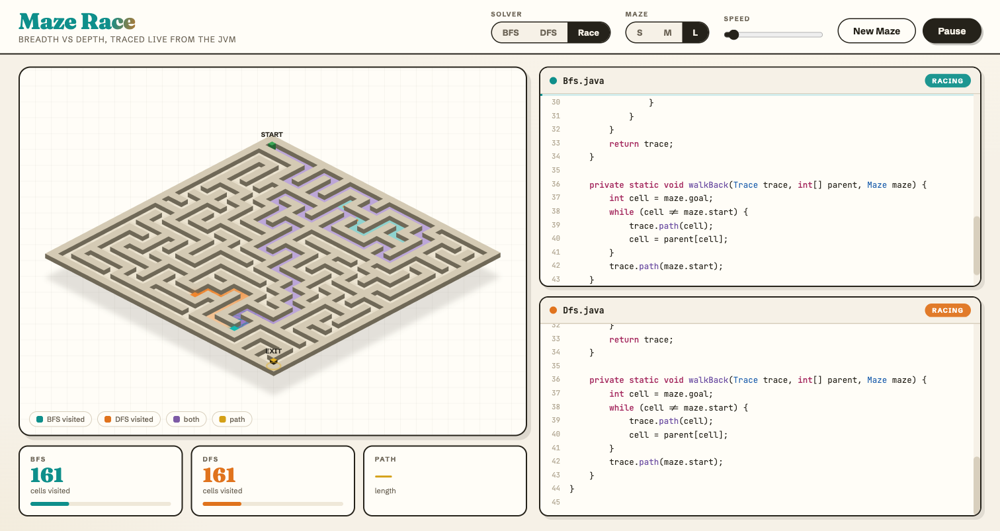
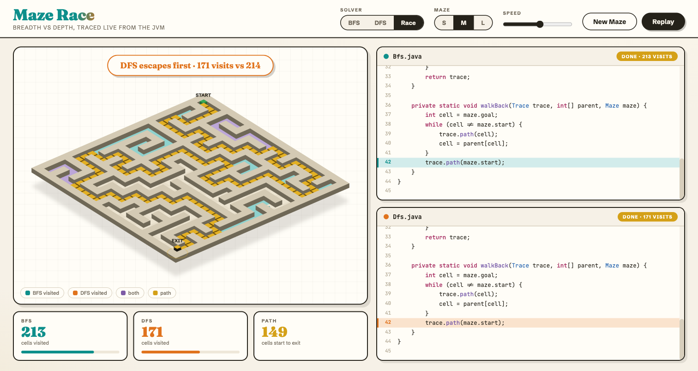
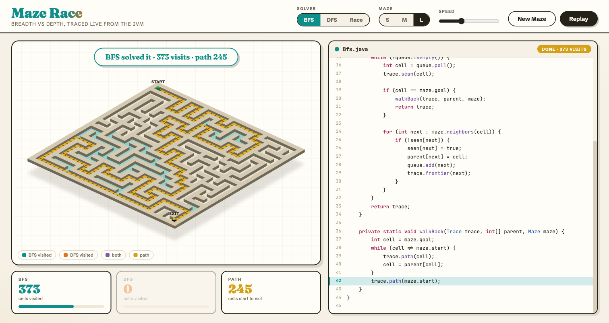

# Maze Race — BFS vs DFS, traced live from the JVM

A maze generator and solver race. The backend is pure Java (JDK only, no dependencies): it carves a perfect maze with a recursive backtracker, then solves it twice — once with Breadth-First Search, once with Depth-First Search — recording every move each algorithm makes. The browser replays both traces side by side: a 3D maze on the left, the real Java solver source on the right, with the currently executing line highlighted in sync with every cell the algorithm touches.

The line sync is not faked. Each `trace.visit / scan / frontier / path` call captures its caller's line number from the JVM stack (`Thread.currentThread().getStackTrace()`), so the highlight in `Bfs.java` and `Dfs.java` always points at the exact statement that produced that step.

## Architecture



- `Maze.java` — perfect maze generation (recursive backtracker over a wall grid, seeded `Random`)
- `Bfs.java` / `Dfs.java` — the racers; queue vs stack, same maze, same start and exit
- `Trace.java` — records `(type, cell, line)` steps, line taken from the live stack frame
- `Server.java` — `com.sun.net.httpserver` on port 8013; serves the site, the raw solver sources, and `GET /api/race?size=&seed=` returning the maze plus both step traces as JSON
- `web/` — zero-library frontend: hand-rolled 3D isometric canvas renderer, hand-rolled Java syntax highlighter with line numbers, and a playback engine that consumes both traces at the chosen speed

## Run it

```bash
./start.sh
```

Open http://localhost:8013 then:

```bash
./stop.sh
```

## The site



The landing view. The maze renders as a rotating 3D isometric board (drag it to spin). Walls are extruded prisms with directional shading, the START pillar is green, the EXIT pillar carries a gold cap with a pulsing beacon ring. On the right, `Bfs.java` and `Dfs.java` are fetched straight from the server and rendered with syntax colors and line numbers — what you read is exactly what runs on the JVM.



Race mode, mid-flight on a large maze. BFS floods outward in teal while DFS commits to one corridor in orange; cells visited by both blend to purple, frontier cells show as colored dots, and each algorithm's current cell is a raised, glowing, pulsing block. Both code panes run at once: the teal highlight tracks the line BFS is executing, the orange one tracks DFS, and the panes auto-scroll to follow the loop. The cards below count visited cells live with progress bars.



The finish. The first algorithm to scan the exit cell wins and the banner calls it with the visit counts. The winning route rises out of the floor as a chain of gold blocks while both panes pin to the `walkBack` path reconstruction lines. Since a perfect maze has exactly one route between two cells, both solvers reveal the same path — the race is about how much of the maze they had to burn to find it.



Single-solver mode. Pick BFS or DFS in the Solver control and the other pane and stat card step aside, giving the chosen algorithm the full code panel. Here BFS solved a large maze in 373 visits for a 245-cell path.

## Controls

| Control | What it does |
|---|---|
| Solver | BFS, DFS, or Race (both at once on the same maze) |
| Maze | S / M / L — 15, 25, or 35 grid |
| Speed | 10 to 400 trace steps per second, adjustable mid-run |
| New Maze | carve a fresh maze and re-run both solvers on the server |
| Run | start, pause, resume, replay |
| Drag the maze | rotate the 3D view |

## Stack

Java 25, `com.sun.net.httpserver`, vanilla HTML/CSS/JS. No frameworks, no build step, no frontend libraries — the 3D projection, painter's-algorithm rendering, and Java tokenizer are all hand-rolled in `web/app.js`.
