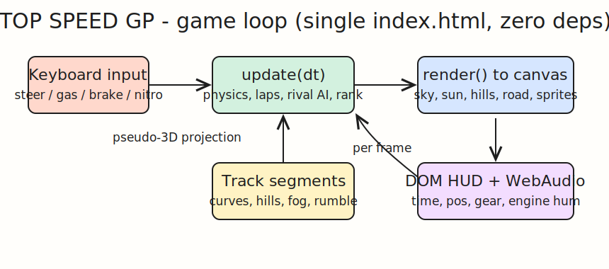
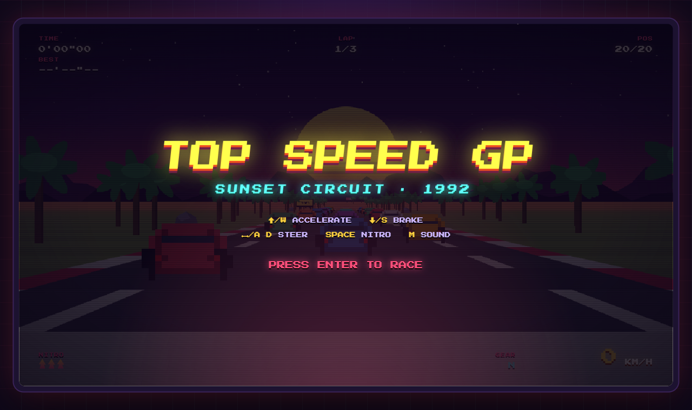
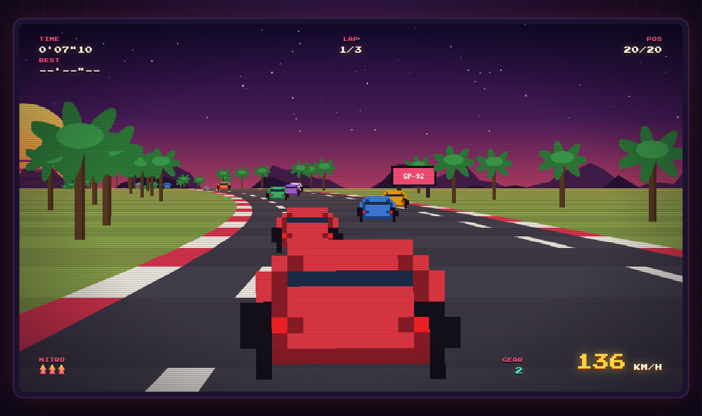
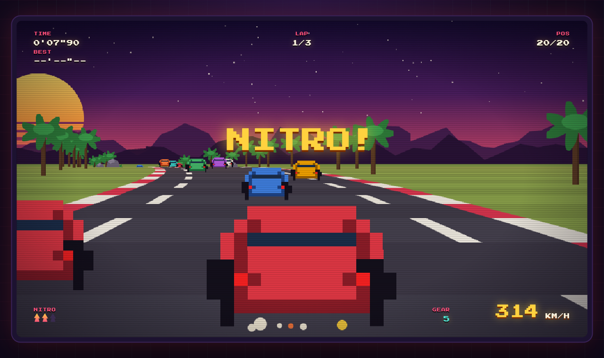
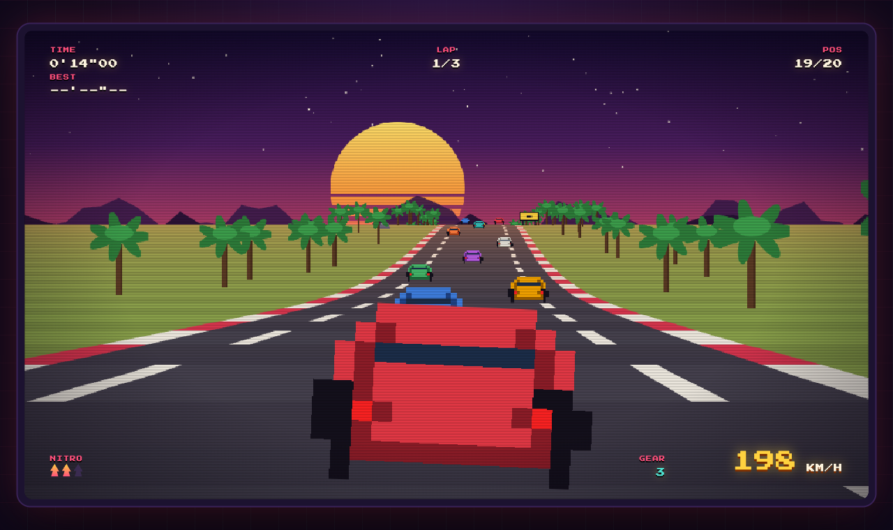

# TOP SPEED GP

A Top Gear style pseudo-3D arcade racing game that runs in the browser. One HTML file, plain canvas and vanilla JS, zero libraries. Sunset circuit, 19 rival cars, 3 laps, nitro boosts, lap timing and a CRT scanline bezel.

## Run

```bash
./start.sh
```

Open http://localhost:8422 then press ENTER. Stop the server with:

```bash
./stop.sh
```

## Controls

| Key | Action |
|-----|--------|
| Up / W | Accelerate |
| Down / S | Brake |
| Left, Right / A, D | Steer |
| Space | Nitro (3 charges) |
| M | Toggle engine sound |
| Enter | Start / restart race |

Grass slows you down, hitting a rival slows you down more, and the centrifugal force in curves pushes you off the road, so brake before the hard ones.

## How it works



The track is an array of segments, each with a curve and an elevation. Every frame the camera projects ~300 segments to the screen back to front, which gives the classic SNES-era pseudo-3D road: curves bend the projection sideways, hills move the horizon, exponential fog fades the far segments into the sunset. Cars, palms, rocks and billboards are pixel-art sprites generated on offscreen canvases at load, scaled by the same projection. The HUD is DOM on top of the canvas, and the engine hum is a single WebAudio sawtooth whose pitch follows your speed.

## Screenshots

Title screen:



Racing through traffic, third gear:



Nitro boost, 314 km/h:



Climbing into the sunset:


