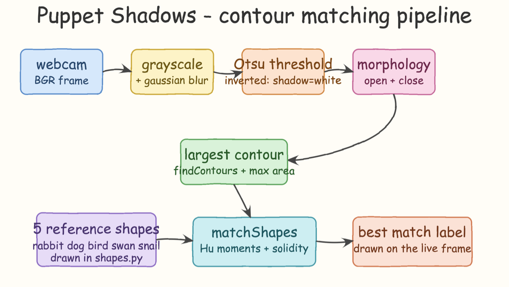
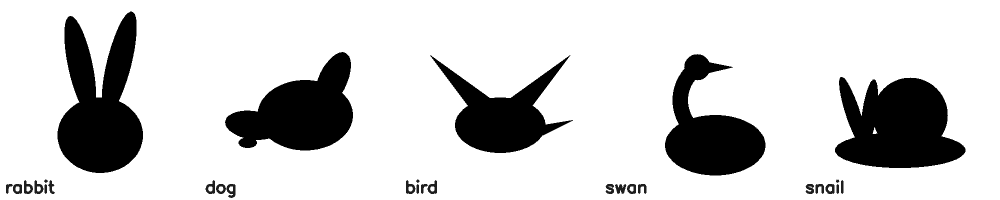
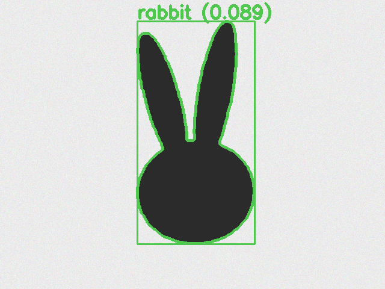
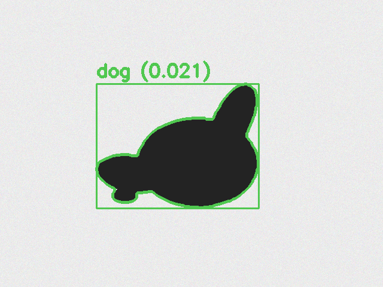
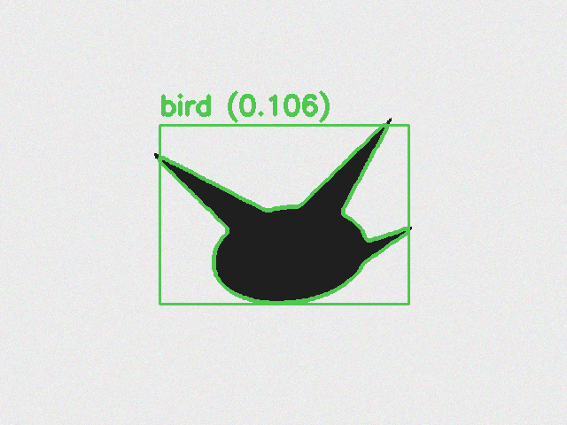
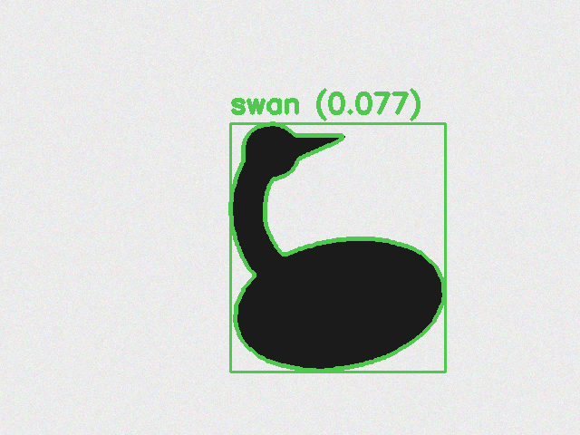
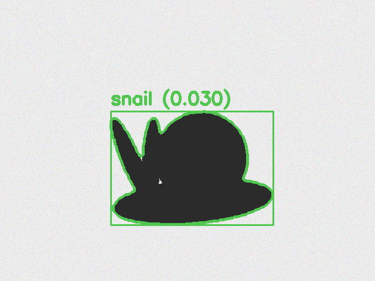

# Puppet Shadows CV

Hand-shadow puppet recognition with OpenCV contour matching. Point your webcam at a wall, make a shadow puppet with your hands, and the app names the animal in real time: **rabbit**, **dog**, **bird**, **swan**, or **snail**.

No machine learning, no models, no training. Just classic computer vision: Otsu thresholding, contour extraction, and Hu-moment shape matching.

## How it works



1. **Capture** — each webcam frame is mirrored and converted to grayscale, then smoothed with a Gaussian blur.
2. **Segment** — an inverted Otsu threshold turns the dark shadow into a white blob on black. Morphological open + close remove speckle noise and seal small gaps.
3. **Extract** — `findContours` runs on the mask and the largest contour wins. Blobs smaller than 2% of the frame are ignored, so random dark spots don't trigger matches.
4. **Match** — the contour is compared against five reference silhouettes with `cv2.matchShapes` (Hu-moment distance, `CONTOURS_MATCH_I1`), which is invariant to translation, scale, and rotation. A solidity term (contour area / convex-hull area) is added to the score, because Hu moments alone confuse compact shapes (snail) with concave ones (swan's curved neck).
5. **Label** — the best match below the 0.45 score limit is drawn on the live frame in green, with the score; anything above shows `no puppet` in red.

The five reference silhouettes are generated at startup from OpenCV drawing primitives in `shapes.py`, so there are no image assets to ship:



## Run it

```bash
./start.sh
```

First run creates a `venv` and installs `opencv-python`. A window opens with the live camera feed; press `q` in the window or run:

```bash
./stop.sh
```

You can also run the pipeline on a still photo of a shadow:

```bash
./venv/bin/python app.py --image input.png output.png
```

## Results

Each frame below was produced by the real pipeline in `app.py` against a shadow silhouette randomly rotated and scaled onto a noisy bright wall, so the matcher never sees the exact reference shape. Lower score = closer match.

| | |
|---|---|
|  |  |
|  |  |



Across 20 randomized trials (5 puppets x 4 rotation/scale perturbations) every silhouette was classified correctly, with match scores between 0.005 and 0.11 against a reject limit of 0.45.

## Tips for real shadows

- Use a bright, evenly lit wall and keep your hands between a single light source and the wall.
- The sharper the shadow edge, the better Otsu separates it; move hands closer to the wall.
- Hold the pose for a moment: matching is per-frame, so a steady shape gives a steady label.

## Files

| File | Purpose |
|---|---|
| `app.py` | Camera loop, segmentation, classification, overlay |
| `shapes.py` | The five reference silhouettes and contour helpers |
| `start.sh` / `stop.sh` | Launch and kill the app (pid tracked in `app.pid`) |
| `architecture.svg` | Source of the pipeline diagram |
