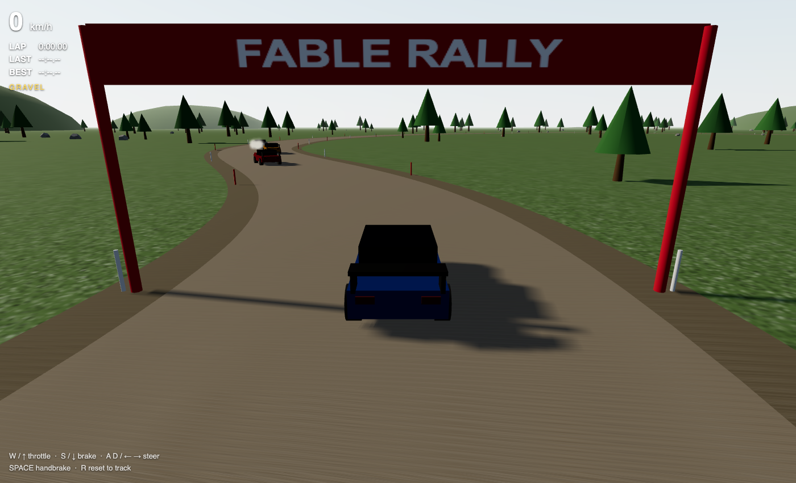
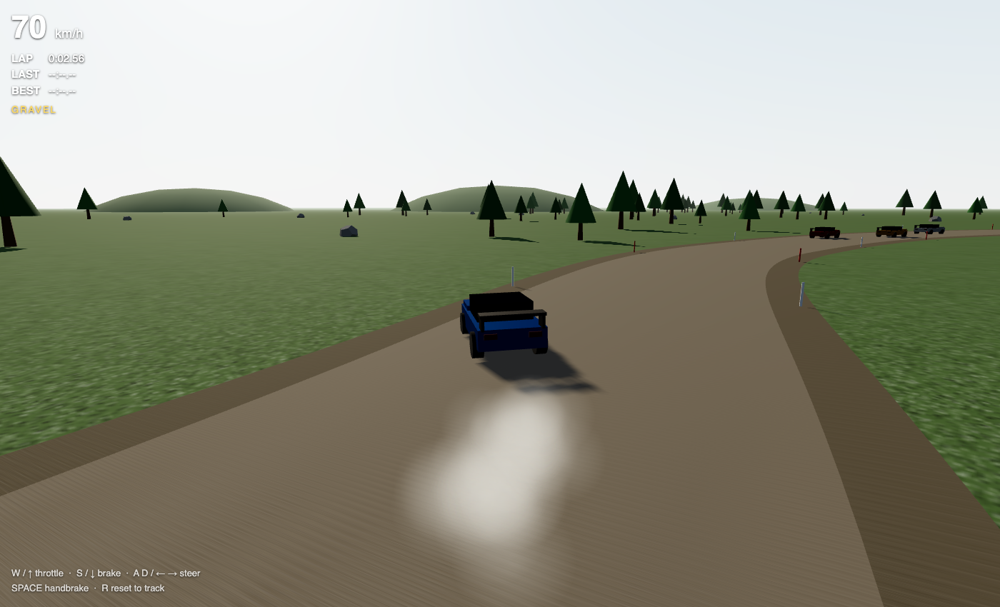
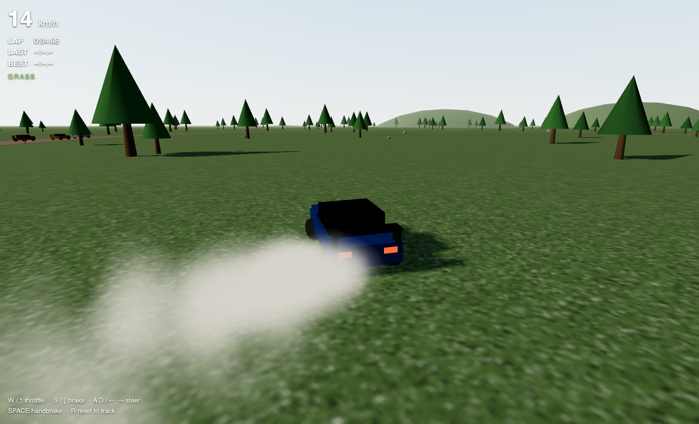
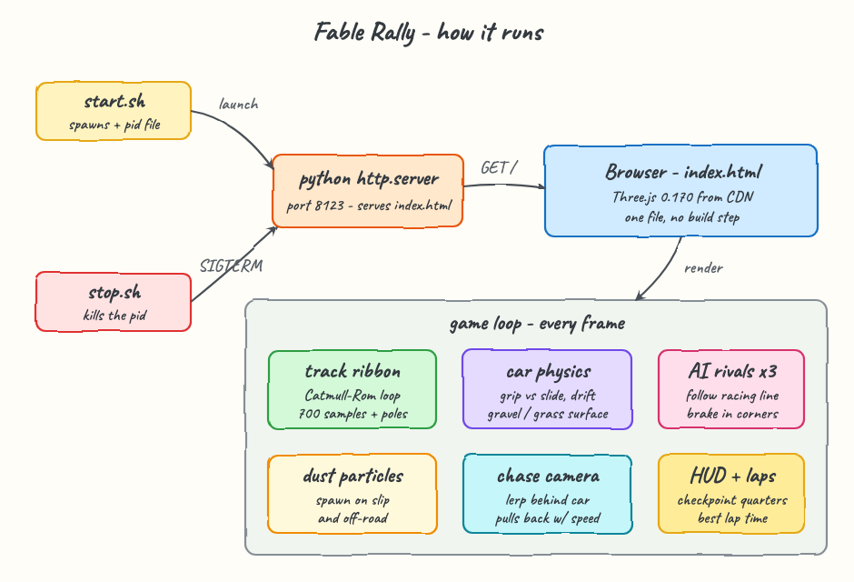

# Fable Rally

A 3D rally racing game that runs entirely in the browser. One HTML file, one library (Three.js loaded from CDN), no build step. You race a rally car over a ~1.2 km gravel loop against three AI rivals, chasing your best lap time.

## Run

```bash
./start.sh
```

Open http://localhost:8123 and drive. To shut down:

```bash
./stop.sh
```

## Controls

| Key | Action |
|-----|--------|
| W / Arrow Up | Throttle |
| S / Arrow Down | Brake, then reverse |
| A D / Arrow Left Right | Steer |
| Space | Handbrake (kick the rear out) |
| R | Reset car onto the track |

## What it looks like

The start line. Your blue car sits under the banner while the red, yellow and white rivals are already pulling away up the road:



Full throttle down the gravel at ~70 km/h, dust kicking up behind the rear wheels, rivals visible ahead:



Handbrake thrown mid-corner: the rear steps out, brake lights glow, and the tires plume dust while speed scrubs off:



## How it works



- **Track**: a closed Catmull-Rom spline through 14 control points is sampled 700 times. Each sample's tangent and normal extrude a triangle ribbon for the gravel road plus a wider dirt shoulder. Red and white marker poles, trees, rocks and far hills are scattered with a minimum distance from the spline.
- **Car physics**: arcade rally model. Velocity is split into forward and lateral parts every frame; grip bleeds the lateral part away. Gravel grips more than grass, the handbrake almost removes grip entirely, which is what lets you drift. Throttle force, drag and steering authority all depend on the surface under the car and current speed.
- **Surface detection**: nearest spline sample distance decides GRAVEL vs GRASS, shown live in the HUD.
- **AI rivals**: three cars follow the spline with a lateral offset. Their target speed drops with the local curvature of the road, so they brake into hairpins (brake lights included) and accelerate out. Bumping into one pushes you off and costs you speed.
- **Lap timing**: the clock starts on your first throttle input. Four checkpoint quarters around the loop must be crossed in order, so cutting across the grass never counts. Last and best lap times stay on the HUD.
- **Rendering**: Sky shader with sun-matched directional light, soft shadows that follow the car, ACES tone mapping, fog, canvas-generated gravel and grass textures, and a particle system for tire dust.
- **Sound**: a small WebAudio engine note that rises with revs, started on the first key press.

## Stack

- [Three.js](https://threejs.org) 0.170 via CDN import map
- Python `http.server` for static serving
- Zero npm, zero build
