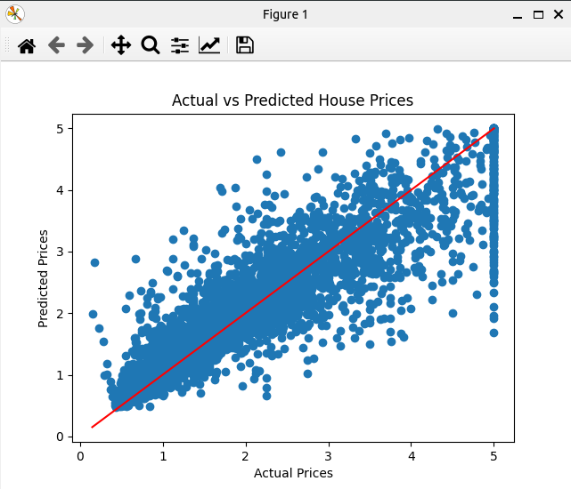

### Result
* Feature Engineering
* Claifornia House Dataset
* Feature Engineering means to create new features from existing features
* Feature Engineering is a process of transforming raw data into features that better represent the underlying problem to the predictive models, resulting in improved model accuracy on unseen data.

