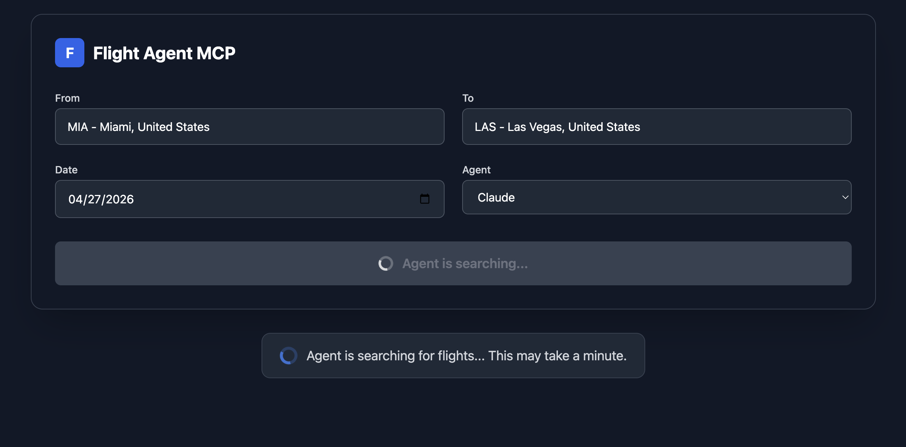
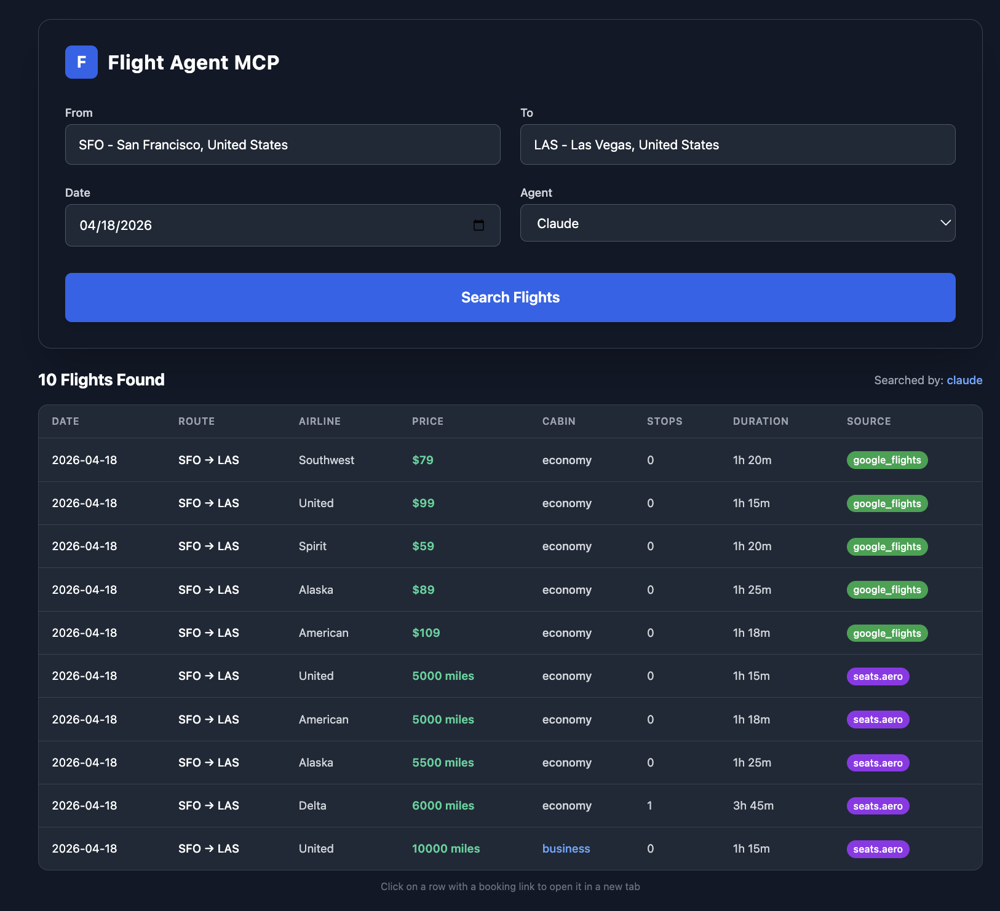

# Flight MCP Skill Search Agent

A flight search application powered by AI agents. Uses Claude or Codex as intermediaries to search for award flights (Seats.aero) and cash prices (Google Flights via SerpAPI) through the travel-hacking-toolkit skills.

| 1 - Search Form with Airport Autocomplete and Agent Selection | 2 - Flight Results Grid with Prices and Sources |
|:--:|:--:|
|  |  |

The search form provides airport autocomplete (city, country, IATA code), date picker, and agent selection (Claude or Codex). Results are displayed in a sortable grid showing cash prices (Google Flights) and award prices (Seats.aero) side by side. Each row is clickable and opens Google Flights for booking.

## Architecture

```
┌─────────────────┐     REST      ┌─────────────────┐
│    Frontend     │──────────────►│     Backend     │
│  React 19/Vite  │   POST/GET    │   Rust/Axum     │
└─────────────────┘              └────────┬────────┘
                                          │
                                          ▼
                                 ┌─────────────────┐
                                 │   CLI Agents    │
                                 │ claude, codex   │
                                 └────────┬────────┘
                                          │
                                          ▼
                                 ┌─────────────────┐
                                 │  Flight APIs    │
                                 │ seats.aero      │
                                 │ serpapi          │
                                 └─────────────────┘
```

## Features

- Airport autocomplete with 90+ international airports (search by code, city, country)
- Agent selection: Claude or Codex
- Flight results grid with color-coded cabins and source badges
- Click-to-book: clicking a result row opens the booking website
- Award flights (miles/points) via Seats.aero
- Cash prices via Google Flights (SerpAPI)

## Requirements

- Rust 1.94+
- Bun
- At least one AI CLI tool installed (claude or codex)
- [travel-hacking-toolkit](https://github.com/borski/travel-hacking-toolkit) skill must be installed in Claude Code first

## Running

Start all services:
```bash
./run.sh
```

Stop all services:
```bash
./stop.sh
```

Access the UI at http://localhost:5173

## API Endpoints

| Method | Endpoint | Description |
|--------|----------|-------------|
| POST | /api/search | Search flights via AI agent |
| GET | /api/agents | List available agents |

## Project Structure

```
backend/
├── src/
│   ├── main.rs           # Entry point
│   ├── lib.rs            # Module declarations
│   ├── routes/           # API handlers
│   └── agents/           # CLI agent runners (claude, codex)

frontend/
├── src/
│   ├── components/       # SearchForm, ResultsGrid
│   ├── api/              # API client
│   ├── data/             # Airport data
│   └── types/            # TypeScript types
```

## Tech Stack

**Backend**: Rust (edition 2024), Axum, Tokio

**Frontend**: React 19, TypeScript, TanStack Query, Tailwind CSS, Vite, Bun
