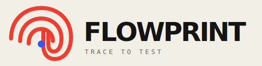
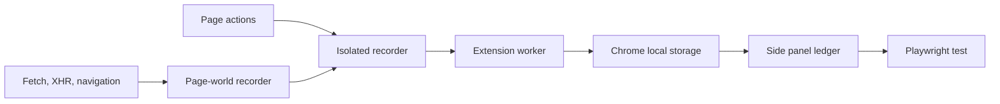

<p align="center">
  
</p>

<p align="center"><strong>Turn real browser journeys into Playwright tests.</strong></p>

<p align="center">GitHub by <a href="https://diegopacheco.github.io">Diego Pacheco</a></p>

# FlowPrint

FlowPrint is a dependency-free Chrome extension that records browser interactions and produces a Playwright test from the trail. Recording lives in a persistent side panel, so the captured journey stays visible while the page changes.

## Features

- Records navigation, clicks, form values, Enter key submissions, selections, submissions, Fetch calls, and XMLHttpRequests
- Prefers stable Playwright locators such as test IDs, labels, roles, IDs, and names
- Redacts password values before storing them
- Shows HTTP method, status, duration, failures, and request address
- Generates a TypeScript Playwright test with exact accessible-name locators and stable route assertions in real time
- Highlights the generated TypeScript directly in the side panel
- Copies the test or saves it as `flow.spec.ts`
- Runs the generated test and opens the latest Playwright HTML report
- Stores the active session locally in Chrome
- Uses no runtime libraries and sends no analytics

## Stack

- Chrome Manifest V3
- Plain JavaScript, HTML, and CSS
- Chrome Side Panel, Tabs, and Storage APIs
- Node.js built-in test runner
- Playwright-compatible TypeScript output

Generated password steps read from `FLOWPRINT_SECRET` so sensitive values do not enter the recording or test file.

## How it works



The page-world recorder wraps Fetch, XMLHttpRequest, and History APIs. It publishes sanitized events to the isolated recorder. The isolated recorder captures user interactions, creates durable locators, and sends each mark to the extension worker. The worker owns the session and updates the side panel.

## Install

Run:

```bash
./install.sh
```

Enable Developer mode on Chrome's extensions page, select **Load unpacked**, and choose the `flowprint` folder opened by the script.

## Use

1. Open an HTTP or HTTPS page.
2. Select the FlowPrint toolbar button.
3. Select **Start recording**.
4. Use the page normally.
5. Select **Stop recording**.
6. Select **Run Playwright**.
7. Select **Show Report** to open the report from that run.

The install script installs Playwright and starts the local Python runner in the background. The runner, generated spec, log, and latest report stay under `/tmp/flowprint`. The uninstall script stops it.

Chrome blocks content scripts on internal pages such as `chrome://settings` and the Chrome Web Store.

## Test

Run:

```bash
./test.sh
```

The checks validate locator generation, string escaping, stable test generation, and the extension manifest.

## Uninstall

Run:

```bash
./uninstall.sh
```

Select FlowPrint on Chrome's extensions page and choose **Remove**.

## Privacy

Sessions stay in Chrome local storage. Password fields are stored as `[redacted]`. Network request bodies, headers, cookies, and response bodies are never captured.

## Project layout

```text
assets/
manifest.json
src/
tests/
install.sh
test.sh
uninstall.sh
```
