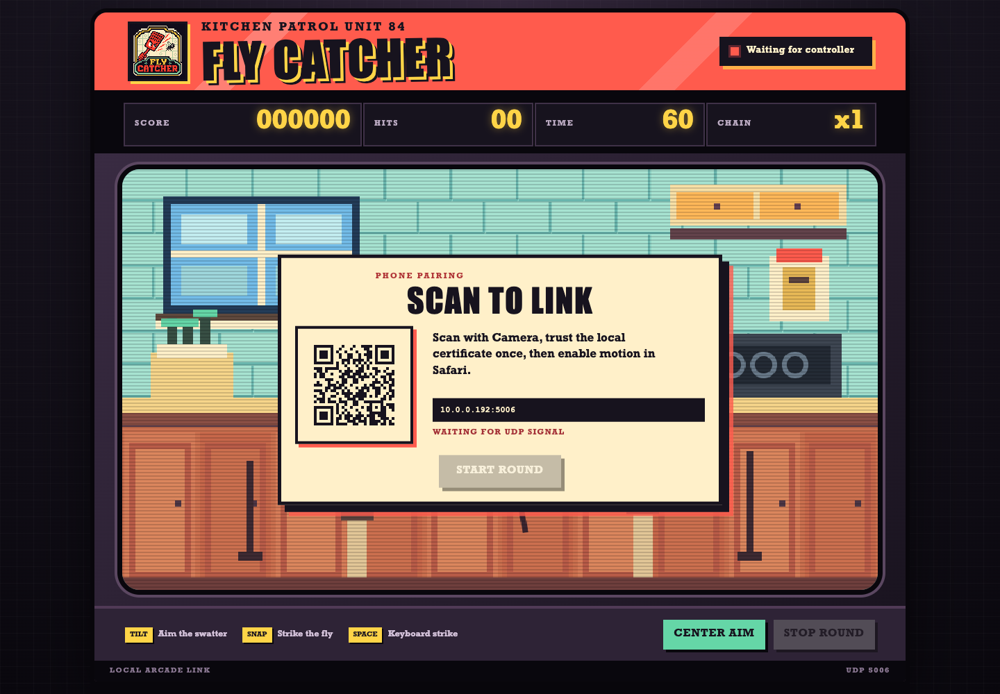
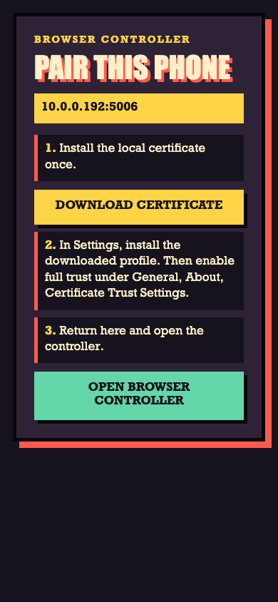

# Fly Catcher


Fly Catcher is a local 8-bit kitchen arcade game controlled from Safari on an iPhone. It uses no native phone app, third-party package, cloud service, account, or public endpoint.

The Mac serves the game only on loopback. The QR code opens a private-LAN setup page on the phone. After a one-time local certificate installation, Safari reads accelerometer motion through HTTPS and sends it to the Mac. The Mac relays each control packet through the local UDP receiver before the game receives it.

## Screens



The opening screen keeps the game on the Mac. The logo appears in the upper-left marquee, while the pairing card shows the current private address and a QR code generated for this run. The round remains locked until the phone controller sends its first packet.



The phone pairing page stays on the private network. First download the local certificate, install its profile, enable full trust in iPhone Settings, then return and open the browser controller.

## Requirements

- macOS with Node.js 20 or newer
- OpenSSL or LibreSSL
- iPhone and Mac on the same private Wi-Fi network
- Safari on the iPhone

## Start

```bash
chmod +x start.sh stop.sh test.sh
./start.sh
```

Open the game address printed by the script. The preferred address is `http://127.0.0.1:8080`.

The script also prints the private phone pairing address. The game displays that address as a QR code.

## Connect the iPhone browser controller

The certificate setup is required once for each iPhone and Mac-generated certificate authority. Safari permits accelerometer access only from a trusted HTTPS page.

Apple documents the profile installation process at [Install a configuration profile](https://support.apple.com/en-mide/102400) and the additional trust step at [Trust manually installed certificate profiles](https://support.apple.com/en-ie/102390).

1. Scan the QR code on the Mac with the iPhone Camera.
2. Open the private pairing page.
3. Tap `Download Certificate`.
4. Open iPhone Settings.
5. Tap `Profile Downloaded`, or open `General`, `VPN & Device Management`.
6. Select `Fly Catcher Local Certificate` and tap `Install`.
7. Open `General`, `About`, `Certificate Trust Settings`.
8. Enable full trust for `Fly Catcher Local Root`.
9. Return to the pairing page by scanning the QR again.
10. The trusted controller opens automatically.
11. Tap `Enable Motion` in Safari.
12. Approve the motion permission request.

The controller status turns green after its first packet reaches the game. The game Start button unlocks only after that packet arrives.

After the one-time certificate setup, future QR scans test local HTTPS trust silently and open the controller automatically. The certificate instructions appear only when the trust check fails. A manual `Open Browser Controller` button remains available.

## Play

- Hold the iPhone upright in portrait orientation.
- Tilt the phone to aim the swatter.
- Push the phone forward quickly to snap.
- Press the large `Snap` button for a manual strike.
- Press `Center Aim` on the Mac whenever the resting phone position changes.
- Arrow keys and Space remain available after the phone controller has connected.

A hit awards 100 points plus a growing chain bonus. A miss costs 25 points and resets the chain. Each round lasts 60 seconds.

## How the browser controller works

```text
iPhone Camera
    |
    v
Private HTTP pairing page
    |
    v
Trusted private HTTPS controller
    |
    v
Accelerometer packet over HTTPS
    |
    v
Mac controller endpoint
    |
    v
Local UDP relay on 127.0.0.1
    |
    v
UDP receiver on port 5005
    |
    v
Browser event stream
    |
    v
Loopback game page
```

Safari cannot create raw UDP sockets. The HTTPS endpoint therefore validates the browser packet and relays it through a UDP socket on the Mac. The game consumes browser and direct UDP controls through the same packet path.

WebKit restricts motion interfaces to secure contexts, which is why the controller uses locally trusted HTTPS rather than private HTTP. See [WebKit Features for Safari 26.4](https://webkit.org/blog/17862/webkit-features-for-safari-26-4/).

The controller sends motion packets with normalized gravity values:

```json
{"type":"motion","ax":0.12,"ay":-0.44,"az":0.91}
```

A forward acceleration spike or the Snap button sends:

```json
{"type":"snap"}
```

The HTTPS controller uses a random startup token embedded in the QR pairing flow. Requests without that token are rejected.

## Local certificates

On first start, the server creates these files under `.certs`:

- A private local certificate-authority key that never leaves the Mac
- A public root certificate delivered through the pairing profile
- A one-year HTTPS server certificate containing the Mac private IPv4 address
- A certificate serial file used when renewing the server certificate
- A certificate-authority lifetime of ten years

The entire `.certs` directory is generated at runtime and ignored by Git. The generated `.fly-catcher.state` and `fly-catcher.log` files are also ignored. A fresh clone creates them when `start.sh` runs and removes the state file when `stop.sh` completes.

When the Mac private IP changes, the server keeps the same local root and generates a new server certificate for the new address. The installed root remains valid.

Only install the certificate profile generated by your own Mac. Remove it from `Settings`, `General`, `VPN & Device Management` when the game is no longer needed.

The first certificate installation cannot be silent. Apple requires the person holding the phone to install the profile and separately enable full trust. A webpage cannot bypass those security confirmations.

## Local ports

- Game HTTP prefers `127.0.0.1:8080` and is inaccessible from other devices.
- Pairing HTTP prefers the same port on the detected private Mac address.
- Controller HTTPS prefers private port `8443`.
- Control UDP prefers port `5005`.

If a preferred port is occupied, the server selects the next available port. The process ID and all selected ports are written atomically to `.fly-catcher.state`, so `start.sh`, `stop.sh`, and `test.sh` use the same values.

Change preferred ports for one run:

```bash
GAME_PORT=8090 CONTROLLER_PORT=9443 UDP_PORT=5006 ./start.sh
```

If the Mac has several private network interfaces, select the controller address:

```bash
CONTROLLER_HOST=192.168.1.20 ./start.sh
```

## Network boundary

The game page binds only to `127.0.0.1`. The pairing and controller servers bind to one detected private IPv4 address, never `0.0.0.0`. The UDP receiver accepts only loopback, link-local, and private source addresses.

The server rejects public source addresses, invalid controller tokens, malformed JSON, unknown packet types, and packets larger than 1024 bytes.

No router forwarding, DNS, public certificate authority, external tunnel, or Internet hosting is used.

## Stop

```bash
./stop.sh
```

## Test

```bash
./test.sh
```

The integration suite checks the game page, QR structure, fixed viewport, controller gate, private pairing page, locally trusted HTTPS controller, token validation path, browser-to-UDP relay, browser event stream, occupied-port fallback, saved-state cleanup, and loopback-only game binding.

## Troubleshooting

If Safari warns that the HTTPS controller is not trusted, repeat the certificate installation and full-trust steps. Installing the profile without enabling full trust is not sufficient.

If `DeviceMotionEvent` is unavailable, confirm the controller address starts with `https://`, the local root is fully trusted, and Safari has motion access enabled.

If the game remains on `Waiting for controller`, keep the controller page open, tap `Enable Motion`, approve permission, and allow incoming Node connections in the macOS firewall.

If the Mac changes Wi-Fi networks, stop and start the game so it generates a server certificate for the new private address. Scan the new QR code.
