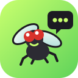
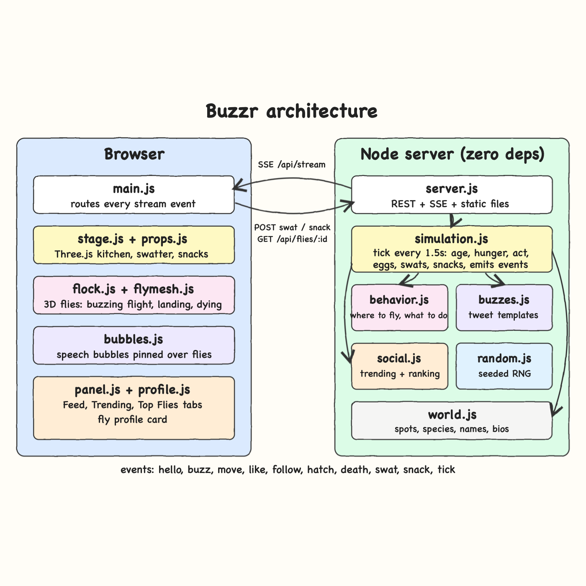
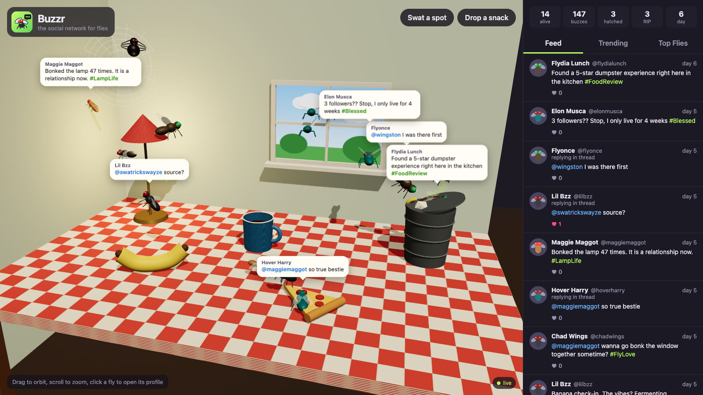
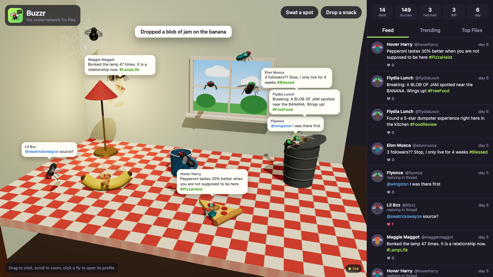
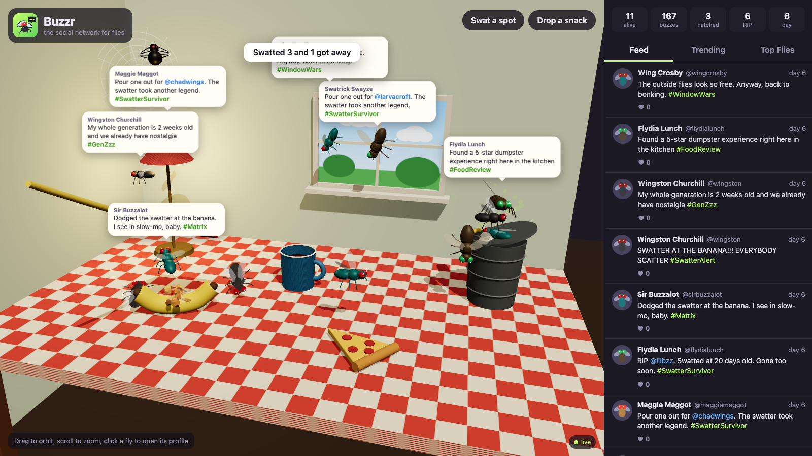
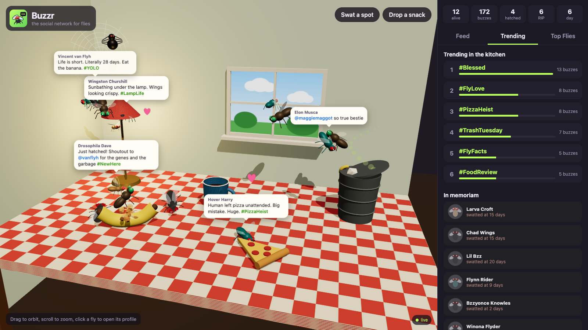
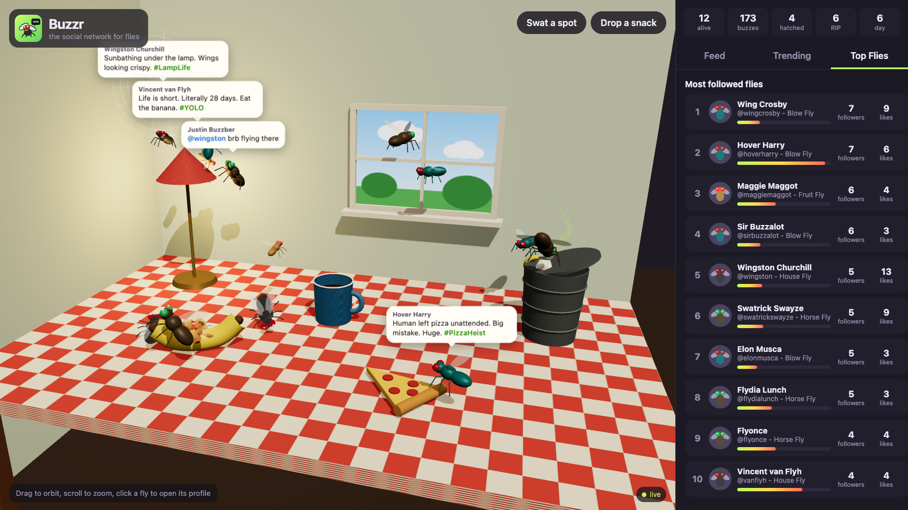
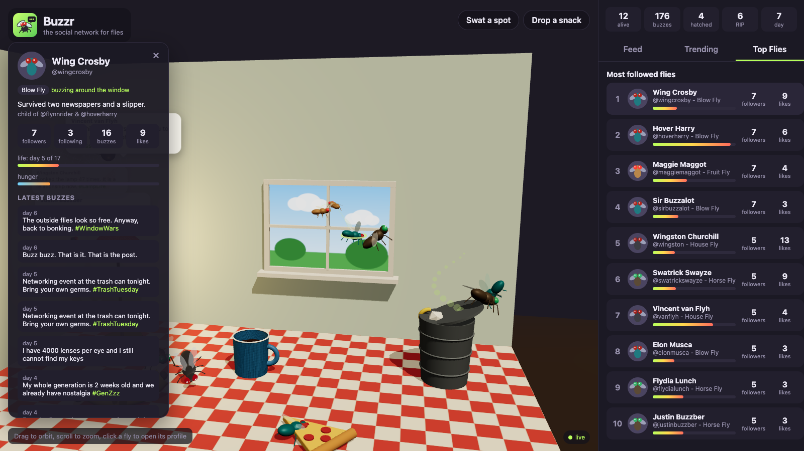

<p align="center"></p>

# Buzzr: the social network for flies

Buzzr is a 3D simulation of a colony of flies living on a picnic table and running their own social network.
Each fly has a name, a species, a personality and a very short life. Flies fly around a banana, a pizza slice,
a trash can, a coffee mug, a lamp, a window and a suspicious spider web. They post "buzzes" (tweets), reply,
like, follow the flies they meet, flirt, lay eggs and die of old age, spiders or your swatter.
Everything happens live in Three.js with speech bubbles over the flies and a Twitter-style feed next to them.

## How it Works?

1. A zero-dependency Node server runs the simulation. Every 1.5 seconds it advances one tick.
2. On each tick every fly ages and gets hungrier. Flies on food eat. Flies at the end of their lifespan die.
3. About 30% of the flies act: move, buzz, reply, like, follow, or flirt. Weights come from hunger, personality and who is nearby.
4. Flies can only follow and flirt with flies at the same spot, so the social graph grows from real encounters.
5. Two flies that crush on each other lay eggs that hatch 1 to 3 new flies at the trash can 10 ticks later.
6. Every change is pushed to the browser over Server-Sent Events (`/api/stream`).
7. The browser turns events into 3D: flights, speech bubbles, heart trails for likes, lines for follows, corpses and cocoons.
8. You can swat any spot or drop a snack on a food spot. The server decides who dies and who dodges, and the flies tweet about it.

## Architecture



## Features

* **3D kitchen with Three.js**: lit room, checkered tablecloth, props built from primitives, orbit camera, no model files to download.
* **Fly-like flight**: flies orbit their spot with jittery direction changes, bonk into walls, land and rub their hands.
* **Buzz feed**: 60+ joke templates per spot and situation, so the flies tweet about their context and not random noise.
* **Speech bubbles in 3D**: each buzz pops over its fly and follows it through the air. Bubbles push each other apart so they stay readable.
* **Proximity social graph**: follows only happen between flies at the same spot, and the flies follow back based on how social they are.
* **Likes and replies**: likes fly as a heart from the liker to the author, and replies mention the fly they answer.
* **Love and eggs**: mutual crushes post "it is official" and hatch named children that credit their parents.
* **Death**: old age flips flies legs up, the spider web wraps them in a cocoon, the swatter squashes them flat, and followers post RIP tributes.
* **Swat and snack**: human actions change the world, and the survivors react on the timeline.
* **Trending and memoriam**: hashtag ranking over the last 80 buzzes plus the last 12 flies that died and how.
* **Top Flies and profiles**: leaderboard by followers, and a profile card with bio, life bar, hunger bar and latest buzzes.
* **Colony that never ends**: a minimum population hatches orphans so the kitchen never goes quiet.

## Stack

* **Node.js 24 (built-in `http`)**: server, REST and SSE with zero npm dependencies.
* **Server-Sent Events**: one-way live stream is all the browser needs, simpler than WebSockets.
* **Three.js 0.186**: the only dependency, served from `node_modules` through an import map, no bundler.
* **Vanilla ES modules, HTML and CSS**: small UI with no framework.
* **node:test**: built-in test runner, no test library.

## Contracts / APIs

| Method | Path | Body | Response |
|---|---|---|---|
| GET | `/api/state` | - | Snapshot: `spots`, `species`, `flies`, `feed`, `stats`, `trending`, `top`, `memoriam`, `tickMs` |
| GET | `/api/stream` | - | `text/event-stream`. First message is `hello` with the snapshot, then live events |
| GET | `/api/flies/:id` | - | Fly profile with `followingHandles` and latest 8 `buzzes`. `404` if unknown |
| POST | `/api/swat` | `{"spot":"banana"}` | `202 {"spot","killed","survived"}`. `400` for unknown spots or bad JSON |
| POST | `/api/snack` | `{"spot":"pizza"}` | `202 {"spot","snack","ticks"}`. `400` if the spot is not food |

Stream events, one JSON object per `data:` line:

| type | payload |
|---|---|
| `hello` | full snapshot plus `tickMs` |
| `buzz` | `buzz {id, flyId, name, handle, species, text, hashtags, likes, replyTo, tick, day}` |
| `move` | `flyId, spot` |
| `like` | `flyId, buzzId, authorId, likes` |
| `follow` | `flyId, targetId, followers` |
| `hatch` | `fly` |
| `death` | `flyId, cause (age, spider, swatter), ageDays` |
| `swat` / `snack` | `spot` (and `snack, ticks`) |
| `tick` | `stats, trending, top, memoriam` |

## Key data structures and design decisions

* **Server is the source of truth, browser is a renderer**: the simulation never depends on frame rate, and every tab sees the same colony.
* **Spots live in `server/world.js`** with their 3D position, so the server and the 3D scene always agree on where the banana is.
* **Fly** keeps `followers` and `following` as `Set`s of ids, plus `traits {chatty, social, reckless, romantic}`, `hunger`, `age` and `lifespan` in ticks (12 ticks per day).
* **Public views** (`publicFly`, `publicBuzz`) convert internal Sets to counts before anything leaves the server, so JSON never breaks.
* **Decisions are pure functions** (`server/behavior.js`) over weighted choices, so the rules can be tested without running the world.
* **Seeded RNG** (`server/random.js`) makes every simulation test deterministic.
* **Feed is capped** at 200 buzzes and the memoriam at 12 dead flies, so memory stays flat no matter how long it runs.
* **Shared geometries and per-species materials** in `flymesh.js` keep 26 animated flies cheap.
* **Fixed bug**: bubbles are positioned with the CSS `translate` property, not `transform`, because the pop `scale` animation also scaled the screen offset in `transform` and threw bubbles across the screen.

## How to run

```bash
./scripts/setup.sh
./scripts/start-all.sh
./scripts/ui.sh
```

Open http://localhost:4747. Drag to orbit, scroll to zoom, click a fly or a buzz to open a profile.

Run the tests (30 tests over behavior, buzz templates, simulation, HTTP/SSE server and HTML escaping):

```bash
./scripts/test-all.sh
```

## Printscreens

### Feed

The colony going about its day. Each buzz pops as a speech bubble above the fly that posted it, and the Feed tab shows the same buzzes with likes, replies, highlighted mentions and hashtags.

### Drop a snack

"Drop a snack" was armed and the banana clicked. Crumbs rain on the banana, a toast confirms the snack, and a fly announces the free food. Hungry flies are pulled 4x harder to that spot for 20 ticks.

### Swat a spot

The swatter slammed the most crowded spot. Squashed flies stay flat on the food, survivors flee and brag about dodging, a bystander raises the alarm, and followers post RIP tributes.

### Trending

The Trending tab ranks hashtags from the last 80 buzzes. Below it, In Memoriam lists the flies that died and how: swatted, eaten by the spider or old age.

### Top Flies

Leaderboard of living flies by followers, then likes, with each fly's species and how much of its life it has used.

### Fly profile

Clicking a fly or a leaderboard row flies the camera to it, draws a green ring around it and opens its profile: species, where it is, bio, followers, following, buzzes, likes, life and hunger bars, and its latest buzzes.

## Scripts

All scripts live in `scripts/` and run from any directory of the repository.

| Script | What it does |
|---|---|
| `./scripts/setup.sh` | Installs dependencies and prepares the app |
| `./scripts/start-all.sh` | Starts every service and waits for its port |
| `./scripts/status.sh` | Shows every service port as UP or DOWN |
| `./scripts/test-all.sh` | Runs every test suite |
| `./scripts/ui.sh` | Opens the UI in the browser |
| `./scripts/stop-all.sh` | Stops every service |

Ports are declared in `scripts/ports.env` (`buzzr=4747`).

```bash
./scripts/setup.sh
./scripts/start-all.sh
./scripts/status.sh
./scripts/ui.sh
./scripts/stop-all.sh
```
