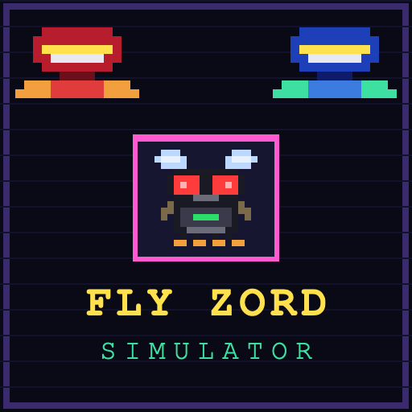
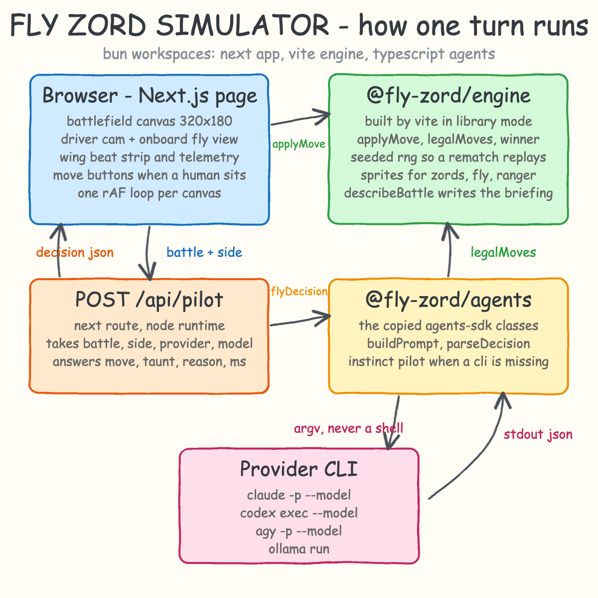
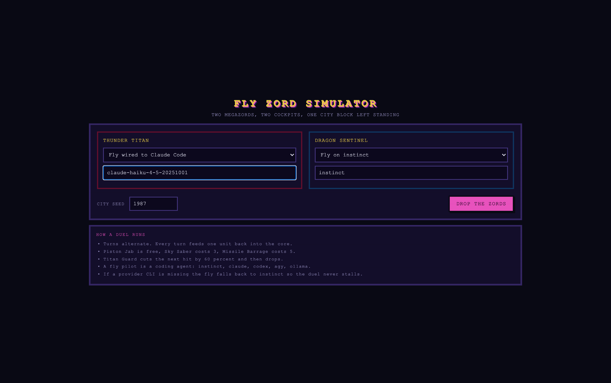
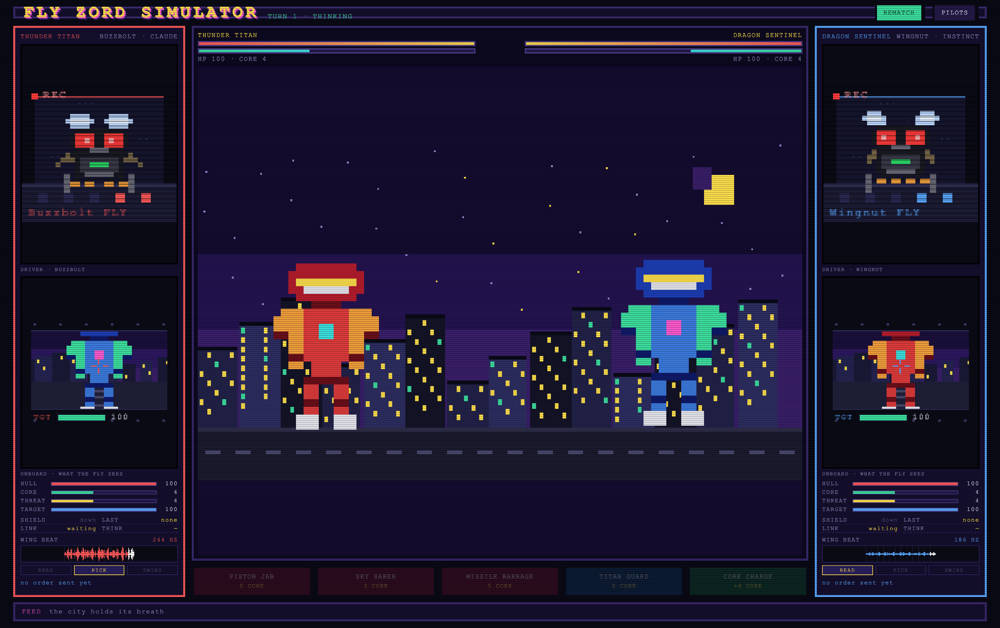
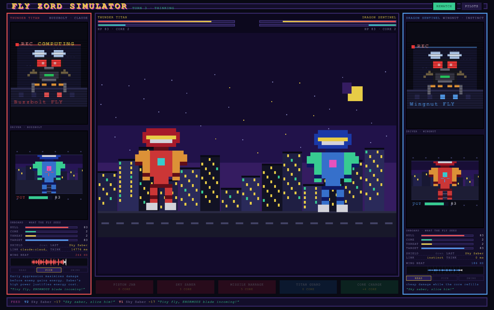
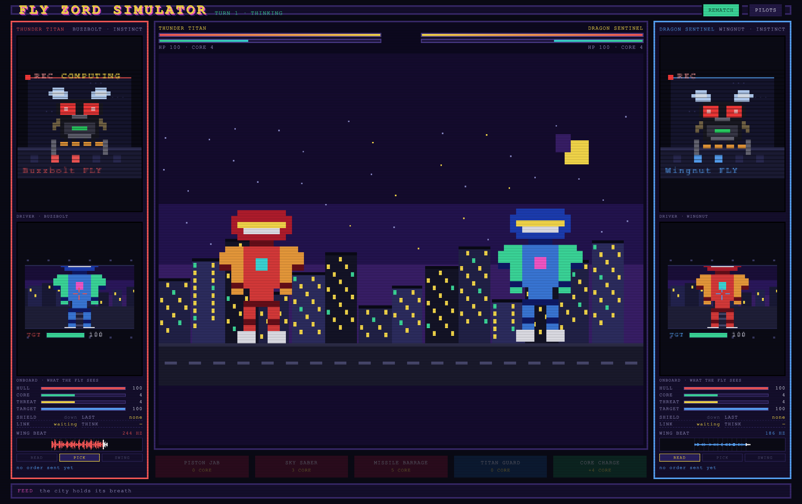
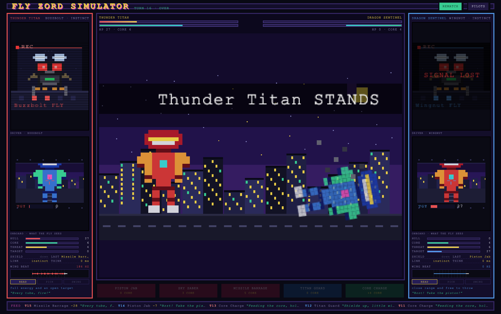

# Fly Zord Simulator

A turn based 8-bit brawl between two megazords in a neon city. Each zord is flown by a house fly
strapped into the cockpit, and every fly is a coding agent: `claude`, `codex`, `agy` or `ollama`
driven through the CLI exactly the way the `agents-sdks` TypeScript SDK does it. A human can take
one seat and fight a fly, or two flies can fight each other while you watch.

Every AI seat shows three panels: the driver cam with the fly working the levers, the onboard view
of what that fly sees through the windshield, and a telemetry strip with hull, core, wing beat and
how many milliseconds the agent took to answer.

## How it Works

1. The browser creates a battle from a seed and two pilots and renders it on a 320x180 canvas.
2. On a human turn the five move buttons are live, gated by the energy the core holds.
3. On a fly turn the page posts the whole battle to `POST /api/pilot`.
4. The route asks `flyDecision`, which writes a briefing of the battlefield and the affordable moves.
5. The briefing goes to the provider CLI as plain argv, never through a shell.
6. The agent answers one JSON object with a move, a taunt and a reason.
7. An illegal or unparsable answer is dropped and the instinct pilot takes the turn instead.
8. The move is applied by the same engine module in the browser, so the rules run in one place.
9. The stage animates the strike, the onboard views show it from both cockpits, the log records it.
10. First zord at zero hull falls, the other one stands, and the cockpit cam of the loser goes dark.

## Architecture



Three bun workspaces:

| Workspace | Built by | Runs where |
|---|---|---|
| `packages/engine` | Vite library mode | browser and server |
| `packages/agents` | TypeScript 7 `tsc` | server only, spawns the CLIs |
| `apps/web` | Next.js 16 under bun | browser and the route handler |

## Features

* **Two flies or one human.** Any seat takes a human or a fly, so you get agent vs agent, human vs agent, or a rematch with the seats swapped.
* **Driver cam.** A pixel fly buzzes at the levers, leans in when it commits a move, and flashes when the zord takes a hit.
* **Onboard view.** The windshield shows the enemy zord from that cockpit, growing as it lunges, cracking red when the hit lands.
* **Wing beat telemetry.** A live waveform and a Hz readout separate a fly that is thinking from one that is idle, next to hull, core, threat and think time.
* **Five moves with an energy economy.** Free jab, saber, barrage, a guard that cuts the next hit, and a charge that refills the core, so a turn is a real choice.
* **Seeded battles.** The same seed replays the same city and the same damage rolls, so two agents can be compared on their choices alone.
* **Never stalls.** A missing or logged out CLI falls back to the instinct pilot and the panel says which provider went quiet.
* **Nothing is hidden.** Every taunt, reason, provider, model and latency the agent produced is on screen.
* **One screen, no scrolling.** The arena is a `100dvh` grid: cockpit, stage, cockpit, move row and feed all size themselves to the viewport.

## Stack

* **TypeScript 7.0.2** — one language across the engine, the agents and the UI, with strict settings.
* **Bun 1.4 workspaces** — installs, runs and tests the three packages without a second tool.
* **Next.js 16** — app router gives the page and the server route that is allowed to spawn a CLI.
* **React 19** — holds the turn state machine; the 60 fps drawing stays inside `requestAnimationFrame`.
* **Vite 8** — builds the engine as a plain ESM library both sides import.
* **Canvas 2D** — every sprite is a string grid painted pixel by pixel, no image assets, no game library.
* **The `agents-sdks` TypeScript SDK** — copied in as `packages/agents/src/agent-sdk.ts` to reach the provider CLIs.

## Contracts

### `POST /api/pilot`

Request:

```json
{
  "battle": { "seed": 1987, "turn": 3, "active": "left", "left": {}, "right": {}, "log": [], "winner": "none" },
  "side": "left",
  "provider": "claude",
  "model": "claude-haiku-4-5-20251001"
}
```

Response:

```json
{
  "move": "saber",
  "taunt": "Tiny fly, MASSIVE blade! Here we go!",
  "reason": "Turn 1 aggression: saber deals 18 damage for 3 energy, leaving 1 energy buffer.",
  "source": "claude:claude-haiku-4-5-20251001",
  "elapsedMs": 9208
}
```

`source` is `provider:model` when the CLI answered, or `instinct (claude unavailable)` when it did not.
A request without a battle or a side answers `400`.

### `GET /api/health`

```json
{ "status": "ok", "arena": "fly-zord-simulator" }
```

## Key Data Structures and Decisions

* `Battle` is a frozen shape: seed, turn, active side, both zords, the log and the winner. `applyMove`
  returns a new one, so the client can post it, the server can read it, and a test can replay it.
* Randomness is `random(seed + turn * 2)`, not `Math.random`, so a battle is a pure function of its
  seed and the moves. Two agents can be judged on their choices instead of their luck.
* The rules live only in `packages/engine`. The route never decides a move, it only asks an agent for
  one and hands it back; the browser applies it. An agent cannot invent an illegal turn.
* Sprites are arrays of equal length strings with one character per pixel and a palette per zord, so
  the same 16x22 mech renders crimson or cobalt and a test can prove every key has a colour.
* The animation clock is the `requestAnimationFrame` frame count inside each canvas. React holds the
  turn, not the frame, so a 60 fps fight never re-renders the tree.
* The copied SDK keeps its own guarantee: a command is an argv array, so a taunt can never become
  a shell fragment.

## How to Run

```bash
./scripts/setup.sh
./scripts/start-all.sh
./scripts/ui.sh
./scripts/stop-all.sh
```

Then pick a pilot for each zord. `instinct` needs nothing installed. `claude`, `codex`, `agy` and
`ollama` need that CLI on the PATH and logged in; the model box takes any model that CLI accepts.

Tests:

```bash
./scripts/test-all.sh
```

That runs 24 bun tests over the engine and the pilots, typechecks the three workspaces with
TypeScript 7 and builds the arena.

## Printscreens

### Pilot selection



Both seats are chosen before the drop. The left zord is wired to Claude Code with a model of your
choice, the right one flies on instinct. The city seed decides the skyline and the damage rolls.

### A fly reading the battlefield



Turn 1. The left cockpit column is flashing `REC COMPUTING` while the agent CLI runs, its wing beat is
up at 244 Hz with a spiky waveform, and the calm fly on the right sits at 186 Hz. Both onboard views
show the enemy zord filling the windshield with a `TGT` hull bar under it.

### The order comes back



The agent answered, so the telemetry shows `LINK claude:claude-haiku-4-5-20251001`, the think time in
milliseconds and `LAST Sky Saber`, with the reason it gave printed under the panel and the decision
loop stepping read, pick, swing. The stage between the two cockpits has already played the swing.

### Fly against fly



Two instinct flies trade turns with no human in the loop. Each cockpit column keeps its own view of
the same fight: hull, core, the threat the other core holds, and the move it just made. The move row
sits under the stage and the feed runs along the bottom, so a whole duel stays in one screen.

### Last one standing



The Dragon Sentinel hits zero hull, topples into the street with smoke coming off it, and its cockpit
cam drops to `SIGNAL LOST` with a flat wing beat, while the winner keeps buzzing.

## Scripts

All scripts live in `scripts/` and run from any directory of the repository.

| Script | What it does |
|---|---|
| `./scripts/setup.sh` | Installs dependencies and prepares the app |
| `./scripts/start-all.sh` | Starts every service and prints the full link of each one |
| `./scripts/status.sh` | Shows every service port as UP or DOWN |
| `./scripts/test-all.sh` | Runs every test suite |
| `./scripts/ui.sh` | Opens the UI in the browser |
| `./scripts/stop-all.sh` | Stops every service |

Ports are declared in `scripts/ports.env`.

```bash
./scripts/setup.sh
./scripts/start-all.sh
./scripts/status.sh
./scripts/ui.sh
./scripts/stop-all.sh
```
