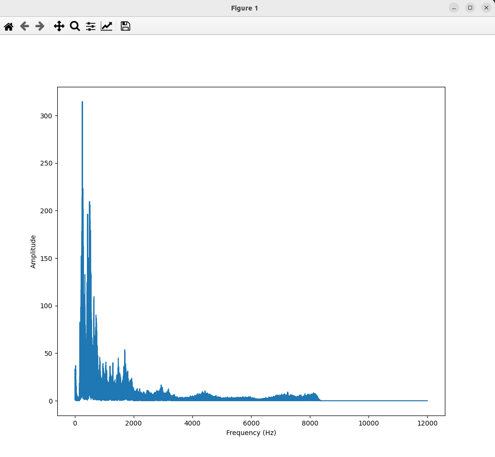

### Result
* Fourier Transform is a mathematical technique that transforms a function of time into a function of frequency.
* Fourier Transform is a mathematical technique used in many fields, including signal processing, image analysis, and even machine learning
* Program uses gTTS to transform text to speech(mp3).
* pydub to convert mp3 file to wav format.
* Plot results with matplotlib.

Fourier Transform is useful for signal processing:

1. Frequency Analysis: The Fourier Transform decomposes a signal into its constituent frequencies, allowing us to identify the underlying frequency components of the signal.
2. Filtering: By modifying the frequency components, we can filter out unwanted noise or interference, or extract specific frequency bands of interest.
3. Modulation Analysis: The Fourier Transform helps analyze amplitude and frequency modulation schemes, which are crucial in communication systems.
4. Signal Compression: The Fourier Transform can compress signals by representing them in a more compact form, reducing storage requirements.
5. Denoising: The Fourier Transform can help remove noise from signals by filtering out high-frequency components.
6. Image Processing: The Fourier Transform is used in image processing techniques like image filtering, de-noising, and compression.
7. Power Spectral Density (PSD): The Fourier Transform helps estimate the PSD, which characterizes the signal's power distribution across frequencies.
8. Convolution: The Fourier Transform simplifies convolution operations, essential for signal processing tasks like filtering and deconvolution.
9. Signal Reconstruction: The Fourier Transform enables signal reconstruction from its frequency components, useful for signal synthesis and analysis.
10. Efficient Algorithms: Fast Fourier Transform (FFT) algorithms provide efficient computation of the Fourier Transform, making it a practical tool for real-time signal processing applications

Generated Audio:

<audio controls>
  <source src="audio_file.wav" type="audio/wav">
</audio>

Result:

