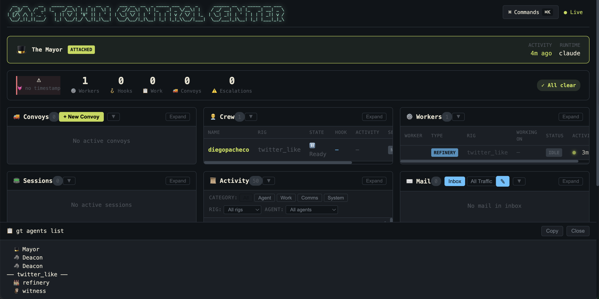

# GasTown

https://github.com/steveyegge/gastown

## Experience Notes

* npm instalation did not work
* I had to install via homebrew
* Instalation was a bit manual and had todo several steps.
* POC Repo: https://github.com/diegopacheco/gastown-poc
* I had issues with convoy to create a feature, doc mention flags that dont exist anymore.
* GasTown Mayor/tmux crashed doring claude code run in a middle of a healthchecker.
* GastTown is crashing and looping over:
```
⏺ Bash(cd ~/gt && gt hook status 2>&1)
  ⎿  Error: Exit code 1
     Error: listing hooked beads: bd list --json --status=hooked --assignee=mayor/ --limit=0: Warning: redirect target does not
     exist or is not a directory: /Users/.beads
     Error initializing --no-db mode: no .beads directory found (hint: run 'bd init' first or set BEADS_DIR)
     Usage:
       gt hook status [target] [flags]

     Flags:
       -h, --help   help for status
           --json   Output as JSON
```
* GT uses a lot of tokens indeed.

## Results

Gas Town Dashboard <br/>


## Install

```
brew install gastown 
```

## Create HQ

```
❯ gt install ~/gt --git

🏭 Creating Gas Town HQ at /Users/diegopacheco/gt

   ✓ Created mayor/
   ✓ Created mayor/town.json
   ✓ Created mayor/rigs.json
   ✓ Created CLAUDE.md (town root identity anchor)
   ✓ Created mayor/.claude/settings.json
   ✓ Created deacon/.claude/settings.json
   ✓ Created plugins/
   ✓ Created mayor/daemon.json

   ✓ Created .gitignore
Initialized empty Git repository in /Users/diegopacheco/gt/.git/
   ✓ Initialized git repository
   ✓ Installed branch protection (auto-reverts non-main checkouts)
   ⚠ dolt not found in PATH — Dolt backend may not fully initialize
   ✓ Initialized .beads/ (town-level beads with hq- prefix)
   ✓ Provisioned 32 formulas
   ⚠ Could not create town-level agent beads: creating hq-mayor: bd create --json --id=hq-mayor --title=Mayor - global coordinator, handles cross-rig communication and escalations. --description=Mayor - global coordinator, handles cross-rig communication and escalations.

role_type: mayor
rig: null
agent_state: idle
hook_bead: null
cleanup_status: null
active_mr: null
notification_level: null --type=agent --labels=gt:agent: warning: beads.role not configured. Run 'bd init' to set.
Error: validation failed: invalid issue type: agent
   ✓ Detected overseer: diegopacheco <diego.pacheco.it@gmail.com> (via git-config)
   ✓ Created settings/escalation.json
   ✓ Created .claude/commands/ (slash commands for all agents)
   ✓ Synced 2 hook target(s)

✓ HQ created successfully!

Next steps:
  1. Add a rig: gt rig add <name> <git-url>
  2. (Optional) Configure agents: gt config agent list
  3. Enter the Mayor's office: gt mayor attach

Note: Dolt server is running (stop with gt dolt stop)
```

## Create a Rig and Crew

```
 gt rig add twitter_like https://github.com/diegopacheco/gastown-poc.git
Creating rig twitter_like...
  Repository: https://github.com/diegopacheco/gastown-poc.git
  Cloning repository (this may take a moment)...
   ✓ Created shared bare repo
  Creating mayor clone...
   ✓ Created mayor clone
  Initializing beads database...
   ✓ Initialized beads (prefix: tl)
  Creating refinery worktree...
   ✓ Created refinery worktree
  Warning: Could not create agent beads: creating tl-twitter_like-witness: bd create --json --id=tl-twitter_like-witness --title=Witness for twitter_like - monitors polecat health and progress. --description=Witness for twitter_like - monitors polecat health and progress.

role_type: witness                                                                                                                 rig: twitter_like                                                                                                                  agent_state: idle
hook_bead: null
cleanup_status: null
active_mr: null
notification_level: null --type=agent --labels=gt:agent --force: Error: failed to open rig "twitter_like" database: dolt backend requires CGO (not available on this build); use sqlite backend or install from pre-built binaries
  ! Could not create rig identity bead: bd create --json --id=tl-rig-twitter_like --title=twitter_like --description=Rig identity bead for twitter_like.

repo: https://github.com/diegopacheco/gastown-poc.git
prefix: tl
state: active --labels=gt:rig --force: Error: failed to open rig "twitter_like" database: dolt backend requires CGO (not available on this build); use sqlite backend or install from pre-built binaries
  Synced hooks for 4 target(s)

✓ Rig created in 7.6s

Structure:
  twitter_like/
  ├── config.json
  ├── .repo.git/        (shared bare repo for refinery+polecats)
  ├── .beads/           (prefix: tl)
  ├── plugins/          (rig-level plugins)
  ├── mayor/rig/        (clone: main)
  ├── refinery/rig/     (worktree: main, sees polecat branches)
  ├── crew/             (empty - add crew with 'gt crew add')
  ├── witness/
  └── polecats/         (.claude/ scaffolded for polecat sessions)

Next steps:
  gt crew add <name> --rig twitter_like   # Create your personal workspace
  cd /Users/diegopacheco/gt/twitter_like/crew/<name>              # Start working
❯ gt crew add diegopacheco --rig twitter_like
Creating crew workspace diegopacheco in twitter_like...
✓ Created crew workspace: twitter_like/diegopacheco
  Path: /Users/diegopacheco/gt/twitter_like/crew/diegopacheco
  Branch: main
⚠ Warning: could not create agent bead for diegopacheco: bd create --json --id=tl-twitter_like-crew-diegopacheco --title=Crew worker diegopacheco in twitter_like - human-managed persistent workspace. --description=Crew worker diegopacheco in twitter_like - human-managed persistent workspace.

role_type: crew
rig: twitter_like
agent_state: idle
hook_bead: null
cleanup_status: null
active_mr: null
notification_level: null --type=agent --labels=gt:agent --force: Error: failed to open rig "twitter_like" database: dolt backend requires CGO (not available on this build); use sqlite backend or install from pre-built binaries

✓ Created 1 crew workspace(s): [diegopacheco]

Start working with: cd /Users/diegopacheco/gt/twitter_like/crew/diegopacheco
```

## Attach to Mayor's office

```
cd twitter_like/crew/diegopacheco/
gt mayor attach
```

## Build a Feature

```
bd init
gt convoy create "build a twitter like application with registration, login, timeline, profile, search, follow, like, post images and limit chars 140. make sure there is a default admin user admin/admin and a run.sh to run the app. frontend must be react and backend must be rust, make sure react is with bun and vite and typescript use as much astanstack as possible. for backend use tokio and actixes, makes ure the frontend and backend are not monolithic, use sqllite for the db in rust." gt-abc12 gt-def34 --notify
```

## Give work to agent

```
gt sling gt-abc12 twitter_like
```

## Track Progress

```
gt convoy list
```

## Monitor Agents

```
gt agent list
```