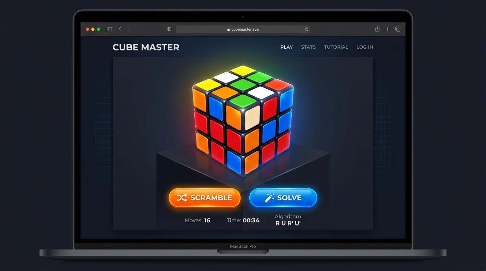
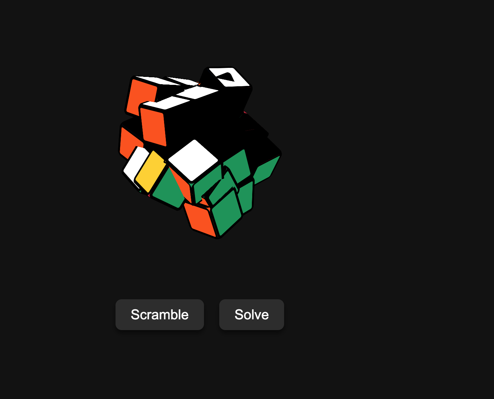

# Rubik 



The picture above shows a sleek 3D Rubik's cube interface rendering a cube with glowing accents on a dark background. The two vibrant buttons at the bottom offer interactive "Scramble" and "Solve" functionality.

## Reality

What you just saw was `agy` / `gemini` mockup, real interface was this:


 - I asked 2x to fixed - it fail to fix it.
 - I see this multiple times with gemini, you asked something, the mock is better than the interface.
 - IDK why created a container to do this (I did not asked)

## Usage

```bash
./start.sh
```

```bash
./test.sh
```

```bash
./stop.sh
```
