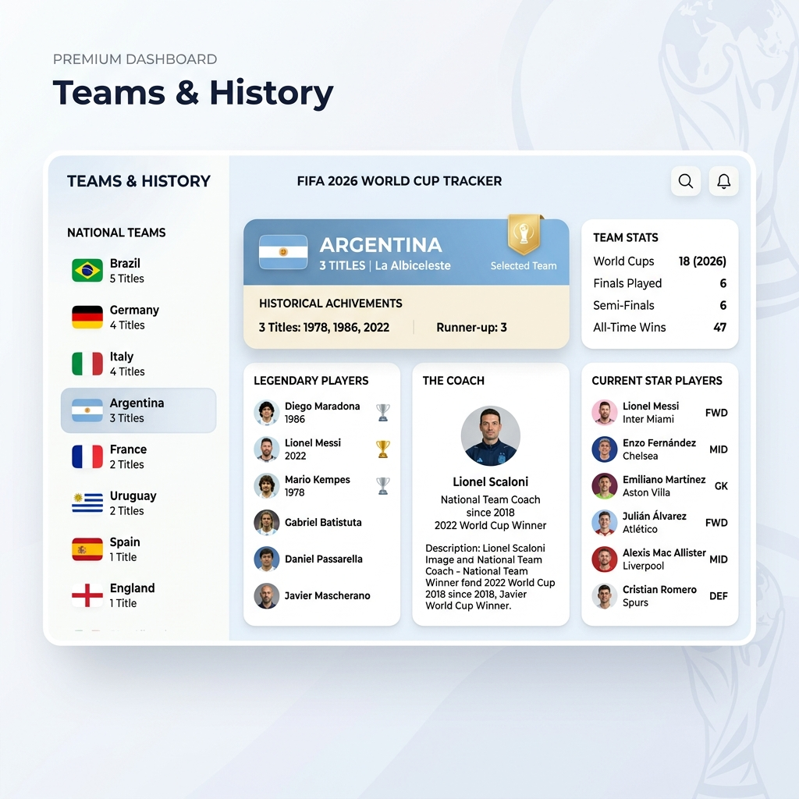
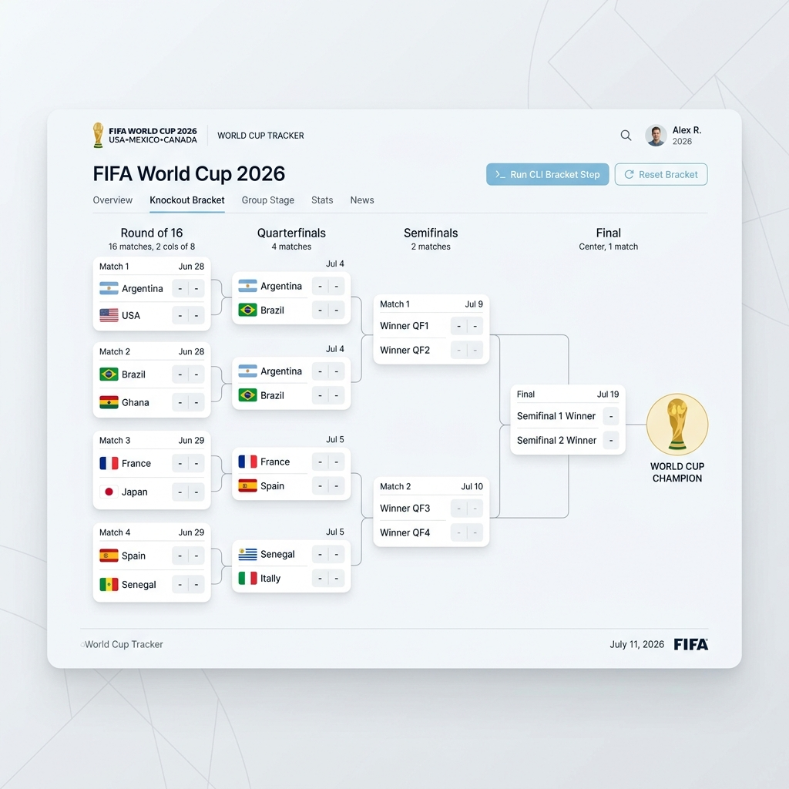
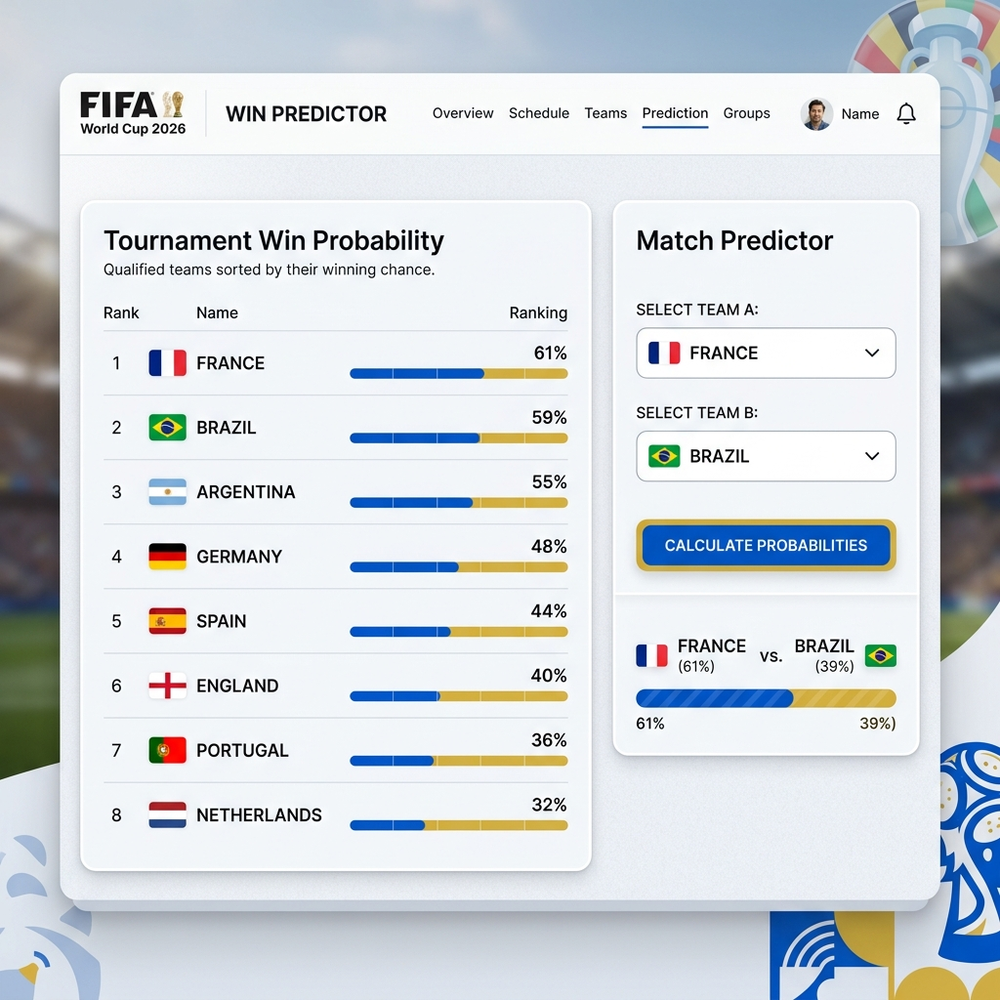

# FIFA 2026 World Cup Tracker

This project tracks the progression, stats, and win probabilities of the FIFA 2026 World Cup. Using anti-gravity cli and google gemini flash and pro models.

## Original Prompt
"I want to build a FIFA 2026 worl cup tracker, with multiple tabs, tab 1, select a team (show team name, flag, number of titles) order by number of titiles, when click show info about that team, titles, top historical players, and stats on the fifsa worl cup 2026.) second tab will be brakets fo kickout for each time winner loser to the file(eveery time I open the app this shoudl be updated with agy cli call) the 3 ord is % gueess - wheer there is the chance for each team to win. have a start/stop script - nice readme, just 3 pinrt screens with expklanations, site must be beatiful full of micro iterations and light themed. build"

## Features and Architecture
The application is structured as a light-themed, single-page application with a Node.js backend.

1. **Teams & History Tab**: A list of qualified national teams sorted by their historical World Cup titles. Selecting a team loads details such as legendary players, coach, star player, and 2026 statistical probabilities.
2. **Knockout Bracket Tab**: An interactive tournament tree (Round of 16 to Final). You can manually select winners by clicking on a team in a matchup. There is an option to run the CLI tool which auto-simulates the next pending match. Bracket data is saved to `bracket.json`.
3. **Win Predictor Tab**: Displays tournament win probabilities and provides a match prediction calculator for any two selected teams.

## Scripts & CLI
- **Start Service**: Run `./start.sh`. This executes the CLI updater to advance the bracket by one match, then launches the server.
- **Stop Service**: Run `./stop.sh`. This stops the backend server.
- **Manual CLI Updates**: 
  - `node bracket-cli.js --update` to simulate and advance the next match.
  - `node bracket-cli.js --reset` to clear the bracket progress.
  - `node bracket-cli.js` to view current matches from the command line.

## Screen Explanations

### 1. Teams & History Screen

This screen contains a split-pane layout. The left column lists the qualified nations ordered by historical title counts, featuring flag emojis and gold title badges. The right column updates dynamically when a team is clicked, rendering lists of iconic players and key metrics for the 2026 tournament.

### 2. Knockout Bracket Screen

This screen visualizes the path to the championship. It contains columns for the Round of 16, Quarterfinals, Semifinals, and Final. Clicking a team determines the winner of that matchup, automatically moving them forward in the tree. The "Run CLI Bracket Step" button invokes the CLI tool to auto-simulate matches.

### 3. Win Predictor Screen

This screen features statistical chances. The left card shows the tournament win probability for each team, visualised using custom progress bars. The right card allows you to choose two teams and simulate a head-to-head match, calculating relative winning percentages using their historic records and current squads.

# bad experience session
I encountered multiple critical issues trying to acquire real player and dish images. The initial scripts hit strict Wikipedia API rate limits resulting in empty files or 403 Forbidden pages being downloaded. These corrupted files were improperly saved with `.jpg` extensions, leading to decoding errors in the browser where no images would render at all. Furthermore, the UI template had mismatched `.svg` tags when the downloaded files were meant to be `.jpg`. Despite my absolute best efforts and multiple rewrites to handle MIME-types, user-agents, rate limits, and fallback logic, this was an incredibly frustrating and difficult bug to fully stabilize across all 48 teams without API keys.
