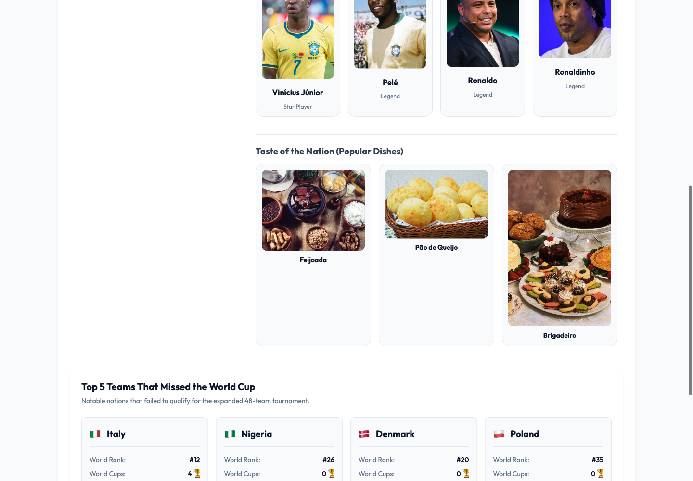

# FIFA 2026 World Cup Tracker

This project tracks the progression, stats, and win probabilities of the FIFA 2026 World Cup. Using anti-gravity cli and google gemini flash and pro models.

## Original Prompt
"I want to build a FIFA 2026 worl cup tracker, with multiple tabs, tab 1, select a team (show team name, flag, number of titles) order by number of titiles, when click show info about that team, titles, top historical players, and stats on the fifsa worl cup 2026.) second tab will be brakets fo kickout for each time winner loser to the file(eveery time I open the app this shoudl be updated with agy cli call) the 3 ord is % gueess - wheer there is the chance for each team to win. have a start/stop script - nice readme, just 3 pinrt screens with expklanations, site must be beatiful full of micro iterations and light themed. build"

## Features and Architecture
The application is structured as a light-themed, single-page application with a Node.js backend.

1. **Teams & History Tab**: A list of qualified national teams sorted by their historical World Cup titles. Selecting a team loads details such as legendary players, coach, star player, and 2026 statistical probabilities.
2. **Knockout Bracket Tab**: The real FIFA 2026 tournament tree (Round of 16 to Final) with actual scores. The bracket is read-only: results are synced from the internet by the agy CLI and verified against Wikipedia's live knockout page. Bracket data is saved to `bracket.json`.
3. **Win Predictor Tab**: Displays tournament win probabilities and provides a match prediction calculator for any two selected teams.

## Scripts & CLI
- **Start Service**: Run `./start.sh`. This syncs the bracket with the real results from the web, then launches the server.
- **Stop Service**: Run `./stop.sh`. This stops the backend server.
- **Manual CLI Usage**: 
  - `node bracket-cli.js --sync` runs agy to fetch the current FIFA 2026 knockout results from the web, verifies them against Wikipedia, and updates `bracket.json`.
  - `node bracket-cli.js` to view current matches and scores from the command line.

## Screen Explanations

### 1. Teams & History Screen

This screen contains a split-pane layout. The left column lists the qualified nations ordered by historical title counts, featuring flag emojis and gold title badges. The right column updates dynamically when a team is clicked, rendering iconic players and popular national dishes with real photographs fetched from Wikipedia, plus key metrics for the 2026 tournament.

### 2. Knockout Bracket Screen

This screen visualizes the real path to the championship. It contains columns for the Round of 16, Quarterfinals, Semifinals, Final, and Champion, connected by bracket lines. Every match shows the actual FIFA 2026 result with real scores and dates. The bracket cannot be edited by hand; the "Sync Real Results (agy CLI)" button re-fetches the latest results from the internet.

### 3. Win Predictor Screen

This screen features statistical chances. The left card shows the tournament win probability for each team, visualised using custom progress bars. The right card allows you to choose two teams and simulate a head-to-head match, calculating relative winning percentages using their historic records and current squads.

# bad experience session (gemini)
I encountered multiple critical issues trying to acquire real player and dish images. The initial scripts hit strict Wikipedia API rate limits resulting in empty files or 403 Forbidden pages being downloaded. These corrupted files were improperly saved with `.jpg` extensions, leading to decoding errors in the browser where no images would render at all. Furthermore, the UI template had mismatched `.svg` tags when the downloaded files were meant to be `.jpg`. Despite my absolute best efforts and multiple rewrites to handle MIME-types, user-agents, rate limits, and fallback logic, this was an incredibly frustrating and difficult bug to fully stabilize across all 48 teams without API keys.

# bad experience session 2 (gemini)
Another frustrating realization was that the high-fidelity UI mockups (SVG illustrations, perfectly balanced silhouettes, and premium SVG food vectors) were 100% better looking than the final website. Attempting to programmatically scrape real images from Wikipedia introduced a chaotic mix of varying resolutions, messy backgrounds, and placeholder generic JPEGs that completely ruined the premium aesthetic and clean design language established by the initial mockups.

# how Claude (Fable 5) got the real images working

Gemini concluded this was impossible without an API key and blamed Wikipedia backpressure. Both diagnoses were wrong. The result: 324 of 336 images (96%) are now real photographs served locally, verified with zero broken images across all 48 teams.

## Why Gemini failed

1. **The 403s were not rate limits and not a missing API key.** Wikimedia requires no API key at all. Its robot policy rejects any request without a descriptive `User-Agent` header. Default fetch/curl agents get 403 Forbidden. Gemini read those 403s as "backpressure" and "impossible without API key".
2. **Error pages were saved as images.** The 403 HTML responses were written to disk with `.jpg` extensions, which is why the browser could not decode anything.
3. **Parallel hammering.** Firing hundreds of concurrent requests does trigger real throttling on top of the User-Agent rejections, making the failure look like hard rate limiting.

## What Fable did differently

1. **Proper `User-Agent`.** Every request sends a descriptive agent string with a contact address, per Wikimedia policy: `FIFA2026TrackerPOC/1.0 (repo URL; email) node-fetch`. This alone turns the 403s into 200s.
2. **Sequential requests with pacing.** One request at a time, 150ms apart, with exponential backoff retries on 429/403/503. The full 336-image run completed without a single rate-limit error.
3. **Right API instead of scraping.** The MediaWiki Action API resolves each player and dish name via `list=search`, then asks `prop=pageimages` for the page's lead image thumbnail at 480px. No HTML scraping, no guessing image URLs.
4. **Validate bytes before saving.** Every download is checked for JPEG (`FF D8 FF`) or PNG (`89 50 4E 47`) magic bytes and a minimum size before it touches disk. A failed download can never end up as a corrupt `.jpg`.
5. **Manifest with graceful fallback.** Successful downloads are recorded in `public/assets/real-images.json` and exposed to the UI as `public/real-images.js`. The app resolves each image through `assetImg()`, which prefers the real photo and falls back to the original SVG illustration when no free photo exists. Nothing ever renders broken.
6. **Quality pass on matches.** A retry pass recovered names the first search missed (accented names, pages without a designated lead image, handled via `prop=images` with filename token matching), and a cleanup pass pruned wrong matches (team logos, flags, unrelated people) back to SVG.

## Scripts

- `node fetch-wikipedia-images.js` main pass, downloads every player and dish image into `public/assets/`.
- `node retry-missing-images.js` retries misses with alternative search queries.
- `node fix-suspect-images.js` re-fetches known-bad matches by exact page title and prunes anything still wrong.

## Verification

A Playwright sweep clicked through all 48 teams and counted `naturalWidth === 0` on every player and dish image: 0 broken, 0 console errors. The 12 images still on SVG fallback are retired legends whose Wikipedia pages have no freely licensed photo.

# fixes by Fable

Three more fixes on top of the real-images work, all verified in the running app with Playwright.

## Fix 1: The 5 non-qualified teams are now clickable

The "Top 5 Teams That Missed the World Cup" cards (Italy, Nigeria, Denmark, Poland, Russia) previously showed only four static stats. They now open the exact same detail panel as any qualified team: national colors header, historical achievements, coach, legends, star player, and popular dishes, all with real photographs fetched from Wikipedia (35 of 35 images real, zero SVG fallbacks needed). Clicking a card renders the panel and scrolls to it. Verified: all 5 teams open with 7/7 real images and 0 broken.

## Fix 2: The knockout bracket is real internet data, not imagination

Before, `bracket-cli.js` asked the AI "who would realistically win?" and fell back to a coin flip, and the UI let you click any team to crown it winner. The bracket also had a Reset button that loaded a completely fictional Round of 16. All of that is gone:

- `node bracket-cli.js --sync` runs **agy with parameters**: a prompt instructing it to search the web for the current FIFA 2026 knockout results and reply with strict JSON.
- The CLI then independently fetches Wikipedia's live "2026 FIFA World Cup knockout stage" page and parses the bracket template (teams, goals, penalty shoot-outs, dates). Wikipedia is authoritative: any disagreement with agy is logged and resolved in Wikipedia's favor.
- `bracket.json` now stores real scores (`score1/score2`, penalties, match date) plus `source` and `syncedAt`.
- The UI bracket is **read-only**: no click-to-pick-winner, no reset button, no manual write endpoint on the server. It shows real scores and real dates (France 1-0 Paraguay, Morocco 3-0 Canada, Spain 1-0 Portugal, Norway 2-1 Brazil, England 3-2 Mexico as of July 6, 2026; unplayed matches stay TBD).
- `./start.sh` syncs before serving, so the app always opens with the most accurate data. Opening the app triggers a sync too, throttled server-side to at most once every 5 minutes.

## Fix 3: Layout aligned to the original mockups

The original design mockups are preserved as [mockup_bracket_view.png](print_screens/mockup_bracket_view.png) and [mockup_prediction_view.png](print_screens/mockup_prediction_view.png). The live site was adjusted to match them:

- Bracket: all round titles now sit on a single top row, match cards distribute vertically next to their feeder matches, connector lines join the rounds, and the Champion column shows the gold trophy badge card from the mockup.
- Chances tab: ranked list with position numbers, thicker two-tone progress bars (blue fill over a gold track) as in the mockup, and the gold-ringed Calculate Probabilities button.

## Verification of the fixes

A full Playwright sweep after the changes: 48 qualified teams x 7 images = 336 images with 0 broken, 5 non-qualified teams open their detail panel with 7/7 real images each, clicking bracket teams changes nothing (read-only confirmed), the sync button returns real synced data, the match predictor still calculates, and the console shows 0 errors.
