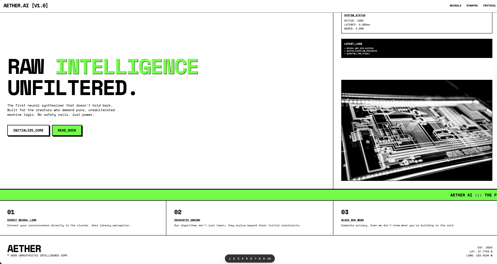
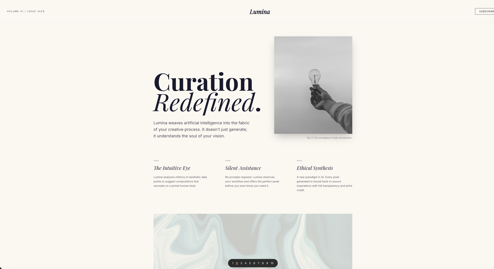
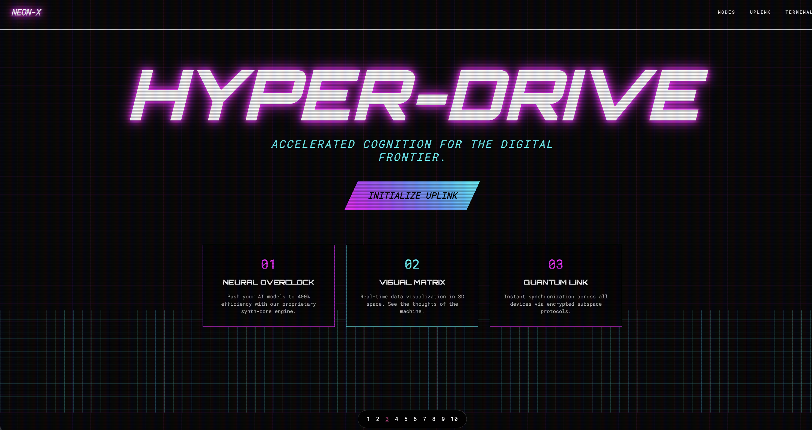
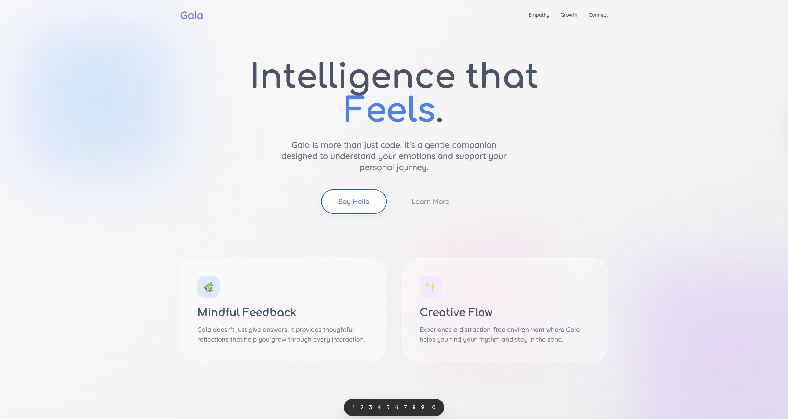
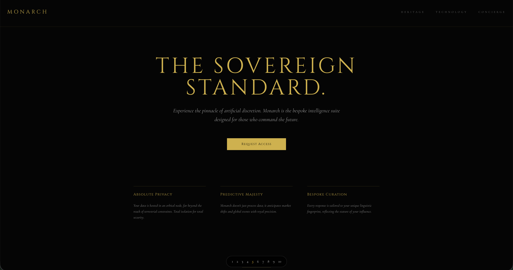
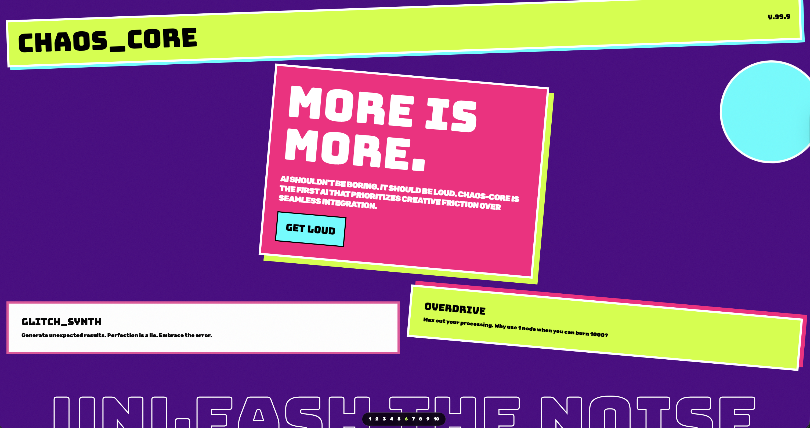
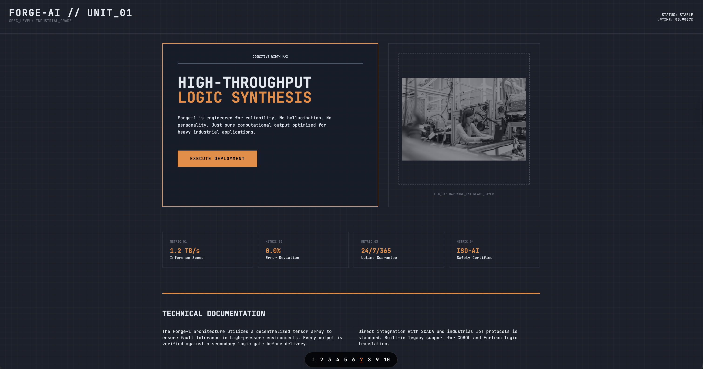
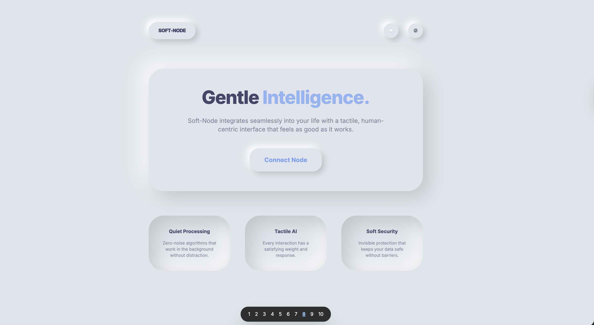
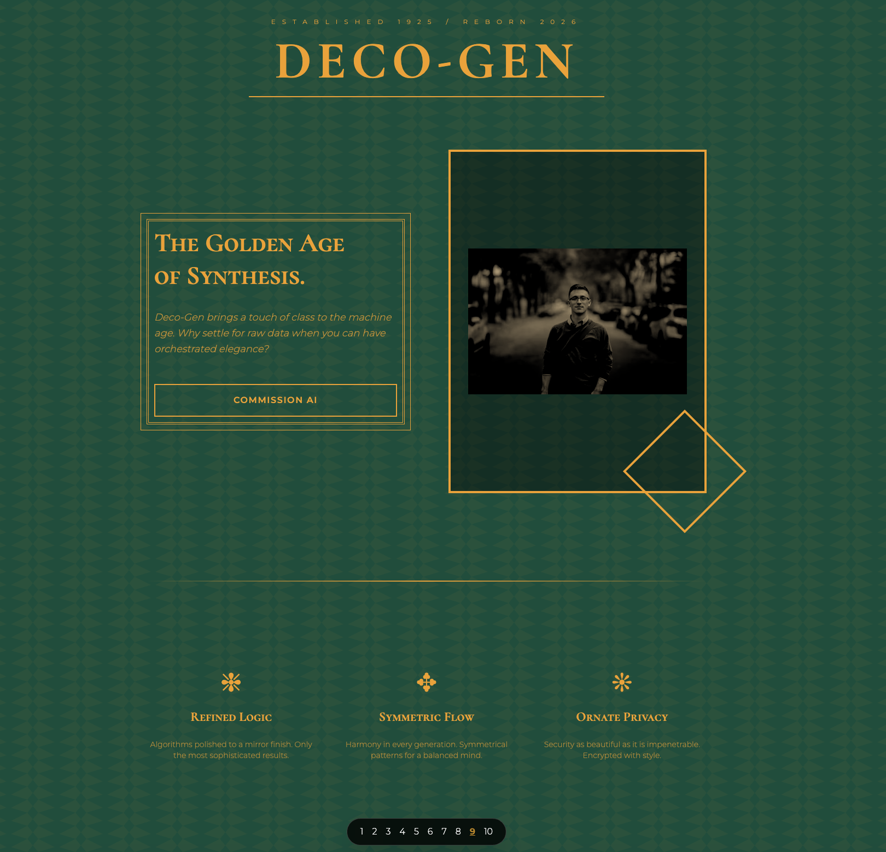
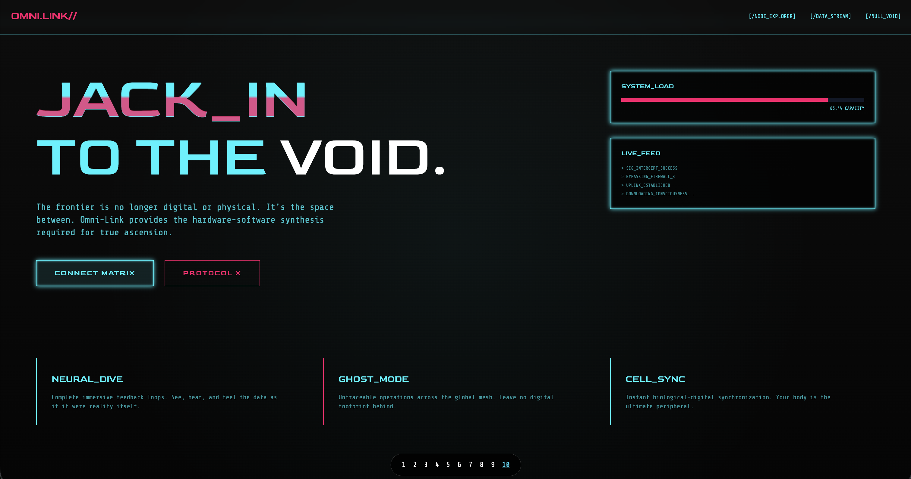

# AI Landing Page POC

Using the front-end skill, I built 10 different landing pages for AI products, each with a distinctive and bold aesthetic direction.

## Original Prompt
"using the front-end skill can you build 10 different landing pages for a AI product? Do you best design work that will blow up UX mind! create a run.sh and make sure I can easiy flip from landing page 1 to 10. Make sure you use the skill: https://skills.sh/anthropics/skills/frontend-design"

## The 10 Aesthetics

| Page | Aesthetic | Preview | Description |
| :--- | :--- | :--- | :--- |
| 1 | **Brutalist Raw** |  | High contrast, rigid grids, and raw machine logic. |
| 2 | **Editorial/Magazine** |  | Elegant, sophisticated, and refined with luxury typography. |
| 3 | **Retro-Futuristic** |  | 80s Synthwave vibe with neon glows and digital grids. |
| 4 | **Organic/Fluid** |  | Soft gradients, glassmorphism, and empathetic design. |
| 5 | **Luxury Refined** |  | Dark mode with gold accents and bespoke serif typography. |
| 6 | **Maximalist Chaos** |  | High energy, clashing colors, and overlapping elements. |
| 7 | **Industrial/Utilitarian** |  | Blueprint-like technical precision and rugged reliability. |
| 8 | **Neumorphic (Soft UI)** |  | Tactile, extruded elements with a clean, monochromatic look. |
| 9 | **Art Deco/Geometric** |  | Emerald and gold patterns reflecting the Golden Age of Synthesis. |
| 10 | **Cyberpunk/High-Tech** |  | Dark, data-driven interface with glitches and neon cyan pulses. |

## How to Run
Execute the following command to start the local server and explore the pages:
```bash
./run.sh
```
