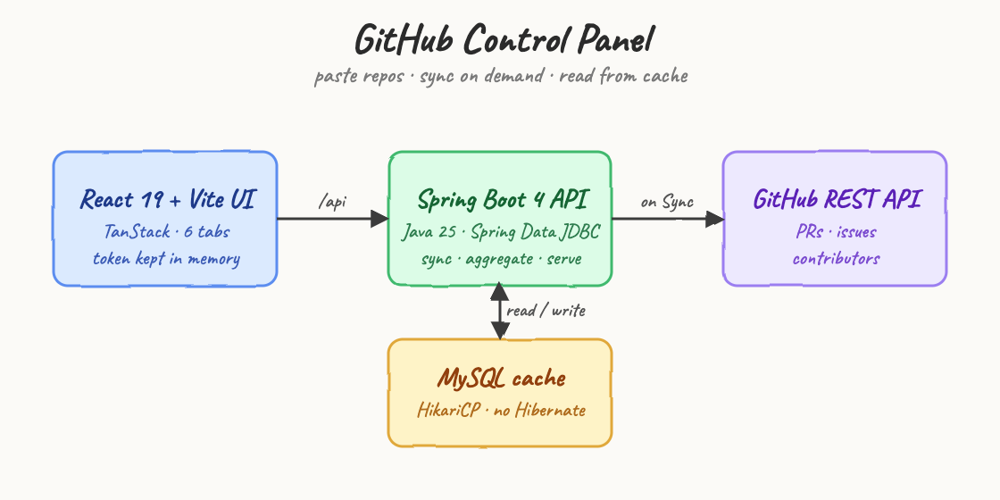
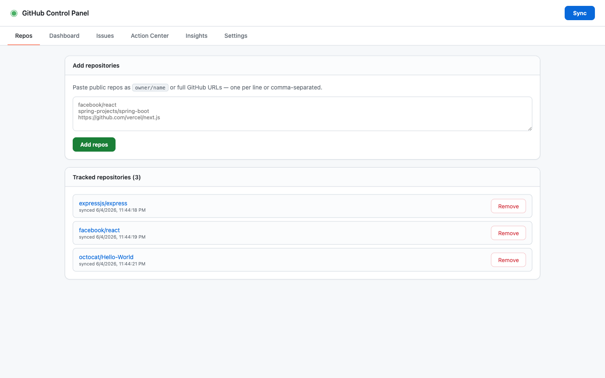
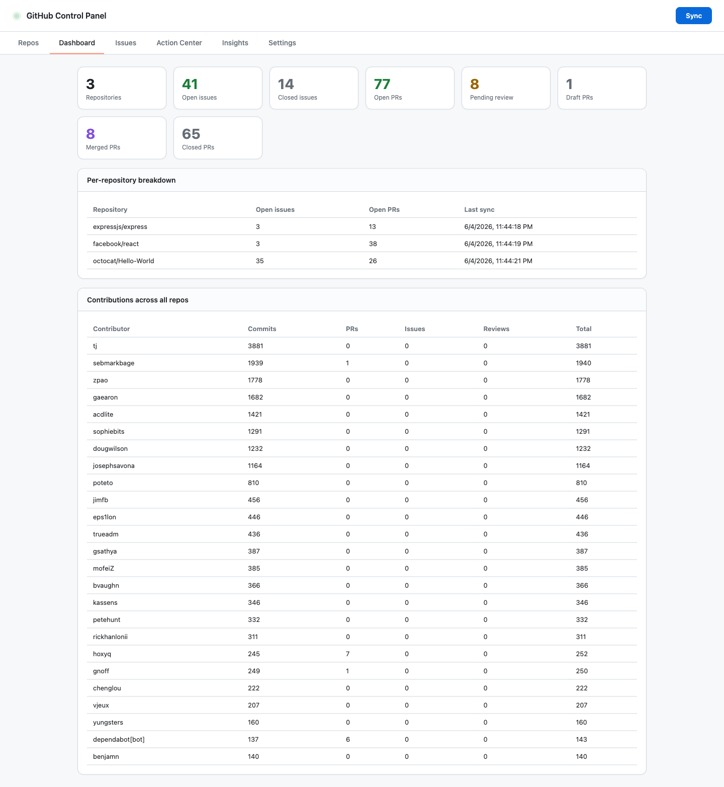
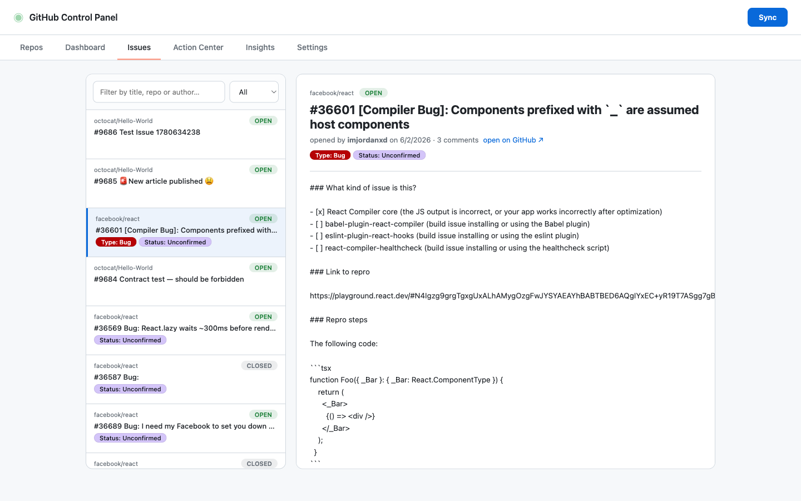
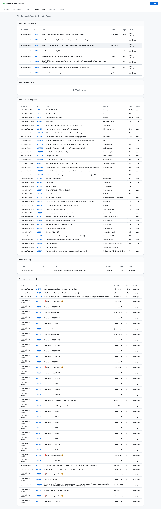
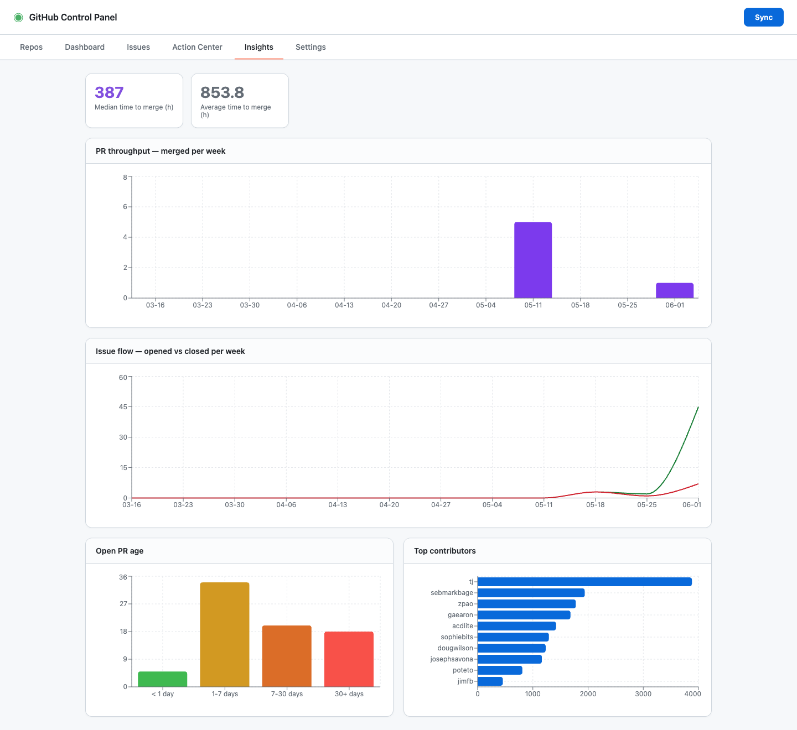
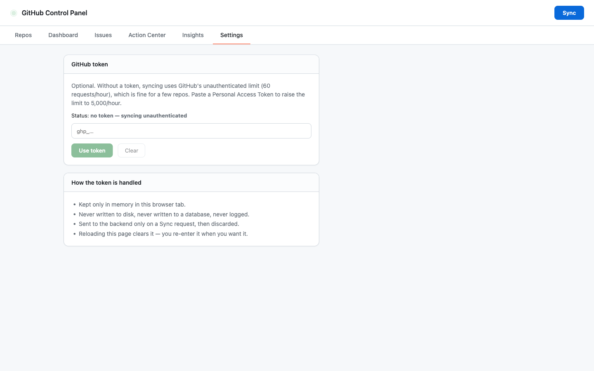

# GitHub Control Panel

A central control panel for watching many **public** GitHub repos from one place.
Paste a list of repos, press **Sync**, and read pull requests, issues, contributions,
a triage inbox, and analytics — all aggregated and served from a local cache.

`React 19 · Vite · TypeScript 6 · TanStack · Recharts` &nbsp;↔&nbsp; `Java 25 · Spring Boot 4 · MySQL · Spring Data JDBC`

## Architecture



The UI never talks to GitHub directly. A user-triggered **Sync** makes the Spring Boot
API pull from GitHub's **REST** API into MySQL; every tab then reads from that cache, so
the UI is fast and never burns GitHub rate limits on page load. An optional GitHub token
is passed in the Sync request header and used transiently — it is never stored.

## The six tabs

### 1 · Repos
Add public repos as `owner/name` or full GitHub URLs (one per line or comma-separated),
see when each was last synced, and remove them.



### 2 · Dashboard
Aggregate counts across all repos — open/closed issues, open/pending/draft/merged/closed
PRs — plus a per-repository breakdown and a contributions table (commits, PRs, issues,
reviews) summed across every repo.



### 3 · Issues
Every issue across all repos in one place. The left rail is a virtualized list (filter by
title/repo/author and by state); the middle pane renders the selected issue for reading —
body, labels, assignees, and a link out to GitHub.



### 4 · Action Center — "what's rotting"
A cross-repo triage inbox: PRs awaiting review, PRs with failing CI, PRs open longer than
the threshold, stale issues (no activity past the threshold), and unassigned issues. The
threshold is **7 days**.



### 5 · Insights
Analytics over the cached data with Recharts — PR throughput (merged per week), median &
average time-to-merge, issue flow (opened vs closed per week), open-PR age buckets, and
top contributors.



### 6 · Settings
Paste an optional GitHub token. It is kept **only in memory** in the browser tab, sent to
the backend only on a Sync request, and never written to disk, a database, or logs.
Reloading the page clears it.



## How sync and the token work

- **Sync is on-demand.** There is no background polling — you control freshness with the
  header **Sync** button (available from every tab). The blinking green dot is just a live
  indicator.
- **No token needed.** Without a token, sync uses GitHub's unauthenticated REST limit
  (60 requests/hour ≈ 20 repos per sync). Each repo costs three REST calls
  (`/pulls`, `/issues`, `/contributors`).
- **With a token** (entered in Settings) the limit rises to 5,000/hour. The token travels
  in the `X-GitHub-Token` header on the Sync call and is discarded after use.

## Tech stack

| Layer    | Choice |
|----------|--------|
| UI       | Node.js, Vite, React 19, TypeScript 6, TanStack (Query, Router, Table, Virtual), Recharts |
| API      | Java 25, Spring Boot 4.0.6, Spring Data JDBC (no Hibernate), JDK/RestClient for GitHub |
| Storage  | MySQL 9 with HikariCP |
| Runtime  | Three containers (MySQL + backend + frontend) via `podman-compose` |

## API

| Method | Path | Purpose |
|--------|------|---------|
| GET    | `/api/repos`          | list tracked repos |
| POST   | `/api/repos`          | add repos `{ "repos": ["owner/name", ...] }` |
| DELETE | `/api/repos/{id}`     | remove a repo |
| POST   | `/api/sync`           | sync now (optional `X-GitHub-Token` header) |
| GET    | `/api/dashboard`      | aggregate counts + contributions |
| GET    | `/api/issues`         | all issues |
| GET    | `/api/issues/{id}`    | single issue detail |
| GET    | `/api/action-center`  | "needs attention" groups |
| GET    | `/api/insights`       | analytics series |

## Running it

Requirements: `podman` + `podman-compose`. Nothing else — the toolchains build inside
containers.

```
./start.sh   # builds and starts MySQL + backend + frontend, waits until both are ready
./test.sh    # adds a repo, syncs, and prints the aggregated endpoints
./stop.sh    # stops everything
```

Then open **http://localhost:5173**. The backend is on **http://localhost:8080**.

## Tests

Backend unit tests cover the encoding round-trip (labels survive delimiter collisions) and
repo-input normalization (URLs, `.git` suffixes, trailing slashes):

```
cd backend && mvn test
```

```
Tests run: 8, Failures: 0, Errors: 0, Skipped: 0
BUILD SUCCESS
```

## Notes & limitations

- The fetch layer uses GitHub's **REST** API, not GraphQL, because GraphQL rejects
  unauthenticated requests — REST is what keeps the token optional.
- REST's PR-list payload does not include CI check status, so the Action Center
  **"failing CI"** group is empty in this build (it would need a token-gated per-PR call).
- Each sync pulls the 50 most recently updated PRs and issues per repo, plus the top 100
  contributors — enough for a control panel without unbounded pagination.
