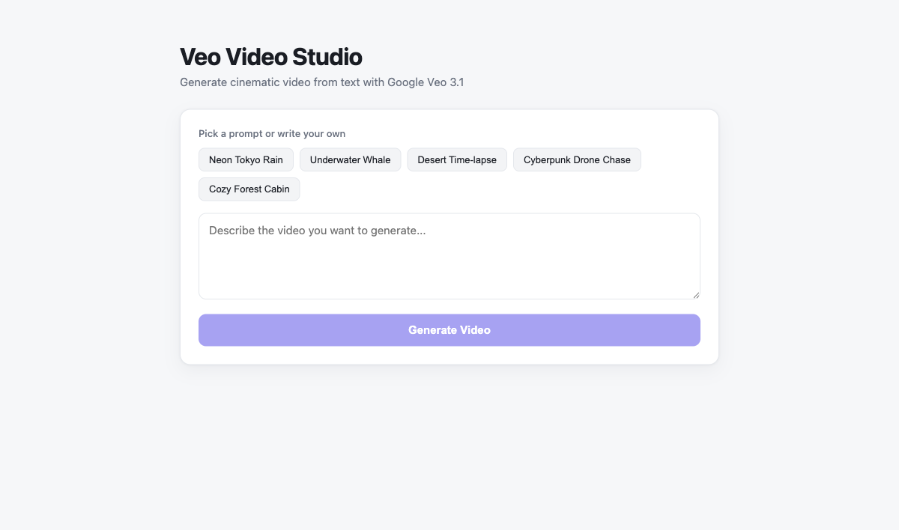
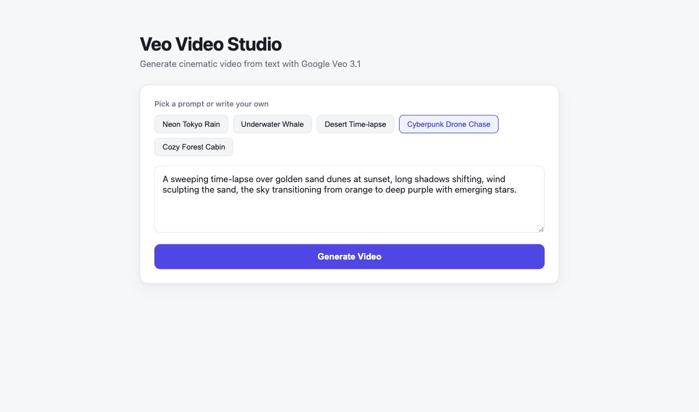

# Veo Video Studio

A web app to generate cinematic video from a text prompt using the **Google Veo 3.1** model through the Gemini API. Type a prompt (or pick a curated one), generate, and the finished MP4 is downloaded by the backend and streamed back into the browser for playback and download.

## Stack

- **Frontend:** React 19, Vite 7, TanStack Query (handles the generate request and polls job status until the video is ready)
- **Backend:** Node.js (latest), Express 5, `@google/genai` SDK
- **Model:** `veo-3.1-generate-preview`

The Gemini API key never reaches the browser. The backend holds `GEMINI_API_KEY`, talks to Veo, downloads the result, and exposes it through a local URL.

## How it works

```
Browser (React + TanStack Query)
   |  POST /api/generate { prompt }
   v
Backend (Express)  --->  ai.models.generateVideos(model: veo-3.1, prompt)
   |                          |
   |   GET /api/status/:id    |  poll operation until done (every 10s)
   |  <---- running/done ---- ai.operations.getVideosOperation()
   |                          |
   |                       ai.files.download() -> videos/<jobId>.mp4
   v
Browser  GET /api/video/:id  --->  streams the MP4 back, plays + offers download
```

Video generation is asynchronous and takes a few minutes. The backend tracks each request as an in-memory job; the frontend polls `/api/status/:jobId` every 4 seconds with TanStack Query and renders the video once the status flips to `done`.

## Screenshots

### Landing screen



The clean, light UI. A row of five curated prompt chips sits above a free-form textarea. The **Generate Video** button is disabled until there is prompt text, so you can't fire an empty request.

### Prompt selected



Clicking a chip fills the textarea with a ready-to-use cinematic prompt (you can edit it or write your own). The button turns solid indigo to show it's now actionable. While a video is generating, the controls disable and a spinner card explains the wait; when finished, a result card appears with the inline `<video>` player and a **Download MP4** link.

## Sample outputs

Real 8-second clips generated by Veo 3.1 from the curated prompts. The animated previews below render inline on GitHub — click any preview to open the full-quality MP4 (with audio).

### Neon Tokyo Rain

[](videos/tokyo-veo.mp4)

### Underwater Whale

[](videos/veo-whale.mp4)

### Desert Time-lapse

[](videos/desert-veo.mp4)

### Cozy Forest Cabin

[](videos/veo-cabin.mp4)

## Curated prompts

Five one-click prompts are built in: **Neon Tokyo Rain**, **Underwater Whale**, **Desert Time-lapse**, **Cyberpunk Drone Chase**, and **Cozy Forest Cabin**. They live in `frontend/src/App.jsx` (`DEFAULT_PROMPTS`) — edit that array to change them.

## Prerequisites

- Node.js (tested on v24) and npm
- A Gemini API key with Veo access, exported as an env var:

```bash
export GEMINI_API_KEY="your-key-here"
```

## Run

```bash
./start.sh
```

`start.sh` installs dependencies on first run, starts the backend on `:3001` and the Vite dev server on `:5173`, then waits until both respond. Open:

```
http://localhost:5173
```

Vite proxies all `/api` calls to the backend, so there is nothing else to configure.

To stop:

```bash
./stop.sh
```

Logs are written to `backend.log` and `frontend.log`.

## API endpoints

| Method | Path                  | Purpose                                              |
| ------ | --------------------- | ---------------------------------------------------- |
| POST   | `/api/generate`       | Start a job. Body `{ "prompt": "..." }` → `{ jobId }`|
| GET    | `/api/status/:jobId`  | `{ status: running\|done\|error, videoUrl, error }`  |
| GET    | `/api/video/:jobId`   | Streams the generated MP4                             |

## Project structure

```
google-gemini-veo-video-poc/
├── backend/
│   ├── server.js        Express API + Veo calls + job tracking
│   ├── package.json
│   └── videos/          downloaded MP4s (gitignored)
├── frontend/
│   ├── src/
│   │   ├── App.jsx      UI, prompts, TanStack Query polling
│   │   ├── main.jsx     React + QueryClient bootstrap
│   │   └── styles.css   light theme
│   ├── vite.config.js   dev server + /api proxy
│   └── index.html
├── docs/                README screenshots
├── videos/              compressed sample outputs shown in this README
├── start.sh
└── stop.sh
```

## Notes

- Generated videos are stored on disk under `backend/videos/` and served by job id; jobs are kept in memory, so a backend restart clears job tracking (the MP4 files remain).
- Veo generation can take 1–3 minutes per clip and is billed by Google per request.

## Compressing the sample videos

The clips in `videos/` were re-encoded with ffmpeg to keep the repo light while staying inline-playable on GitHub:

```bash
for f in *.mp4; do
  ffmpeg -y -loglevel error -i "$f" \
    -c:v libx264 -crf 30 -preset veryslow -pix_fmt yuv420p \
    -c:a aac -b:a 96k -movflags +faststart \
    "/tmp/c_$f" && mv "/tmp/c_$f" "$f"
done
```

- `-c:v libx264 -crf 30` — H.264, quality-based encode (lower CRF = bigger/better)
- `-preset veryslow` — more CPU for better compression at the same quality
- `-pix_fmt yuv420p` — broad browser/player compatibility
- `-c:a aac -b:a 96k` — AAC audio at 96 kbps
- `-movflags +faststart` — moov atom up front so playback starts before full download

Resolution and length were kept as-is (1280×720, 8 s).

### Size win

| File | Before | After |
| ---- | ------ | ----- |
| desert-veo.mp4 | 3.4 MB | 836 KB |
| tokyo-veo.mp4 | 9.0 MB | 2.0 MB |
| veo-whale.mp4 | 6.8 MB | 2.0 MB |
| veo-cabin.mp4 | 11.7 MB | 3.0 MB |
| **total** | **~30 MB** | **~7.8 MB** |
