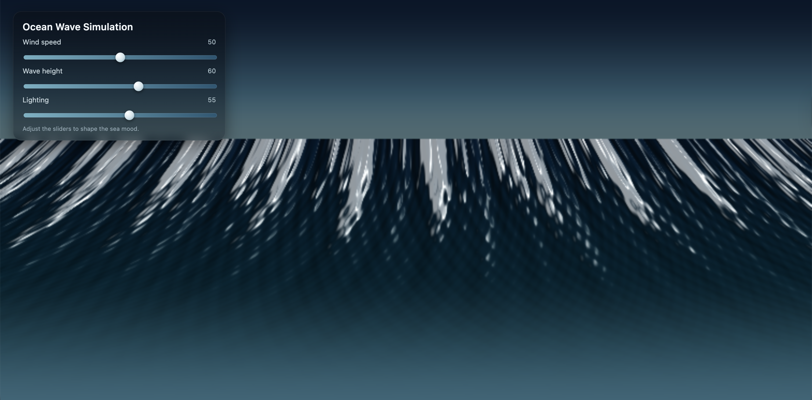

# Prompt

```
Create a single-page app in a single HTML file with the following requirements:
  - Name: Ocean Wave Simulation
  - Goal: Display realistic animated waves.
  - Features: Change wind speed, wave height, lighting.
  - The UI should be calming and realistic.
```

### Result

