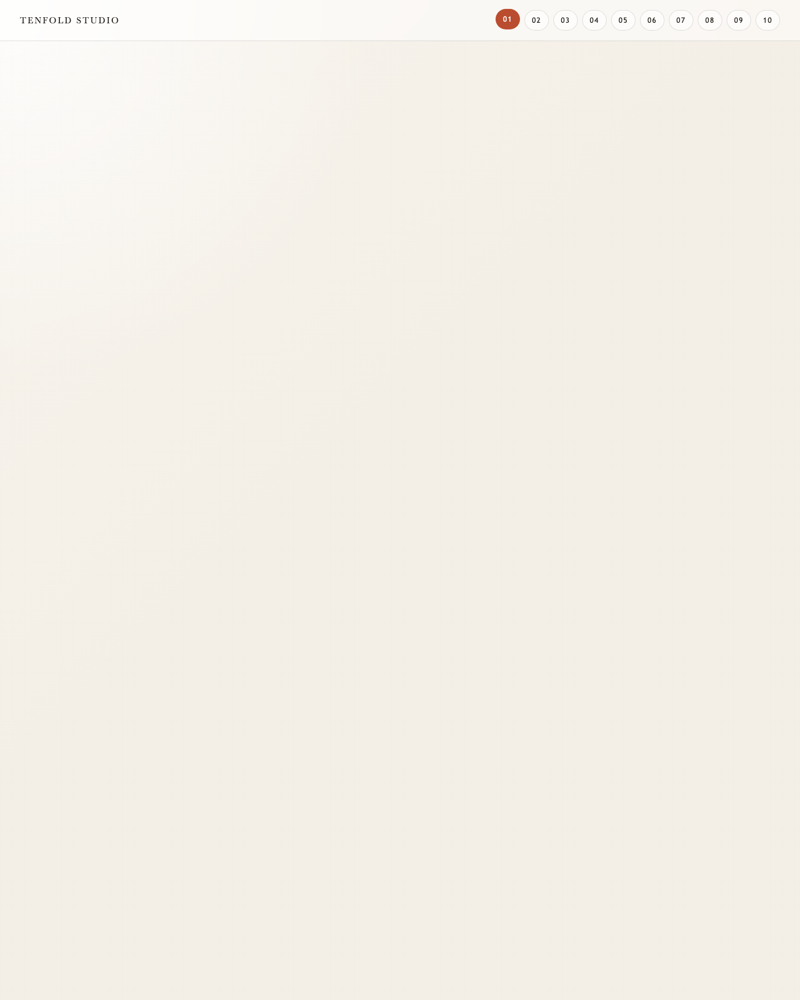
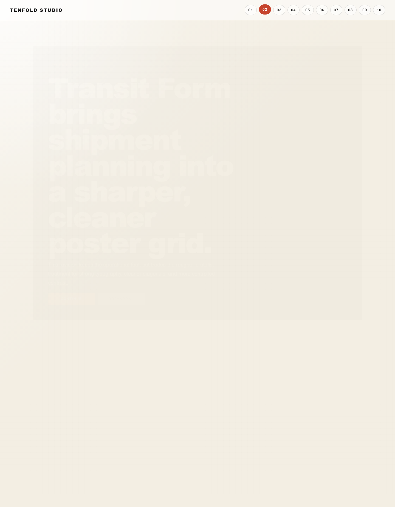
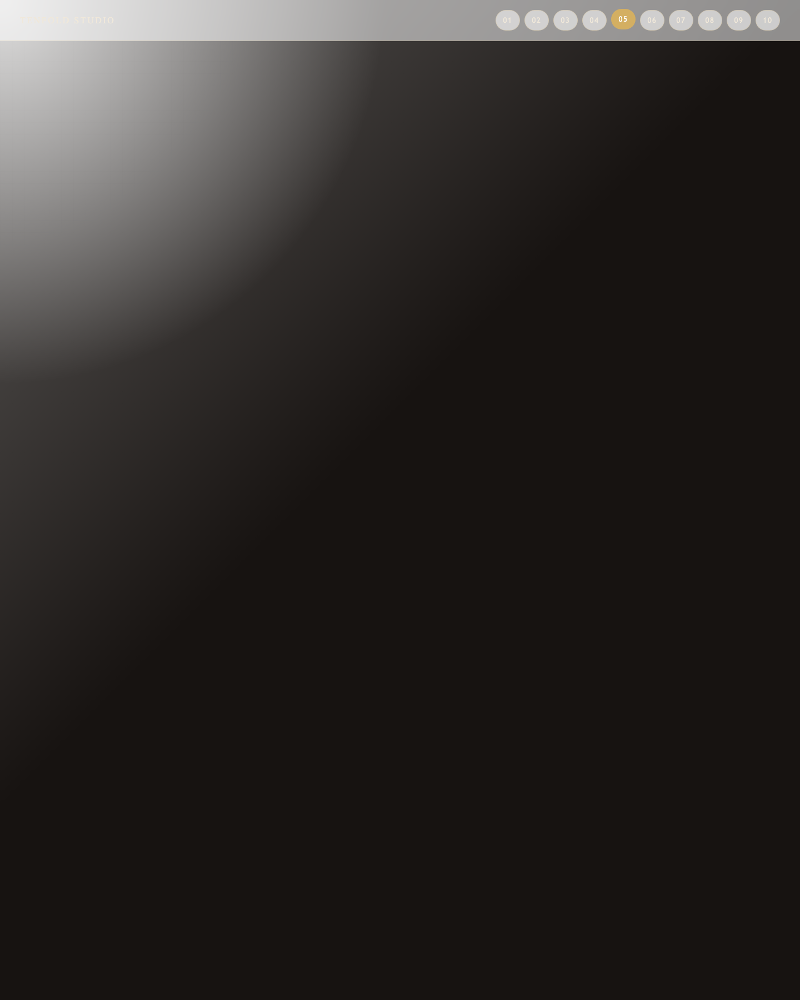
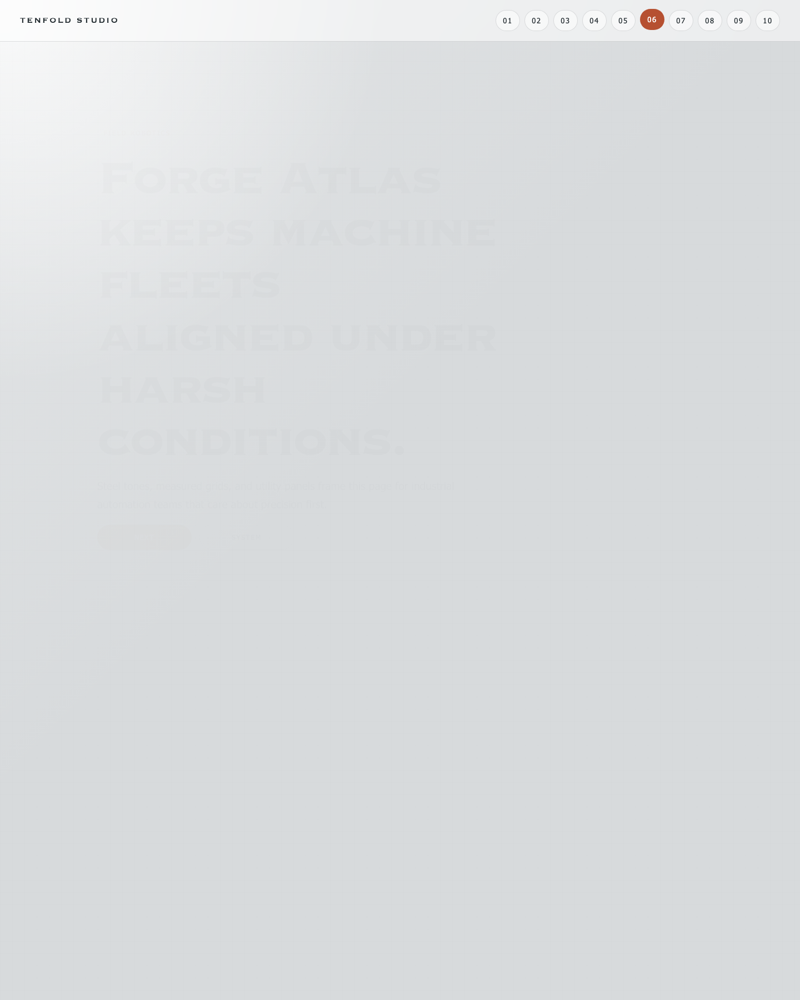
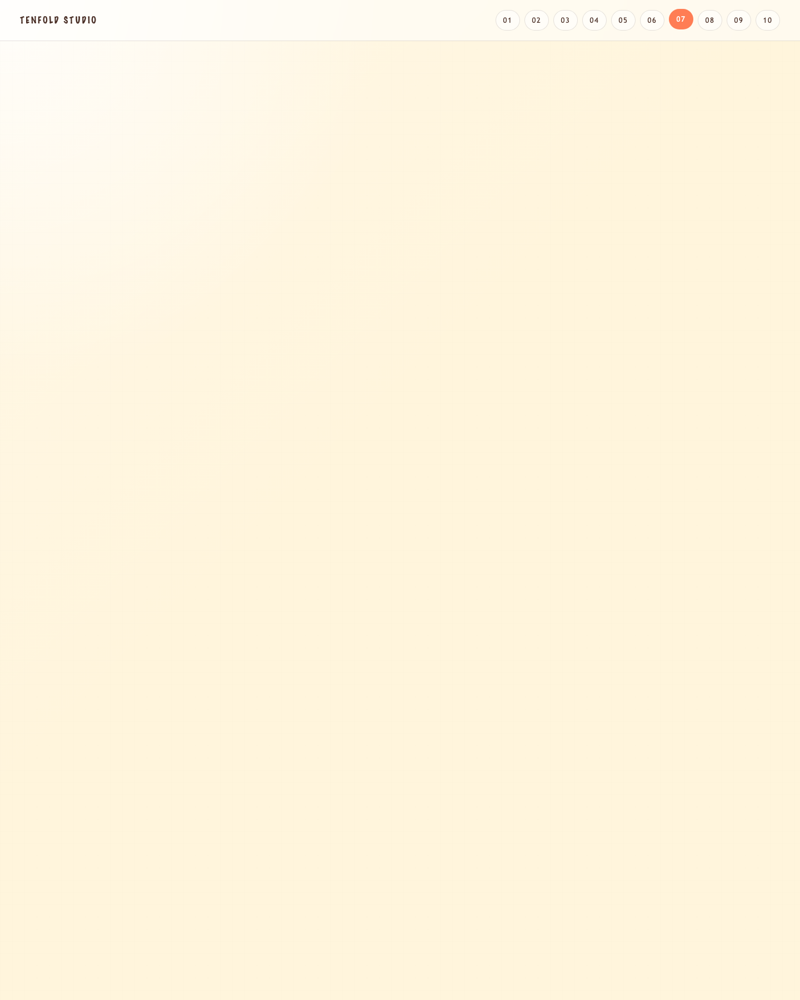
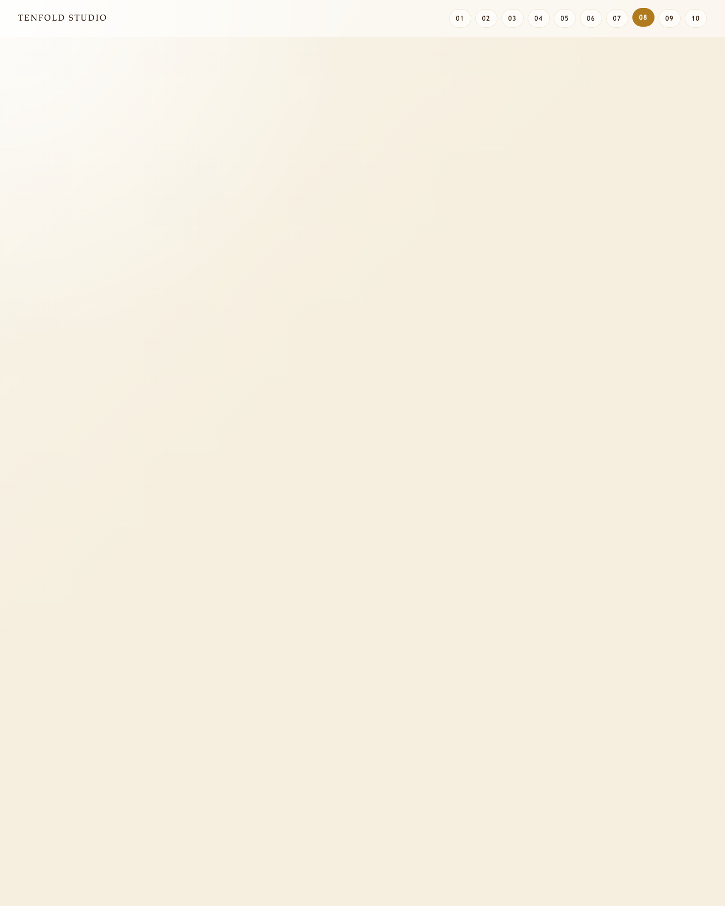
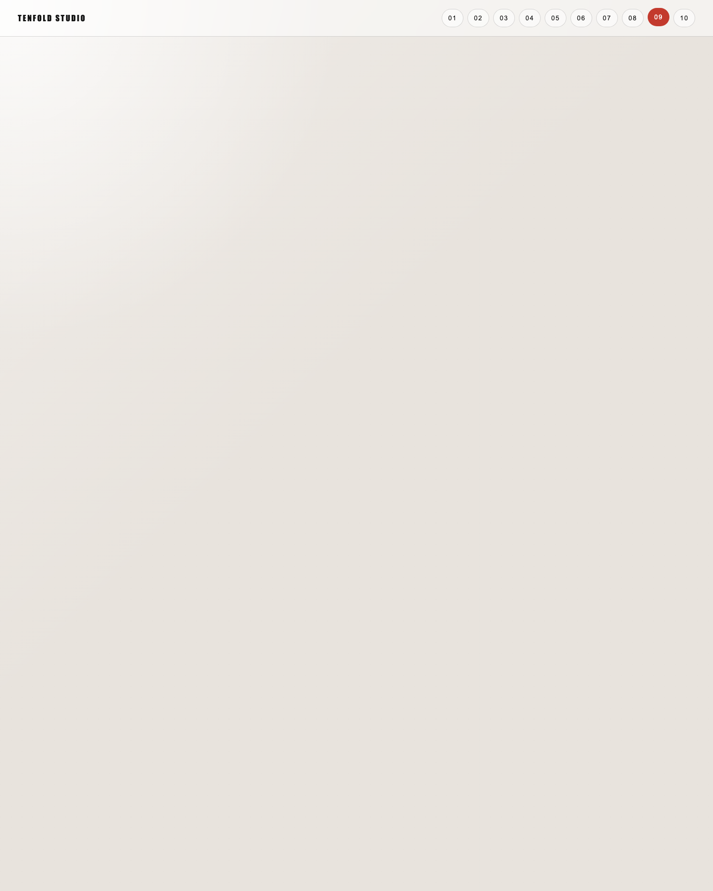
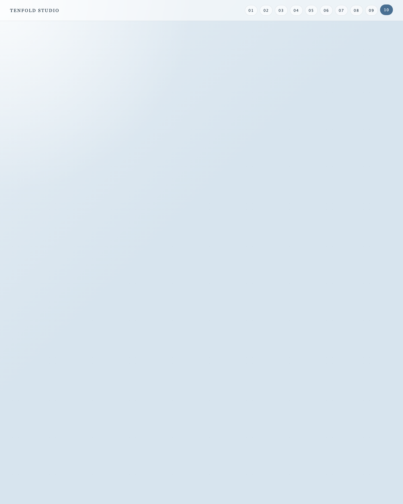

# Ten Landing Pages

This repository contains 10 distinct landing pages connected by a fixed top navigation so each page is one click away. The app itself uses plain HTML, CSS, and JavaScript to keep the stack simple and easy to run locally.

## Model and code notes

The work here was produced with `GPT-5.4 Codex`. The codebase uses:

- `HTML` for the page structure
- `CSS` for layout, themes, and motion
- `JavaScript` for active navigation and keyboard page switching
- `Playwright` for screenshot capture

## Run

```bash
./run.sh
```

Open `http://127.0.0.1:4173`.

## Screenshot capture

Run:

```bash
bun add -d playwright
bunx playwright install chromium
node scripts/capture.mjs
```

The images are written to `screenshots/`.

## Pages

### 01. Signal Bloom
Editorial launch page with serif headlines, newsroom spacing, and warm print-like contrast.



### 02. Transit Form
Swiss-poster logistics page with sharper alignment, stronger restraint, and a cleaner operational tone.



### 03. Neon Meridian
Night-market analytics page with glowing horizon layers and sharp neon framing.


### 04. Verdant Current
Organic wellness page with softer tones, rounded forms, and calm breathable spacing.


### 05. Velvet Reserve
Luxury hospitality page with restrained black-and-gold styling and polished negative space.



### 06. Forge Atlas
Industrial robotics page with steel textures, utility framing, and field-ready presentation.



### 07. Sprout Parade
Playful family learning page with kinetic colors, rounded geometry, and upbeat motion.



### 08. Aurelian Ledger
Private wealth page with cream space, subtle gold framing, and a quieter luxury feel.



### 09. Dataline Post
Media intelligence page with editorial urgency, signal panels, and a headline-first layout.



### 10. Summit Kindred
Outdoor retreat page with alpine light, layered ridges, and open-air composition.


