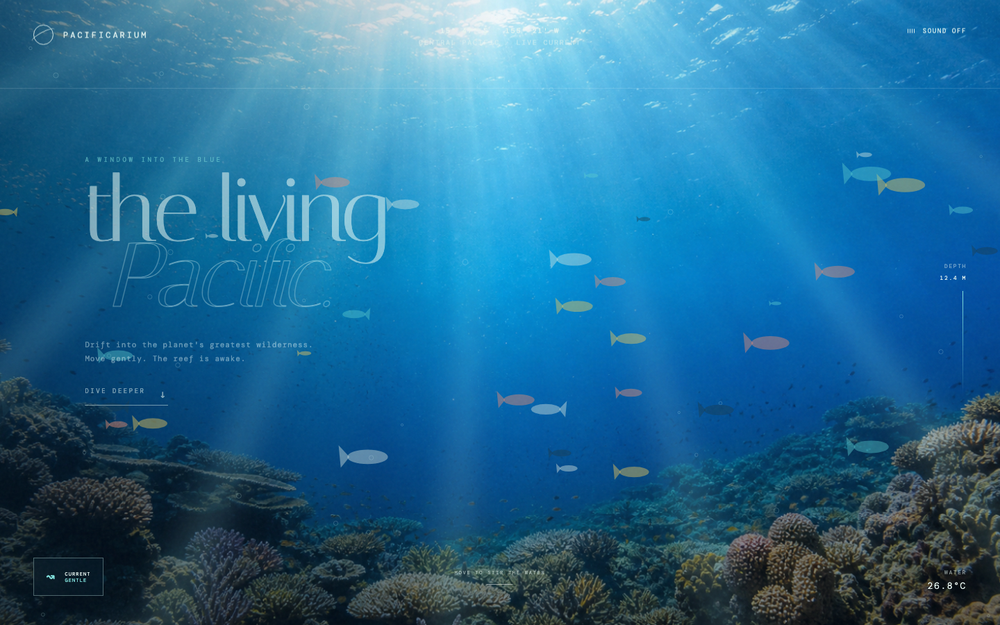
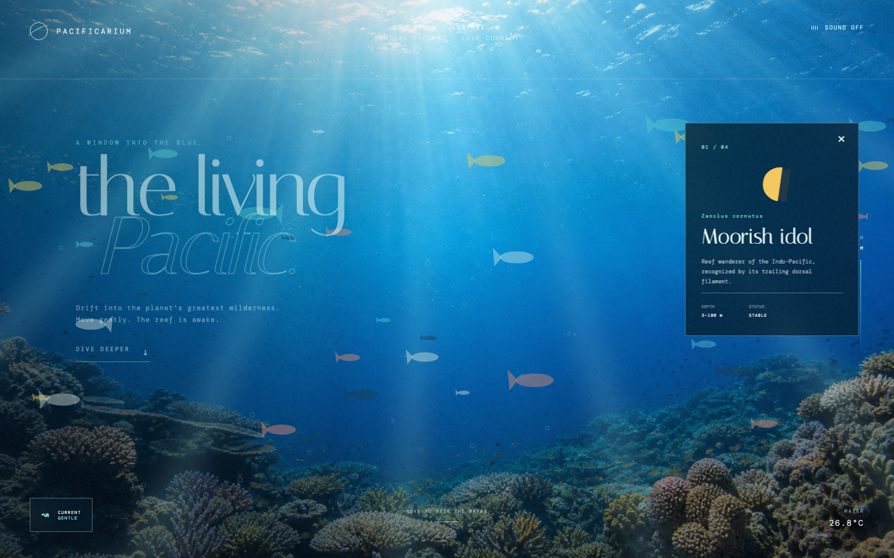

# Pacificarium

An immersive living Pacific reef rendered with a photographic backdrop, animated marine life, shifting light, responsive currents, and generative ocean sound.





## Run

```bash
./start.sh
```

Open [http://127.0.0.1:8080](http://127.0.0.1:8080).

```bash
./stop.sh
```

## Explore

- Move the pointer to stir nearby fish
- Toggle the current between gentle and still
- Turn on a locally generated ocean soundscape
- Select “Dive deeper” to discover a reef resident

## Design

Pacificarium uses plain HTML, CSS, and JavaScript. The reef image is original AI-generated artwork stored locally, while fish, bubbles, caustics, depth changes, and sound are generated in the browser without external libraries.
