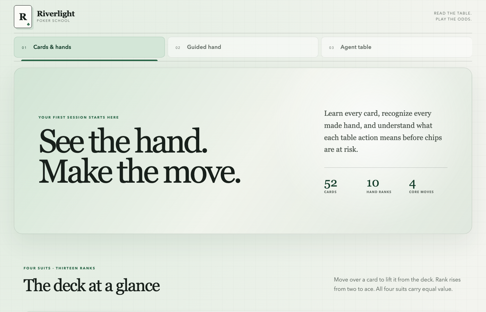
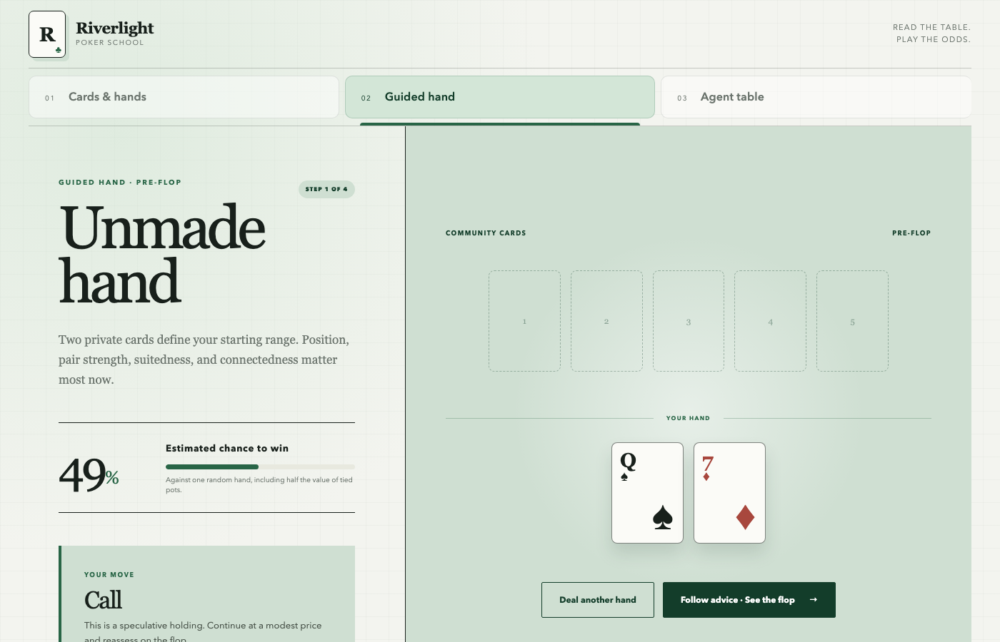
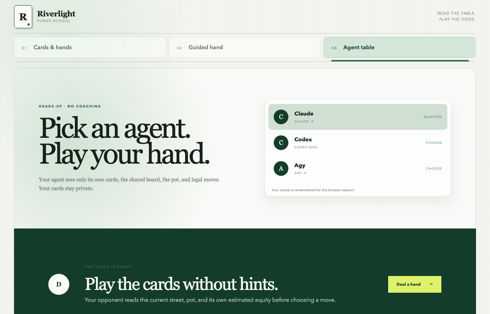

# Riverlight Poker School

Riverlight is a light-themed Texas Hold’em learning application built with Python 3.14 and Django 6. It teaches the deck, hand strength, table actions, probability, street-by-street decisions, and heads-up play against local agent CLIs.

The interface uses no CSS or JavaScript libraries.

## Application screens

### Tab 1: Cards & Hands



This tab is the poker reference desk. It contains:

- All 52 cards across spades, hearts, diamonds, and clubs
- Thirteen ranks from two through ace
- Clean white card faces with Dock-style proximity magnification
- The ten standard poker hand ranks in strongest-to-weakest order
- Five-card deal frequencies and odds
- The four table actions: Fold, Check, Call, and Raise
- The rule that the best five cards decide the final hand
- Ace-high and ace-low straight behavior

Move the pointer across a suit row or hand-rank row. The closest card grows most while nearby cards rise proportionally.

Open directly at [http://127.0.0.1:8000/?tab=cards](http://127.0.0.1:8000/?tab=cards).

### Tab 2: Guided Hand



This tab teaches one complete Hold’em hand from pre-flop through the river. It shows:

- Two private cards
- The current community cards
- The current made hand
- Estimated heads-up equity
- The recommended action
- A plain-language reason for that action
- Equity movement after every new community card
- A persistent four-street decision timeline
- A completed-hand review at the river

Use `Follow advice` to move from pre-flop to flop, turn, river, and final review. The page updates only the active lesson area, preserving the current position on screen.

Open directly at [http://127.0.0.1:8000/?tab=simulation](http://127.0.0.1:8000/?tab=simulation).

### Tab 3: Agent Table



This tab provides heads-up play against a local CLI agent. Choose among:

- Claude through `claude -p`
- Codex through `codex exec`
- Agy through `agy -p`

The selected opponent is remembered in the Django session. The table supports:

- Private player and opponent cards
- Pre-flop, flop, turn, and river progression
- Pot and stack tracking
- Fold, Check, Call, and Raise decisions
- Opponent decisions based on its cards, board, pot, legal actions, and estimated equity
- In-place actions without full document navigation
- Hand history and showdown results
- An optional `Reveal your chance to win` report
- Win, tie, and loss percentages
- Improvement paths and unseen-card counts
- A local poker policy when the selected CLI is missing, times out, or returns an invalid move

Open directly at [http://127.0.0.1:8000/?tab=ai](http://127.0.0.1:8000/?tab=ai).

## Load the application

Requirements:

- Python 3.14.x available as `python3.14`
- `curl`
- One or more supported agent CLIs for live agent decisions

Start Riverlight:

```bash
./start.sh
```

The script creates `.venv`, installs Django, applies the session migrations, starts the server, and waits until the home page responds.

Open [http://127.0.0.1:8000](http://127.0.0.1:8000).

Stop Riverlight:

```bash
./stop.sh
```

Run the tests:

```bash
./test.sh
```

## The 52-card deck

A standard deck has four suits:

- Spades: `♠`
- Hearts: `♥`
- Diamonds: `♦`
- Clubs: `♣`

Every suit contains thirteen ranks:

`2 3 4 5 6 7 8 9 10 J Q K A`

Suits are equal in Hold’em. A flush in spades does not outrank an equal flush in hearts. Rank and kickers settle ties.

An ace is normally the highest rank. It can also act below a two in the lowest straight: `A–2–3–4–5`. It cannot wrap around, so `Q–K–A–2–3` is not a straight.

## The ten poker hand ranks

The percentages below describe random five-card hands from a 52-card deck.

| Rank | Hand | How it is made | Tie-break rule | Five-card frequency |
|---:|---|---|---|---:|
| 1 | Royal flush | `10–J–Q–K–A` in one suit | Equal royal flushes split the pot | 0.000154% |
| 2 | Straight flush | Five consecutive cards in one suit | Highest card in the straight wins | 0.00139% excluding royal flushes |
| 3 | Four of a kind | Four cards sharing one rank | Higher four-card rank wins, then kicker | 0.0240% |
| 4 | Full house | Three cards of one rank and two of another | Higher three-card rank wins, then pair | 0.1441% |
| 5 | Flush | Five cards in one suit without a straight | Compare highest card, then each lower card | 0.1965% |
| 6 | Straight | Five consecutive ranks in mixed suits | Highest card in the straight wins | 0.3925% |
| 7 | Three of a kind | Three cards sharing one rank | Higher trips win, then both kickers | 2.1128% |
| 8 | Two pair | Two different pairs and one kicker | Higher pair, lower pair, then kicker | 4.7539% |
| 9 | One pair | Two cards sharing one rank | Higher pair wins, then three kickers | 42.2569% |
| 10 | High card | No pair, straight, flush, or stronger hand | Compare cards from highest to lowest | 50.1177% |

### Royal flush

A royal flush is the strongest possible hand: `10`, `J`, `Q`, `K`, and `A`, all in the same suit. There is no higher kicker because all royal flushes contain the same ranks.

### Straight flush

A straight flush contains five consecutive ranks in one suit. `9–8–7–6–5` beats `8–7–6–5–4`. The ace-low `A–2–3–4–5` straight flush is five-high and is the weakest straight flush.

### Four of a kind

Four of a kind contains all four cards of one rank. Four queens beat four jacks. When the shared board contains the four matching cards, the fifth card acts as the kicker.

### Full house

A full house combines three of a kind with a pair. `K–K–K–4–4` beats `Q–Q–Q–A–A` because the three-card group is compared first.

### Flush

A flush contains five cards in one suit that are not consecutive. Compare the highest card first. If tied, compare the second-highest card and continue until the tie breaks.

### Straight

A straight contains five consecutive ranks. Suits do not matter. `10–9–8–7–6` beats `9–8–7–6–5`. The ace can be high in `10–J–Q–K–A` or low in `A–2–3–4–5`.

### Three of a kind

Three of a kind contains three cards sharing one rank plus two unrelated kickers. Higher trips win. If both players use the same trips from the board, compare the kickers.

### Two pair

Two pair contains two cards of one rank, two of another, and a kicker. Compare the higher pair first, then the lower pair, then the kicker.

### One pair

One pair contains two cards sharing one rank plus three kickers. Compare pair rank first, then the highest available kicker, continuing downward if needed.

### High card

A high-card hand has no stronger five-card pattern. Compare the highest card, then the next-highest card until the tie breaks.

## Choosing the best five cards

Hold’em provides seven available cards at the river:

- Two private cards
- Five community cards

Only the strongest five-card combination counts. A player may use both private cards, one private card, or no private cards. When the five best cards are all on the board, every remaining player may have the same hand and split the pot.

## Table actions

### Fold

Fold gives up the current hand. Chips already placed in the pot remain there, but no additional chips are paid. Folding is available whenever action reaches the player.

### Check

Check passes action without adding chips. It is only legal when there is no outstanding bet to match. Checking keeps the player in the hand.

### Call

Call matches the outstanding bet. If the opponent bets 20, calling normally adds 20 to the pot and keeps the hand alive.

### Raise

Raise increases the current bet. The opponent must then fold, call, or raise again. Raising can build value with a strong hand or apply pressure with a bluff.

## Calculating the chance to win

Poker probability begins with known and unseen cards.

```text
Unseen cards = 52 - private cards - visible community cards
```

On the flop, the player knows five cards: two private cards and three community cards. That leaves `47` unseen cards.

### Equity

Equity gives tied pots half value:

```text
Equity % = (wins + 0.5 × ties) ÷ total trials × 100
```

If 1,200 simulated showdowns produce 684 wins, 72 ties, and 444 losses:

```text
Equity = (684 + 0.5 × 72) ÷ 1,200 × 100
Equity = 60%
```

The separate rates are:

```text
Win %  = wins ÷ trials × 100
Tie %  = ties ÷ trials × 100
Lose % = losses ÷ trials × 100
```

### Outs

An out is an unseen card that improves the hand to the intended target.

For a four-card flush after the flop:

- Thirteen cards exist in that suit
- Four are already known
- Nine flush outs remain
- Forty-seven cards are unseen

The chance to hit on the next card is:

```text
P(hit next card) = outs ÷ unseen cards
P(hit next card) = 9 ÷ 47
P(hit next card) = 19.1%
```

With two cards still to come, calculate the chance of missing both cards and subtract it from one:

```text
P(hit by river) = 1 - ((unseen - outs) ÷ unseen)
                    × ((unseen - outs - 1) ÷ (unseen - 1))
P(hit by river) = 1 - (38 ÷ 47) × (37 ÷ 46)
P(hit by river) = 35.0%
```

Completing a draw is not always the same as winning. An opponent may make a higher flush, full house, or stronger hand. Full equity calculation accounts for opposing cards and complete board runouts.

### Rule of four and two

A quick table estimate is:

- With two cards to come: multiply outs by four
- With one card to come: multiply outs by two

Nine flush outs give roughly `9 × 4 = 36%` from flop to river and `9 × 2 = 18%` from turn to river. The exact results are about `35.0%` and `19.6%`.

### Pot odds

Pot odds compare the price of calling with the final pot after the call:

```text
Required equity % = call amount ÷ (current pot + call amount) × 100
```

If the current pot is 100 and calling costs 20:

```text
Required equity = 20 ÷ (100 + 20) × 100
Required equity = 16.7%
```

A call is mathematically favorable when estimated equity is higher than the required equity, before considering future betting, stack depth, position, and the possibility that some outs are not clean.

## How Riverlight calculates equity

Riverlight removes all known cards, deals unseen opponent cards and remaining board cards, evaluates both best five-card hands, and records the result.

The application uses:

- 900 trials for the guided-hand estimate
- 1,200 trials for the optional agent-table probability report
- 500 trials for the agent opponent’s private decision estimate

The known cards seed the sampler, so the same visible state produces a stable teaching number. Wins count fully, ties count halfway, and losses add no equity.

An exact flop calculation against one unknown opponent can require more than one million opponent-and-runout combinations. Sampling keeps the interface responsive while providing a useful learning estimate.

## Agent decision flow

The selected CLI receives:

- Its own private cards
- Current street
- Visible community cards
- Pot size
- Legal actions
- Its estimated equity

The CLI is instructed to return exactly one legal action. Commands use argument arrays without a shell and stop after 45 seconds. Invalid, unavailable, or timed-out agent responses use the local policy so the table remains playable.

## Project structure

```text
academy/
  agents.py
  poker.py
  tests.py
  urls.py
  views.py
docs/screenshots/
  agent-tab.png
  cards-tab.png
  guided-tab.png
poker_school/
  settings.py
  urls.py
static/academy/
  app.js
  style.css
templates/academy/
  actions.html
  card.html
  home.html
manage.py
start.sh
stop.sh
test.sh
```

`academy/poker.py` owns the deck, hand evaluator, equity sampler, dealing flow, improvement paths, and teaching guidance.

`academy/agents.py` owns the constrained CLI calls and local fallback policy.

`academy/views.py` owns session-backed guided hands, agent games, provider selection, and probability reports.

`static/academy/app.js` owns in-place form updates and Dock-style card magnification.

## Verification

The test suite covers:

- Royal flush comparison
- Ace-low straights
- Repeatable and bounded equity
- All three tabs
- Provider persistence
- Invalid provider rejection
- Guided progression through all four streets
- Complete guided-hand review
- Optional equity reveal
- Agent move progression

Riverlight is intended for learning and practice. Probability is information about possible outcomes, not a guarantee of the next card or hand result.
