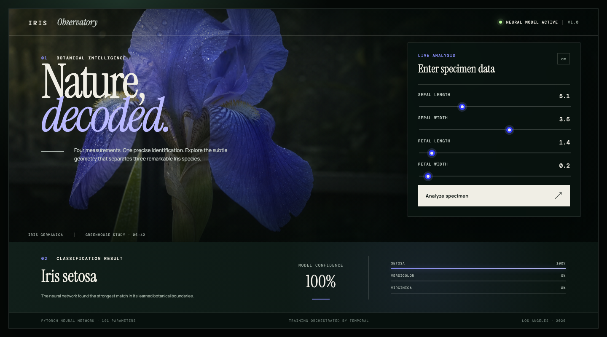
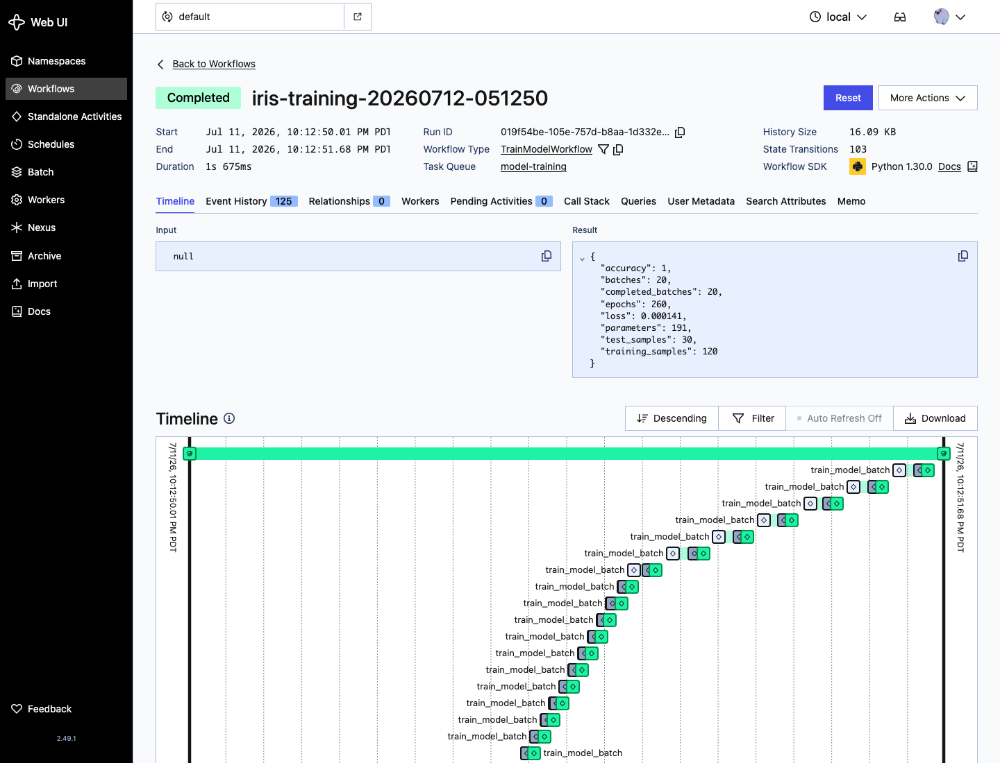

# Temporal PyTorch Model Pipeline

A complete Python 3 system that trains a compact PyTorch neural network inside a Temporal workflow and serves the resulting model through an interactive browser interface. Podman runs every service.

## Screens

### Inference interface



### Temporal training workflow



## Architecture

```text
train.sh
   |
   v
Temporal Server + UI :7233 / :8233
   |
   v
model-training task queue
   |
   v
TrainModelWorkflow -> train_model activity -> model/artifacts/iris-network.pt
                                               |
                                               v
                                   web-ui inference server :8091
```

The project has three explicit boundaries:

- `model/` contains the reusable PyTorch network and generated artifacts.
- `model-pipeline/` contains the Temporal workflow, training activity, worker, and trigger.
- `web-ui/` contains the inference HTTP server and browser assets.

## Requirements

- Podman 5 or newer
- podman-compose 1.5 or newer
- `curl`
- macOS `open` is optional; scripts still print each URL on other systems

No host Python environment is required. The application container uses Python 3.14, PyTorch 2.13, and Temporal Python SDK 1.30.

## Train

```bash
./train.sh
```

This command performs the following work:

1. Starts Temporal's development server and built-in browser interface.
2. Builds and recreates the Python training worker.
3. Waits for Temporal to become healthy.
4. Starts a uniquely identified `TrainModelWorkflow`.
5. Waits for all 20 training batch activities to finish.
6. writes `iris-network.pt` and `metrics.json` under `model/artifacts/`.
7. opens `http://localhost:8233` when macOS browser opening is available.

Set `OPEN_BROWSER=0` to keep the command in the terminal:

```bash
OPEN_BROWSER=0 ./train.sh
```

## Run inference

```bash
./start-ui.sh
```

Open `http://localhost:8091`, adjust the four measurements, and select **Identify specimen**. The response includes the predicted species, winning confidence, and the distribution across all classes.

Stop only the inference service with:

```bash
./stop-ui.sh
```

The requested browser shortcut starts the service and opens the interface:

```bash
./demo.sh
```

## Scripts

| Script | Purpose |
| --- | --- |
| `train.sh` | Builds the worker, triggers Temporal training, waits for the result, and opens Temporal UI |
| `start-ui.sh` | Builds and starts the inference service after verifying that an artifact exists |
| `stop-ui.sh` | Stops the inference service |
| `demo.sh` | Starts the inference service and opens its browser interface |
| `links.sh` | Prints every local application and Temporal address |
| `test.sh` | Runs training, starts inference, validates health, and checks a known classification |

## Model

The classifier is a 191-parameter feed-forward neural network:

```text
4 measurements -> 12 ReLU units -> 8 ReLU units -> 3 species logits
```

Training uses Adam, cross-entropy loss, feature standardization, 20 Temporal batches, 260 epochs, and a deterministic seed. The dataset contains 150 synthetic observations sampled from the published Iris class means and standard deviations. It is split into 120 training rows and 30 held-out rows. Synthetic generation keeps the project self-contained and avoids a dataset library or network download.

The artifact stores:

- learned weights and biases
- training feature means
- training feature standard deviations
- ordered class names

The JSON metrics file stores held-out accuracy, final loss, epoch count, sample counts, and parameter count.

## Temporal pipeline

`TrainModelWorkflow` schedules 20 sequential `train_model_batch` activities on the `model-training` task queue. Each activity advances the same checkpoint by 13 epochs and reports its batch number and loss through a heartbeat. Temporal records every batch separately in workflow history. The twentieth batch publishes the final model and metrics atomically from the workflow's perspective.

The inference server compares the model artifact modification time before every prediction. When training publishes a newer artifact, the next request reloads it automatically without restarting the UI.

The Temporal development container uses embedded SQLite persistence and includes the browser interface. It is intended for local development.

## HTTP API

Health:

```bash
curl http://localhost:8091/health
```

Inference:

```bash
curl -X POST http://localhost:8091/predict \
  -H 'Content-Type: application/json' \
  -d '{"sepal_length":5.1,"sepal_width":3.5,"petal_length":1.4,"petal_width":0.2}'
```

All four measurements are centimeters and must be greater than zero and no more than ten.

## Verification

```bash
./test.sh
```

The test performs a real Temporal workflow run and asserts that:

- Temporal can dispatch the activity to the worker.
- the model artifact is persisted through the shared volume.
- the inference service reports the loaded artifact.
- known setosa measurements return `Iris setosa` with more than 90% confidence.

## Service ports

| Service | URL |
| --- | --- |
| Inference interface | `http://localhost:8091` |
| Inference health | `http://localhost:8091/health` |
| Temporal gRPC | `localhost:7233` |
| Temporal browser interface | `http://localhost:8233` |

Set `UI_PORT` when another host port is preferred:

```bash
UI_PORT=8092 ./start-ui.sh
```
