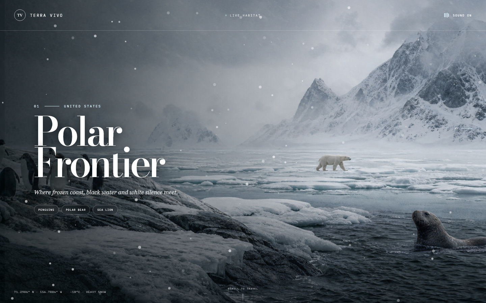
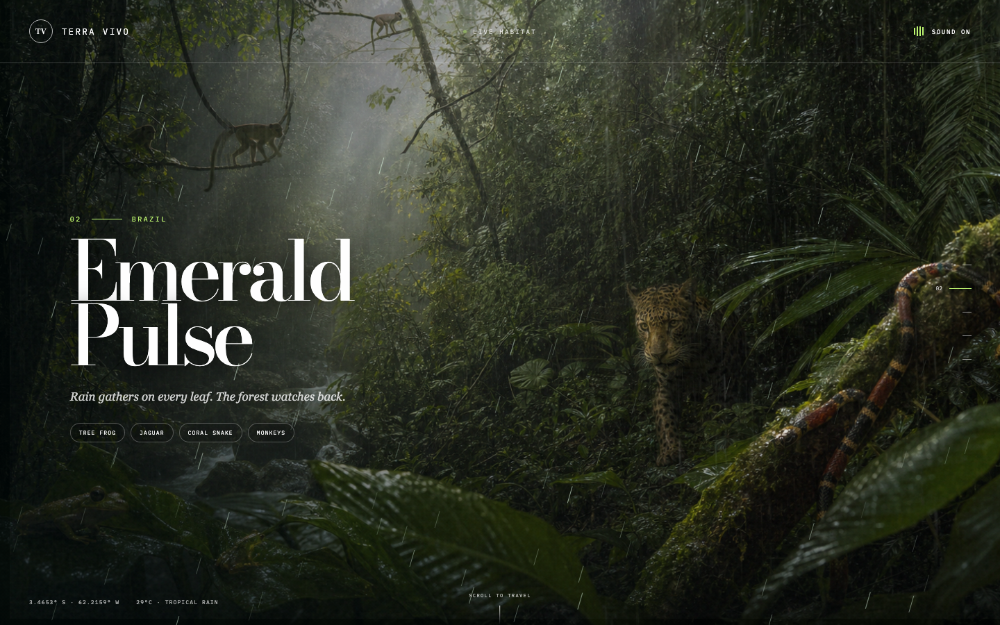
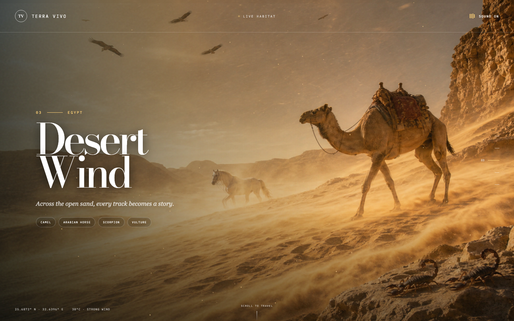
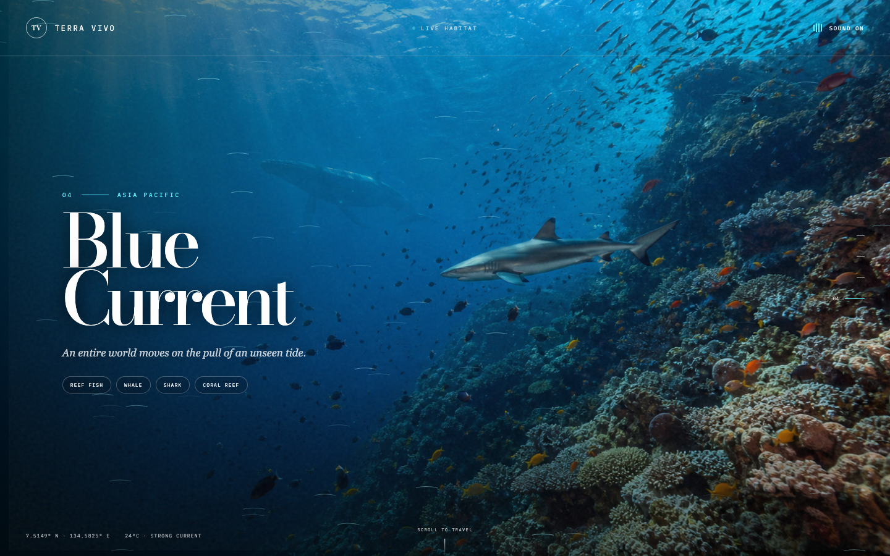
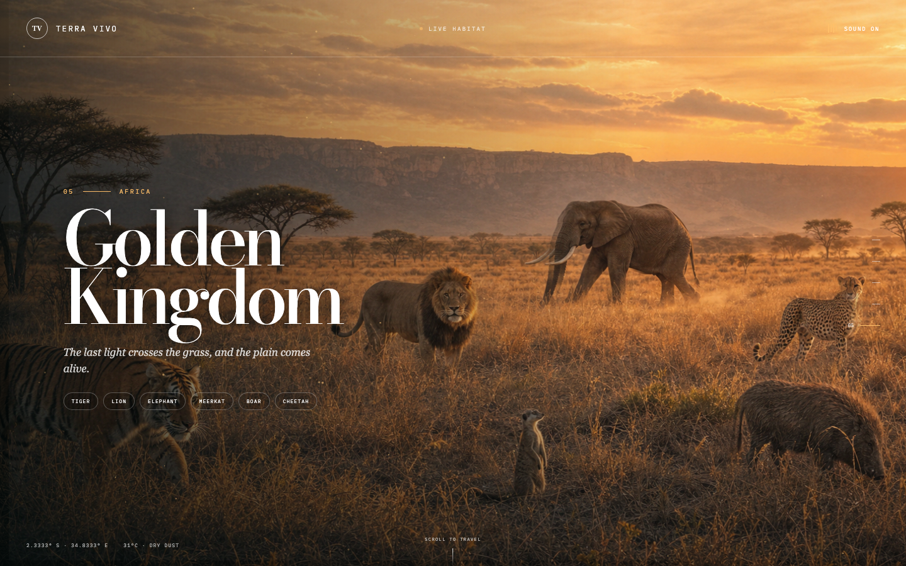

# Terra Vivo

A full-screen, cinematic wildlife journey through five habitats. Scroll, swipe, use the arrow keys, or select the side navigation to move between regions. The fifth habitat loops back to the first.

## Habitats

- United States polar frontier
- Brazilian rainforest
- Egyptian desert
- Asian Pacific reef
- African savanna

Every habitat includes moving wildlife regions, live weather, location data, ambient sound, and a click response.

## Run

```bash
./start.sh
```

Open `http://127.0.0.1:8080`.

## Stop

```bash
./stop.sh
```

## Controls

- Scroll down or swipe up to travel forward
- Scroll up or swipe down to travel backward
- Use arrow or page keys for keyboard navigation
- Select the sound control to mute or restore ambience
- Click a habitat to trigger a wildlife response

## Screenshots

### Polar frontier



### Rainforest



### Desert



### Ocean current



### Savanna


