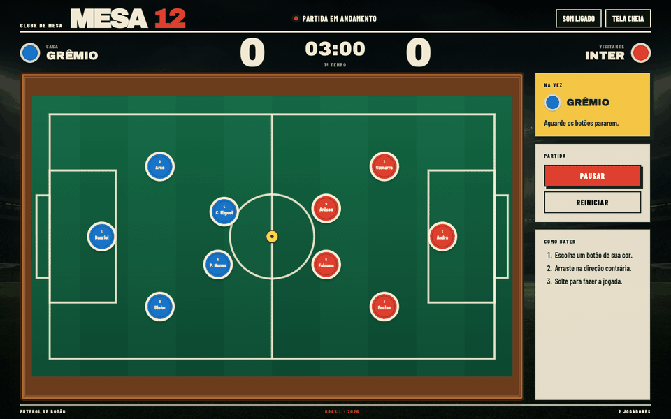

# Mesa 12



Five seconds of real gameplay captured in Google Chrome with Playwright: Grêmio opens the match, the buttons collide across the felt, and the ball comes alive under the stadium lights.

Mesa 12 is a dependency-free futebol de botão game for the browser. Play a local Grenal with two people or put Grêmio against an AI-controlled Inter.

## Features

- Turn-based button football for human versus human or human versus AI
- Drag-to-aim controls with variable shot power
- Canvas physics with momentum, friction, rebounds, and button collisions
- Three-minute match clock with pause and restart controls
- Goals, scoring, team-colored confetti, sound effects, and crowd reactions
- Named Grêmio and Inter players from the 1996 season
- Optional AI-generated commentary in Brazilian Portuguese or English
- Spoken narration with automatic crowd-volume adjustment
- Responsive single-screen layout with fullscreen support
- Photorealistic night-stadium atmosphere

## Grêmio and Inter in 1996

The match celebrates a memorable Porto Alegre rivalry from 1996. Each side uses five recognizable names from that season.

### Grêmio

- Danrlei
- Arce
- Dinho
- Carlos Miguel
- Paulo Nunes

Grêmio arrived with the steel of Luiz Felipe Scolari's team and finished 1996 as Brazilian champion. That mix of Danrlei's security, Arce's precision, Dinho's bite, Carlos Miguel's creativity, and Paulo Nunes' fire makes the blue side the stronger team here. Grêmio is better. The trophy cabinet settles the argument.

### Inter

- André
- Gamarra
- Enciso
- Arílson
- Fabiano

Inter still brings a dangerous 1996 group to the table. Gamarra anchors the red defense, Enciso supplies control, Arílson adds invention, and Fabiano gives the attack speed. It is a serious opponent, which makes beating it with Grêmio even more satisfying.

## AI player and narrator

AI is optional and selected during match setup.

In **Humano × IA**, the human controls Grêmio while Claude, Codex, or Agy controls Inter. After every Grêmio turn, the local Python server sends the board and ball coordinates to the selected CLI. The agent returns the Inter player, shot angle, and power. If the CLI is unavailable, the game produces a safe automatic move so the match can continue.

Narration is configured separately. Players can choose a different Claude, Codex, or Agy agent as commentator and select Brazilian Portuguese or English. The narrator receives the player, team, event, and ball movement after every completed turn and goal. It responds with one short, lively, colorful, and fun call that appears over the pitch and is spoken by the browser.

The supported local commands are:

```bash
claude -p "prompt"
codex exec "prompt"
agy --print "prompt"
```

## Stack

- HTML5 Canvas
- CSS
- JavaScript
- Web Audio API
- Web Speech API
- Python standard library HTTP server
- Claude, Codex, or Agy CLI for optional AI features
- Playwright with Google Chrome for visual capture

No package installation or third-party runtime library is required for the game.

## Run

```bash
./start.sh
```

Open `http://127.0.0.1:8091`.

Stop the server with:

```bash
./stop.sh
```

## Still views

### Match setup


The opening screen keeps match mode, AI opponent, narrator, and language choices in a short conditional flow.

### Live match


The match view combines the 1996 players, scoreboard, turn guidance, stadium setting, controls, and optional commentary without page scrolling.
