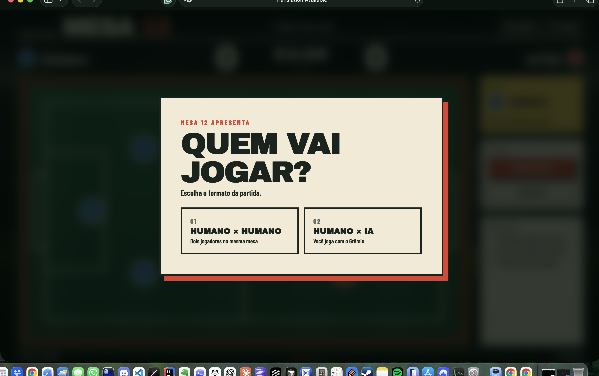
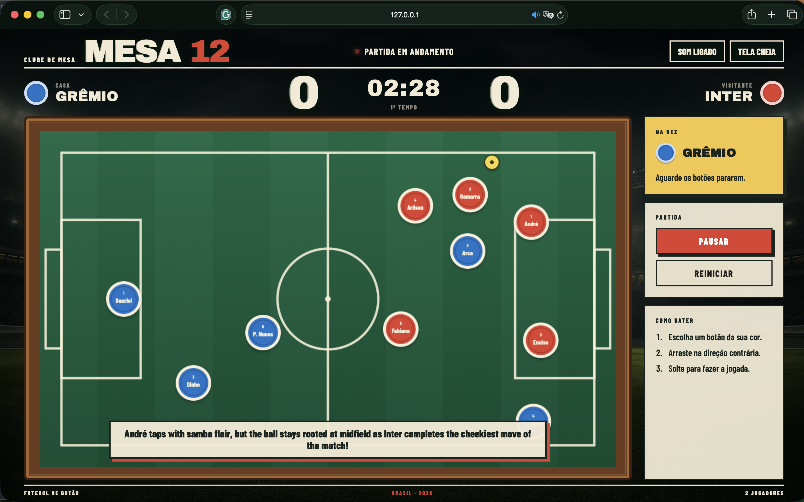

# Mesa 12

A dependency-free futebol de botão game for the browser. Play locally with two people or challenge an AI-controlled Inter powered by Claude, Codex, or Agy.

## Screenshots

### Match setup



Every session begins with a focused setup screen. Players first choose between a local two-player match and a match against an AI-controlled Inter. AI and narrator selections only appear when they are relevant.

### Live match



The live table combines the three-minute scoreboard, named Grêmio and Inter players from 1996, turn guidance, tactile button physics, stadium atmosphere, and optional spoken AI commentary displayed over the pitch.

## Run

```bash
./start.sh
```

Open `http://127.0.0.1:8091`.

Use a different port when needed:

```bash
PORT=8123 ./start.sh
```

Stop the server:

```bash
./stop.sh
```

## Play

1. Select a button from the team shown in the yellow turn panel.
2. Drag backward to aim and set the shot power.
3. Release to flick the button.
4. Wait for every piece to stop before the next turn.
5. Put the yellow ball into the opposing goal.

At startup, choose **Humano × Humano** or **Humano × IA**. AI mode requires at least one authenticated local CLI:

```bash
claude -p "prompt"
codex exec "prompt"
agy --print "prompt"
```

The setup then offers optional spoken narration. Choose Claude, Codex, or Agy as the commentator and select Brazilian Portuguese or English. The selected AI creates a short commentary after every move and goal, while the browser reads it aloud.

The match lasts three minutes. Use **PAUSAR** to pause the clock and **REINICIAR** to reset the score, clock, and pieces.

## Stack

- HTML5 Canvas
- CSS
- JavaScript
- Python game server

No package installation or third-party runtime libraries are required.
