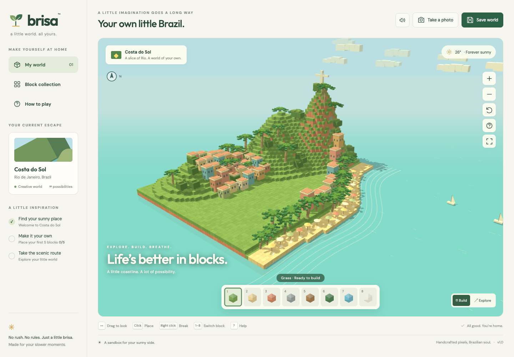
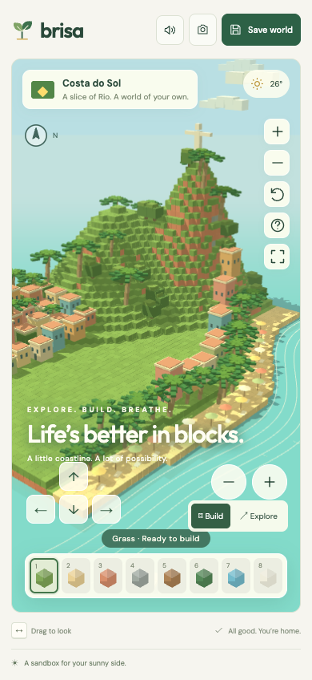
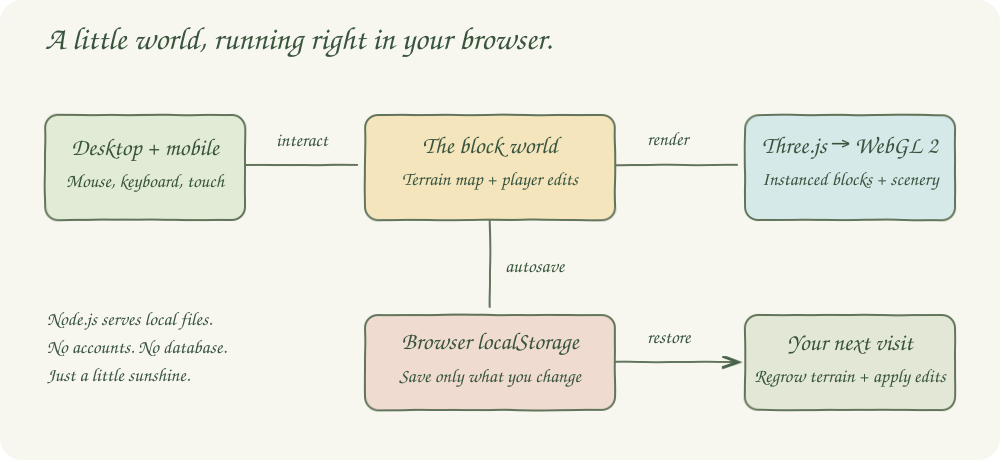

<p align="center"></p>
<h1 align="center">brisa</h1>
<p align="center"><strong>Your own little Brazil.</strong><br>A sunny, cartoon-styled 3D block sandbox for desktop and mobile browsers.</p>



Explore **Costa do Sol**, a fictional coastline inspired by Rio de Janeiro. Build with unlimited materials, reshape the hills, or fly past palms and sailboats. A cream interface, warm pastel buildings, terraced green hills, and turquoise water draw on the supplied Brazilian illustration.

## Play

Requires Node.js 22.17+ or 24+, npm, and a browser with WebGL 2 enabled.

```bash
./scripts/setup.sh
./scripts/start-all.sh
./scripts/ui.sh
```

Open **http://localhost:4173**. On a phone connected to the same Wi-Fi, open `http://YOUR_COMPUTER_LAN_IP:4173`. The server listens on all network interfaces. Browser saves belong to the particular browser and URL you use.

| Action | Desktop | Mobile browser |
|---|---|---|
| Look around | Drag the world | Swipe the world |
| Place a block | Click a terrain block | Tap a terrain block, or use the + action button |
| Remove a block | Right click | Use the − action button to edit the center target |
| Select material | Keys 1–8 or the block tray | Tap a block in the tray |
| Open the collection | Sidebar or material label | Tap the material label |
| Zoom | Scroll or upper + / − buttons in Build | Pinch or upper + / − buttons in Build |
| Explore | Select Explore, then WASD / arrow keys | Select Explore, then hold directional buttons |
| Fly vertically | Space up, Shift down | Camera look and horizontal flight |
| Return to overview | Build, Escape, or reset-camera button | Build or reset-camera button |
| Help | ? key or help button | Help button |

Eight materials are available: grass, sand, terracotta, stone, wood, leaves, ocean blue, and limestone. Ocean blue is a solid decorative block. The water and landmarks are scenery. Creative flight lets you move freely through terrain; there is no survival mode, combat, crafting, multiplayer, or character collision physics.

Changes autosave after editing. **Save world** saves immediately. **Take a photo** downloads the current 3D view as a PNG. Ocean audio starts only after pressing its button. The collection contains **Start a fresh world**, with confirmation before replacing saved edits.

## Mobile

<p align="center"></p>

The sidebar folds away on phones, keeping the landscape and building tray within reach. Direction buttons pan in Build and move the camera in Explore. The round action buttons edit the terrain at the center of the screen. Screenshots are captured by the Playwright CLI and visually inspected; mobile coverage uses Chromium touch emulation, not a physical device.

## Architecture



The app’s HTML, styles, and game logic live in `index.html`. A small Node.js static server serves that page and the installed Three.js modules. There is no application backend or database. The diagram uses pastel boxes, a wobble filter, solid flow arrows, and Caveat handwriting typography.

## Stack

- **JavaScript, HTML, CSS** — the interface and game are self-contained in one page, without a UI framework or bundler.
- **Three.js 0.185.1** — WebGL rendering, instanced terrain, lighting, raycasting, and orbit controls; the only runtime dependency.
- **Node.js built-ins** — a small static server with an explicit file allowlist and health endpoint.
- **Playwright 1.63.0** — browser interaction tests and desktop/mobile screenshots.
- **Node test runner** — validates HTTP behavior and protection of project internals without another testing library.

## Contracts / APIs

| Resource | Contract |
|---|---|
| `GET /` or `/index.html` | The game page |
| `GET /health` | HTTP 200 with `{"status":"ok","app":"brisa"}` |
| `GET /assets/:filename` | App assets and the OrbitControls module alias |
| Explicit Three.js module URLs | Locally installed rendering library modules |
| All other paths | HTTP 404; project source, scripts, and Git metadata are not served |
| `localStorage["brisa-world-v1"]` | Versioned JSON: `version`, `edits`, `placed`, and `explored` |

Each edit is a pair of a coordinate string (`"x,y,z"`) and a material index from 0 to 7. A null material removes that block. Invalid versions, coordinates, materials, and malformed saves restore the original coastline and show an explanatory message. Storage failures remain visible in the save status.

## Data structures and design decisions

- A `Map` keyed by integer `x,y,z` coordinates stores terrain occupancy and material type.
- A second `Map` stores edits only, so the original terrain does not inflate the save file.
- Deterministic terrain height functions reproduce the same Brazilian coastline on each visit.
- Only exposed blocks are rendered. One instanced mesh per material keeps draw calls small.
- Raycasting maps visible instances to block coordinates. The selected face determines where a new block goes.
- Each edit rebuilds visible instances. This keeps the implementation simple for this bounded world, at the cost of a brief update on slower devices.
- Terrain editing is bounded to x ±42, z ±38, and y −2 through 45. The foundation cannot be removed.
- Homes, palms, umbrellas, the monument, clouds, and boats use shared primitive geometry. They are decorative and cannot be edited.
- Static shadows refresh when terrain changes, avoiding repeated shadow rendering during camera movement.
- Pixel ratio is capped at 1.7 to limit mobile rendering cost. Browser hardware acceleration affects performance.
- Google Fonts supplies the optional display typography; local font fallbacks keep the game usable when that service is unavailable.
- `window.brisa` exposes read-only state snapshots and world-to-screen projection for browser test observations.

## How it works

1. The browser generates stepped hills and a curved sandy coastline.
2. Valid saved edits are applied to the terrain map.
3. Exposed blocks are grouped into eight material batches.
4. Three.js renders the world with warm daylight, soft shadows, and moving water details.
5. Clicking targets a terrain face to add or remove a block.
6. Build or Explore controls update the camera, with touch equivalents on phones.
7. Editing updates the scene, inspiration checklist, and local save.
8. The next visit recreates the coastline and restores your changes.

## Tests

```bash
./scripts/test-all.sh
```

The test runner starts a local server when needed and reuses an existing one. Tests cover desktop and phone rendering, material selection, placement, removal, persistence across reloads, orbit gestures, exploration, dialogs, audio toggling, PNG downloads, reset confirmation, and invalid saved data. HTTP tests ensure private project files are not served. Browser tests refresh `printscreens/desktop.png` and `printscreens/mobile.png`.

Verified on September 6, 2026: **12 browser tests passed in 58.2 seconds**, plus **1 HTTP test passed**, with no skipped tests. Repeated setup/start/stop and status from a nested directory also passed.

## Scripts

All scripts live in `scripts/` and resolve the project root from their own location. They work from nested directories, use Bash 3.2-compatible syntax, and stop only the recorded Brisa process. Logs and PID files live in `.run/`.

| Script | What it does |
|---|---|
| `./scripts/setup.sh` | Installs locked dependencies and Chromium for browser tests |
| `./scripts/start-all.sh` | Starts the server and waits for its health endpoint |
| `./scripts/status.sh` | Shows the web port as UP or DOWN and its PID |
| `./scripts/test-all.sh` | Runs HTTP checks and all Playwright tests |
| `./scripts/ui.sh` | Opens the running game in your default browser |
| `./scripts/stop-all.sh` | Stops the Brisa process it started |

The web port is **4173**, declared once in `scripts/ports.env`. The server and tests read the same setting. Start and stop can be repeated safely; startup refuses to take over an occupied port. No database or containers are required.

```bash
./scripts/status.sh
./scripts/test-all.sh
./scripts/stop-all.sh
```

Rendering references: [Three.js InstancedMesh](https://threejs.org/docs/pages/InstancedMesh.html) and [Raycaster](https://threejs.org/docs/pages/Raycaster.html).
