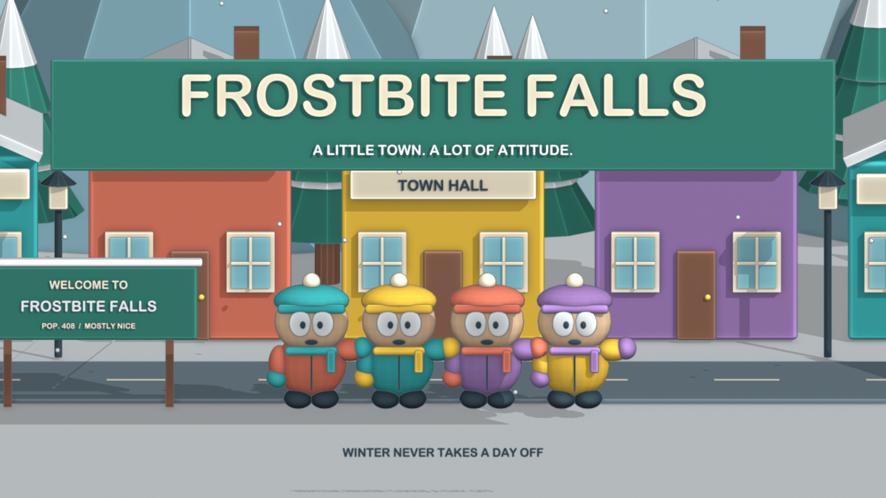
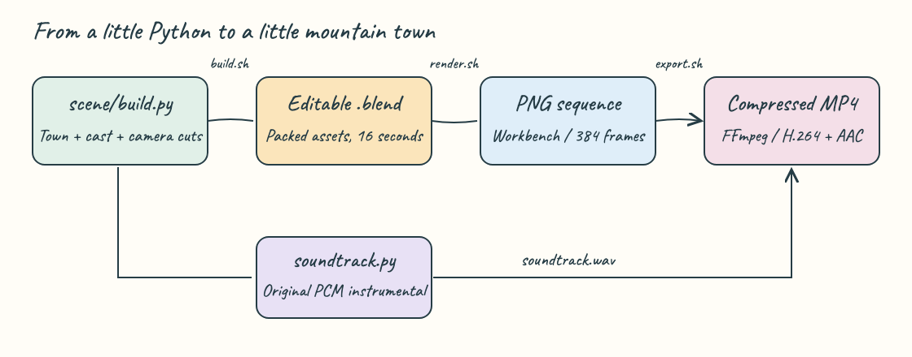
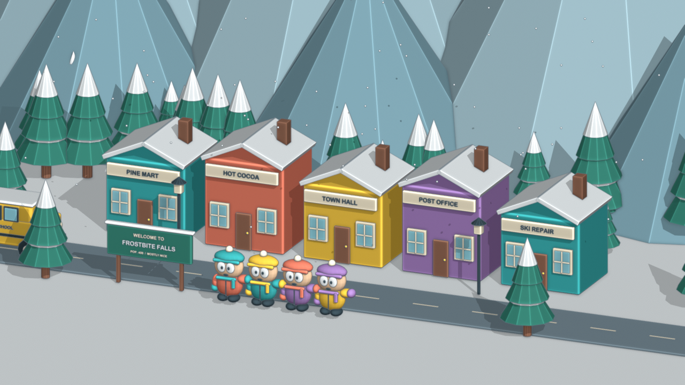
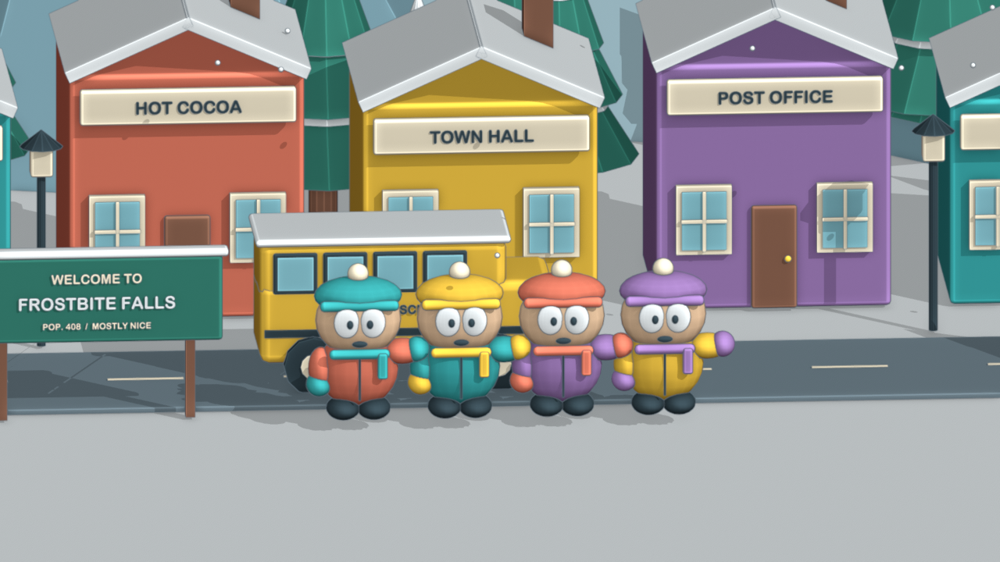
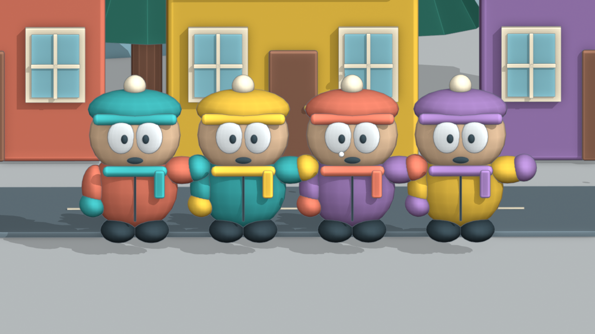

A 16-second 3D cartoon opening inspired by South Park's snowy mountain-town atmosphere: four winter-clad friends, colorful storefronts, a passing school bus, drifting snow, and a title reveal. The cast, town name, and instrumental music are original. Everything is generated locally with Blender and Python.



## Build and run

```bash
./scripts/setup.sh
./scripts/run.sh
./scripts/test-all.sh
./scripts/ui.sh
```

The default output is **[output/standard/frostbite-falls.mp4](output/standard/frostbite-falls.mp4)**: 1280 × 720, 24 fps, 16 seconds, H.264 video and AAC audio. The editable scene is **[output/standard/frostbite-falls.blend](output/standard/frostbite-falls.blend)**. In Blender, press Space to play the timeline; the four camera cuts are already assigned.

`setup.sh` uses existing tools or installs missing Blender and FFmpeg through Homebrew on macOS. On other systems, install Blender, FFmpeg with libx264, and Python 3.9+ through your package manager first. A working graphics driver is required even for background Workbench rendering. Tested with Blender 5.2.1 LTS and FFmpeg 8.1.1 on macOS; other versions are not verified.

```bash
PROFILE=draft ./scripts/run.sh
PROFILE=full ./scripts/run.sh
CRF=28 ./scripts/export.sh
BLENDER_BIN=/path/to/blender ./scripts/build.sh
```

| Profile | Resolution | Rate | Frames | Output directory |
|---|---|---|---|---|
| `draft` | 640 × 360 | 12 fps | 192 | `output/draft/` |
| `standard` | 1280 × 720 | 24 fps | 384 | `output/standard/` |
| `full` | 1920 × 1080 | 24 fps | 384 | `output/full/` |

Set the same `PROFILE` when building, rendering, exporting, opening, or testing a profile. `CRF` defaults to 23; a higher value makes a smaller video with less visual detail. PNG frames remain available for re-encoding. Generated scene, audio, frames, and video stay out of Git.

## How it Works?

1. `build.py` creates every mesh, material, character, and camera from simple primitives.
2. Keyframes move the bus, bounce the characters, wave their mittens, and drift the snow.
3. Timeline markers switch cameras every four seconds.
4. `soundtrack.py` synthesizes an original 120 BPM plucked melody, bass, and percussion.
5. Blender Workbench renders numbered PNG frames using studio lighting and contact shading.
6. The export guard checks every expected frame and its resolution.
7. FFmpeg compresses the frames into H.264, adds AAC audio, and enables fast-start playback.

## Architecture



The [vector diagram](docs/architecture.svg) embeds the Caveat handwriting font and uses pastel boxes, a wobble filter, and solid directional paths. The font is distributed under its [SIL Open Font License](docs/Caveat-OFL.txt).

## Features

- Four directed shots: town arrival, morning commute, character close-up, and title reveal.
- Editable 3D geometry with named objects, four camera markers, and packed font data.
- Seeded scene generation and synthesized music without downloaded scene assets.
- Foreground and background render workflows with per-profile logs and process tracking.
- Frame validation, animation checks, and full video decoding before declaring tests successful.

## Stack

- **Blender + bundled `bpy`**: builds the editable scene and renders stylized geometry with Workbench.
- **Python standard library**: generates PCM audio, controls background jobs, and validates artifacts without pip packages.
- **Bash 3.2**: keeps commands portable to stock macOS and resolves paths from each script.
- **FFmpeg / FFprobe**: produces compact, broadly playable MP4 files and verifies media streams.

## Contracts/APIs

This is a local file pipeline; it has no HTTP API, network service, port, or database.

| Contract | Contents |
|---|---|
| `output/<profile>/frostbite-falls.blend` | Editable scene with geometry, animation, cameras, and packed font |
| `output/<profile>/frostbite-falls.json` | Title, width, height, fps, frame count, duration, and shot names/start frames |
| `output/<profile>/frames/0001.png` onward | Consecutive RGB PNG files at the profile resolution |
| `output/<profile>/soundtrack.wav` | 16-second mono PCM, 44.1 kHz, 16-bit |
| `output/<profile>/frostbite-falls.mp4` | H.264, yuv420p, AAC at 128 kb/s, fast-start metadata |
| `.run/<profile>.json` | Background render process identifier |
| `.run/logs/<profile>.log` | Build, render, and encoding output |

The generator's CLI accepts `--output`, `--width`, `--height`, and `--fps` after Blender's `--` separator. Prefer the scripts so media settings stay consistent.

## Key data structures and design decisions

`palette` maps material names to colors. Each character is parented to one named empty, with separate arm pivots for waving. The bus uses the same parent/child approach. Camera timeline markers define the four shots; frame positions derive from fps so all profiles retain the same duration. Seed 27 fixes tree placement, snow positions, and percussion noise.

Workbench keeps rendering fast and gives the scene a toy-like cartoon finish. PNG intermediates separate rendering from compression, so changing `CRF` does not require another render. Each profile has its own output directory to prevent mixed frame sizes. The title is attached to the final camera and only becomes visible on the last cut. On macOS, the generator uses Arial Rounded Bold when available and packs it into the scene; otherwise it uses Blender's built-in font.

## Shot stills

These images are actual Blender renders, stored in `printscreens/`. This project has no browser UI; the stills document the animation itself.



**0–4 seconds:** the camera moves into the mountain town, showing the storefronts, welcome sign, and cast.



**4–8 seconds:** a moving camera follows the school bus along Main Street.



**8–12 seconds:** Pip, Moss, June, and Otis bounce and wave in a closer group shot.


**12–16 seconds:** the full title and town motto appear above the friends.

## Tests

```bash
./scripts/test-all.sh
PROFILE=draft ./scripts/test-all.sh
```

Run the matching profile's `run.sh` first. Tests validate Bash syntax, rejection of missing or mixed-resolution frames, scene duration, all camera cuts, bus travel, character motion, snow count, and title timing. Media checks count decoded video frames, inspect codecs and duration, confirm audio exists, and decode the complete MP4. Missing video is an explicit failure; media checks are never silently skipped.

Verified on September 5, 2026: both export-guard tests passed, all scene checks passed, and the standard profile's 384 frames decoded successfully. The finished MP4 is 2,182,473 bytes. Repeated setup, background start, and stop commands were checked, along with status from the root and a nested directory. Draft and full profiles are configured but were not rendered during this verification.

## Scripts

All scripts live in `scripts/` and work from any directory. This adaptation of the scripts skill manages a finite Blender render job, so there is no `ports.env` or SQL console.

| Script | What it does |
|---|---|
| `./scripts/setup.sh` | Checks or installs dependencies and prepares output folders |
| `./scripts/run.sh` | Builds, renders, and exports in the foreground |
| `./scripts/build.sh` | Generates the `.blend`, manifest, and original soundtrack |
| `./scripts/render.sh` | Renders the selected profile's complete PNG sequence |
| `./scripts/export.sh` | Validates frames and compresses them with FFmpeg |
| `./scripts/preview.sh` | Renders a still at 2, 6, 10, and 14 seconds |
| `./scripts/start-all.sh` | Starts one background pipeline per profile; repeated starts reuse it |
| `./scripts/status.sh` | Shows the job state, PID while running, log path, and video availability |
| `./scripts/stop-all.sh` | Stops the background pipeline and its child processes |
| `./scripts/test-all.sh` | Runs source, scene, and exported-video checks |
| `./scripts/ui.sh` | Opens the selected scene in Blender |

```bash
./scripts/start-all.sh
./scripts/status.sh
tail -f .run/logs/standard.log
./scripts/stop-all.sh
```

To preserve changes made interactively in Blender, save the scene and run `render.sh`, followed by `export.sh`. `build.sh` and `run.sh` regenerate the scene from source. `stop-all.sh` controls jobs launched by `start-all.sh`; use Ctrl+C for a foreground run. Background job status reports process activity and file availability; inspect the log and run tests to confirm a successful export.

Implementation references: [Blender Workbench shading API](https://docs.blender.org/api/5.2/bpy.types.View3DShading.html) and [scene timeline marker API](https://docs.blender.org/api/5.2/bpy.types.Scene.html).
