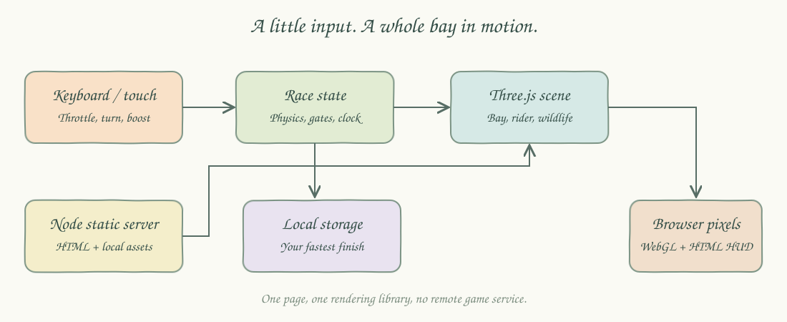
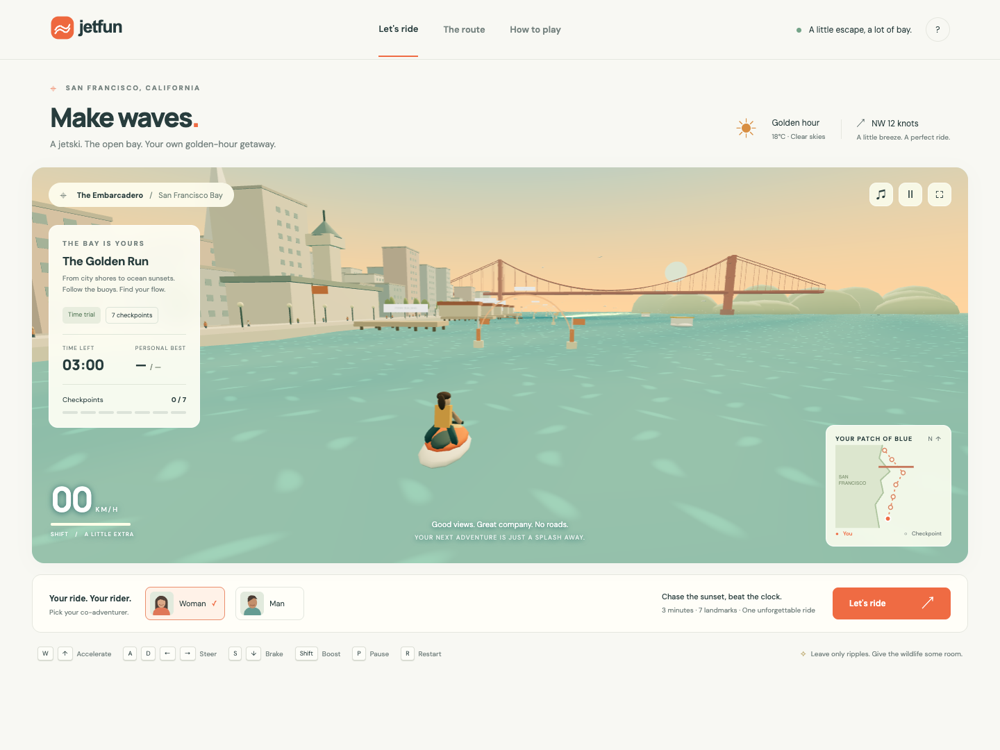
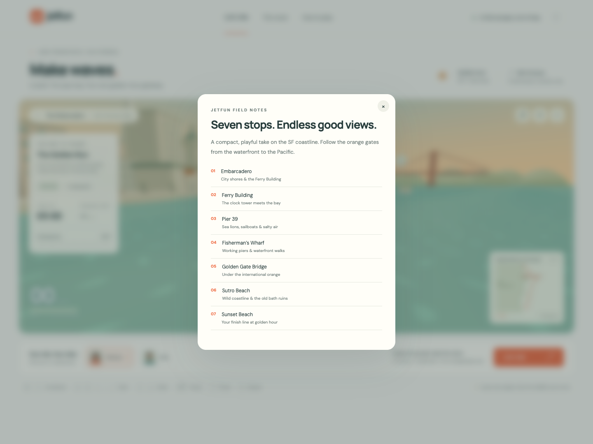
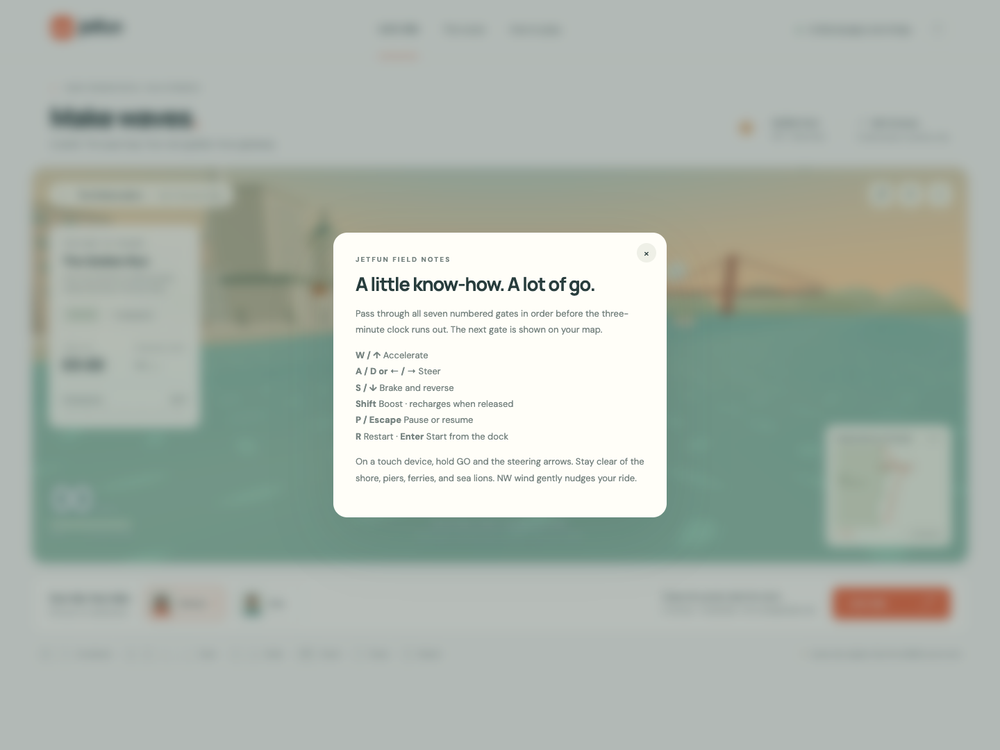
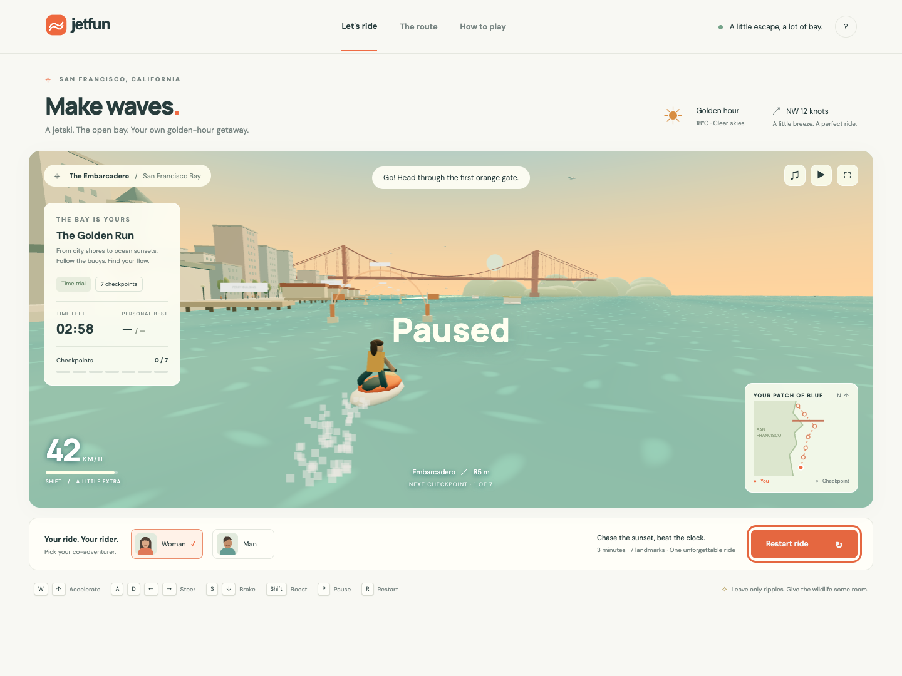
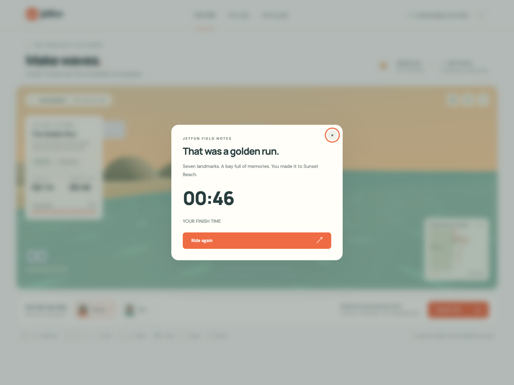
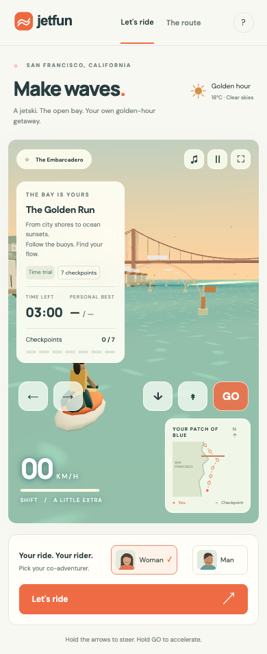

A light-themed Three.js jetski time trial through a compact, stylized San Francisco waterfront. Choose a woman or man rider, chase seven gates, and reach Sunset Beach before the three-minute clock runs out.

## How it Works?

Choose your rider and press **Let's ride** to begin the countdown.
Accelerate with **W / ↑**, steer with **A / D / ← / →**, and brake or reverse with **S / ↓**.
Hold **Shift** for rechargeable boost; use **P / Escape** to pause and **R** to restart.
Touch devices automatically receive steering, throttle, brake, and boost buttons.
Pass the numbered gates in order from the Embarcadero to Sunset Beach.
The water, gulls, sea lions, ferry, pedestrians, and flags animate continuously.
A small wind drift affects steering; shore and wildlife collisions slow the rider.
Finish all seven gates to save your fastest time in browser local storage.

## Architecture



`index.html` contains the interface, styles, Three.js scene, input handling, and race simulation. `server.mjs` serves the page and installed Three.js files using Node's built-in HTTP server. There is no application backend or database. The hand-drawn diagram uses a wobble filter and the Caveat font family with a cursive fallback.

## Features

- Seven checkpoints: Embarcadero, Ferry Building, Pier 39, Fisherman's Wharf, Golden Gate Bridge, Sutro Beach, and Sunset Beach.
- Procedural waterfront: towers, piers, clock face, bridge cables, beach rocks, bath ruins, pedestrians, and trees.
- Animated bay: wave displacement, sun glints, wake particles, wind, gulls, sea lions, and moving ferries.
- Rider selection: woman or man, with matching 3D rider details.
- Timed race: countdown, ordered gates, speed display, boost meter, pause, restart, results, and personal best.
- Desktop and mobile: keyboard input, detected touch controls, responsive HUD, and fullscreen where supported.
- Optional synthesized engine audio, with sound off initially.

## Stack

- **Three.js** — the only runtime library, providing WebGL rendering and procedural geometry. [Official documentation](https://threejs.org/docs/).
- **HTML, CSS, JavaScript** — the interface and game live in one page without a UI framework or build step.
- **Node.js** — built-in HTTP and filesystem modules serve local assets without a server library.
- **Playwright** — development-only browser tests and screenshots through `npx playwright`.
- **Web Audio and localStorage** — browser-native engine audio and local best-time persistence.

## Contracts / APIs

| Contract | Behavior |
|---|---|
| `GET /` | Returns the game page |
| `GET /assets/*` | Returns logo and documentation assets |
| `GET /node_modules/three/build/*` | Returns the locally installed Three.js modules |
| `scripts/ports.env` | Declares the single HTTP port as `WEB=4173` |
| `localStorage["jetfun-best"]` | Fastest successful finish in seconds; missing storage is tolerated |
| `window.jetfun` | Browser inspection interface exposing `state`, `checkpoints`, `checkpointHit`, `updateRace`, `reset`, `scene`, and `renderer` |

No account, remote gameplay API, or database is required. Fonts are optionally fetched from Google Fonts and fall back to local fonts if unavailable.

## Key data structures and design decisions

- `state` stores race phase, position, heading, speed, remaining time, elapsed time, checkpoint index, boost, and rider.
- `checkpoints` is the ordered seven-element course containing coordinates, names, and descriptions.
- A `Set` stores held keys and touch controls so steering and acceleration work simultaneously.
- A segment-to-checkpoint distance check prevents a fast rider from skipping through a gate between frames.
- Race phases are `ready`, `countdown`, `racing`, `paused`, `finished`, and `failed`.
- Reused materials, capped pixel density, and a smaller mobile water mesh reduce rendering cost.
- Geography and distance are compressed for a short arcade course; this is not a geographic navigation tool.
- Browser tests inspect game state to verify terminal states quickly, alongside real keyboard and touch interaction tests.

## Run and test

Requires Node.js 22 or newer, npm, and a browser supporting WebGL 2.

```bash
./scripts/setup.sh
./scripts/start-all.sh
./scripts/test-all.sh
```

Open [Jetfun](http://localhost:4173). On a phone connected to the same network, open `http://YOUR_COMPUTER_LAN_IP:4173`. The server listens on all interfaces. Desktop tests and mobile viewport/touch emulation run in Chromium; physical iOS and Android hardware are not covered by the automated suite.

```bash
npm start
npx playwright test
```

The tests cover scene startup, both rider selections, route/help dialogs, audio controls, keyboard motion, steering, boost, pause, restart, gate order, shoreline collision, timeout, race completion, saved best, mobile detection, touch acceleration, and driving the complete course through throttle and steering. Test runs capture the following images in `printscreens/`.

## Printscreens

### Waterfront and rider selection



The live 3D bay sits between the golden-hour heading and the rider dock. The HUD shows the race clock, checkpoints, speed, boost, and route map.

### Course details



The route view lists the seven gates and the landmark at each stop.

### Controls



The guide explains the controls, boost, timing, and wildlife clearance.

### Race in progress



The paused state preserves the current time and checkpoint progress after keyboard acceleration, steering, and boost.

### Finish



The finish view shows the completed course, elapsed time, and a button to race again.

### Mobile



The portrait layout stacks the rider dock and adds simultaneous touch steering, brake, boost, and throttle controls.

## Scripts

All scripts live in `scripts/` and run from any directory of the repository.

| Script | What it does |
|---|---|
| `./scripts/setup.sh` | Installs locked dependencies and Chromium for browser tests |
| `./scripts/start-all.sh` | Starts the static server and checks readiness for up to 30 seconds |
| `./scripts/status.sh` | Shows the web port as UP or DOWN and its PID |
| `./scripts/test-all.sh` | Runs every Playwright test and returns failure if any test fails |
| `./scripts/ui.sh` | Opens the running game in the system browser |
| `./scripts/stop-all.sh` | Stops the server owned by these scripts |

Ports are declared in `scripts/ports.env`. PID and log files live in the ignored `.run/` directory. Start and stop are idempotent; stop checks process ownership before sending a signal.

```bash
./scripts/setup.sh
./scripts/start-all.sh
./scripts/status.sh
./scripts/ui.sh
./scripts/stop-all.sh
```
