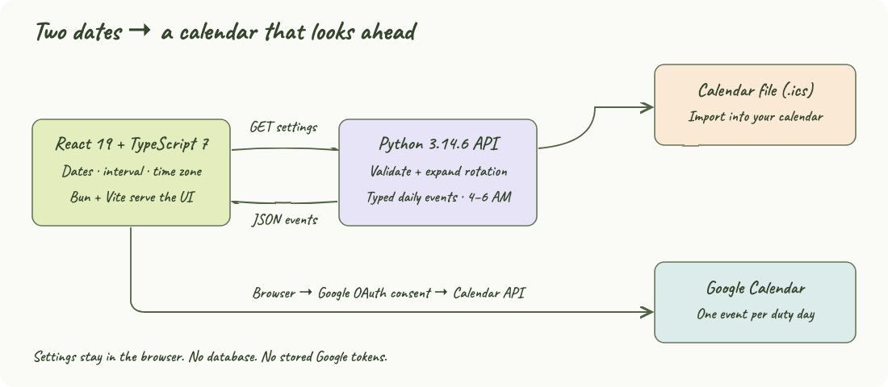
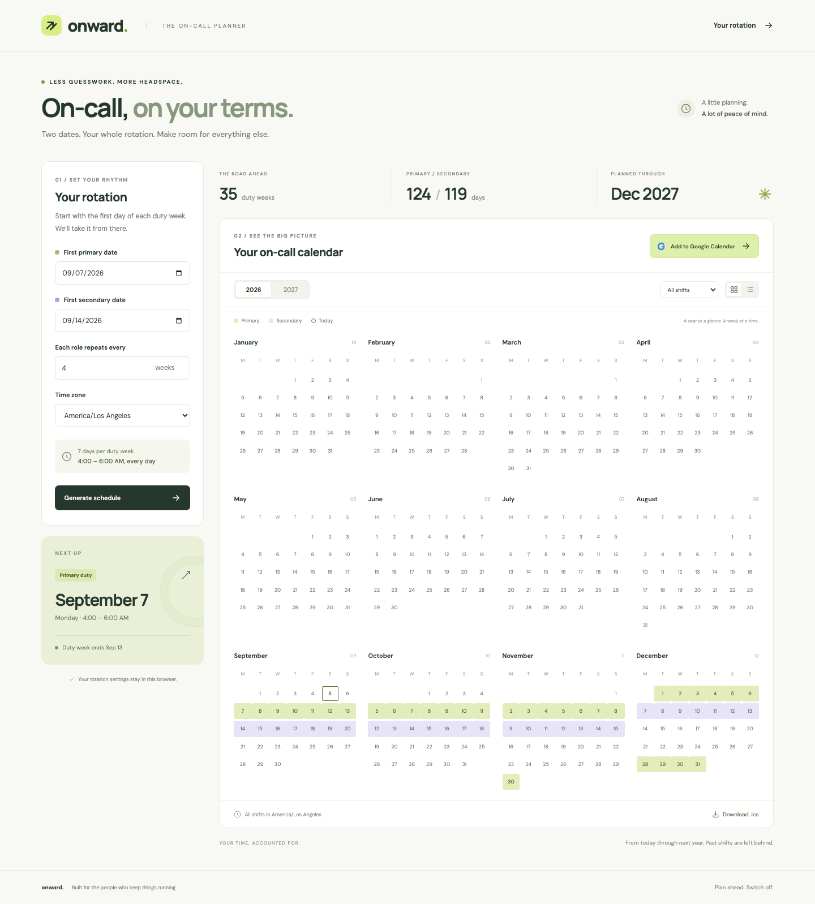
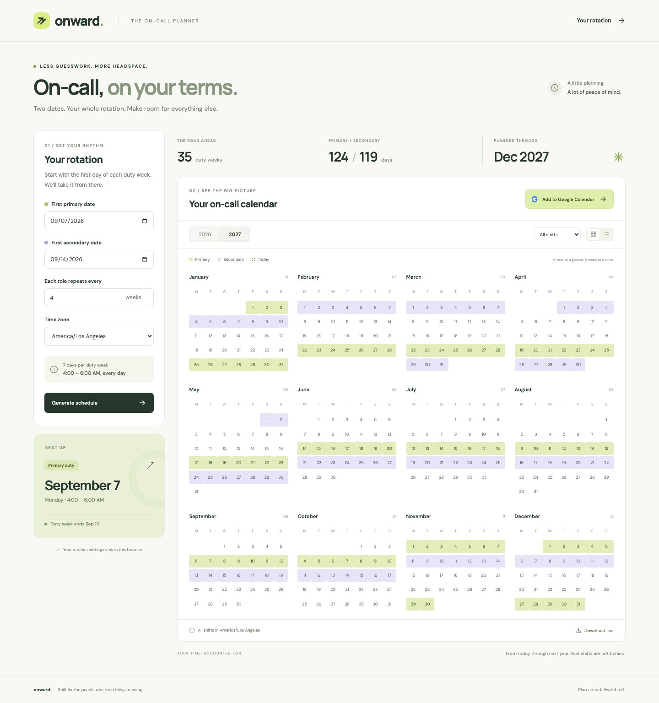
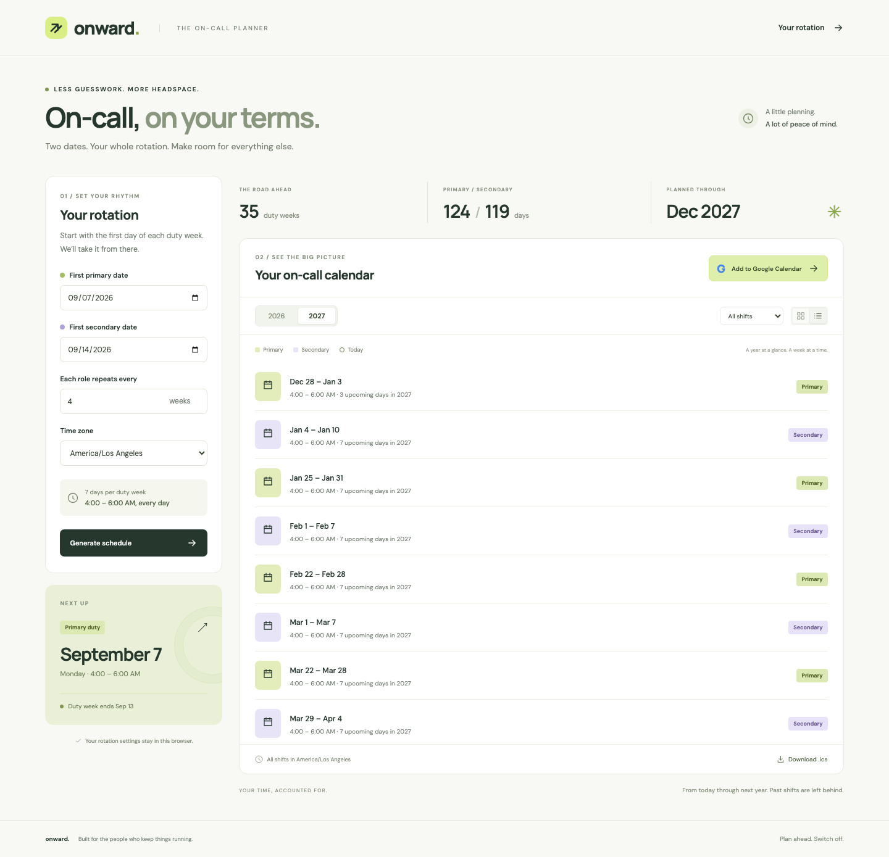
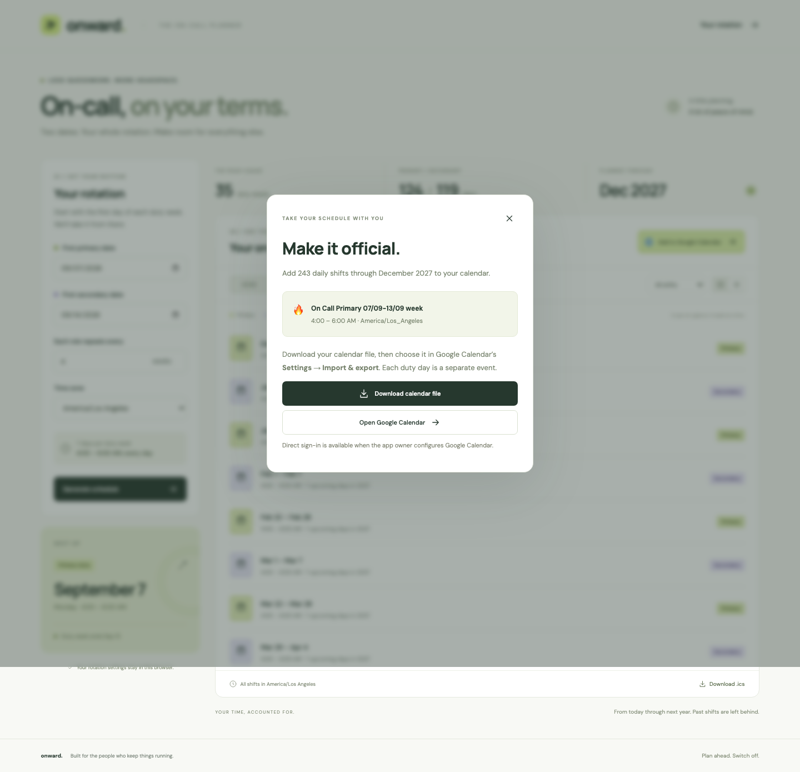
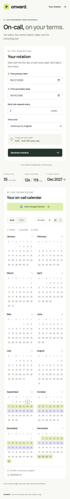

# Onward

A simple on-call planner built with React 19, Bun, TypeScript 7, and a strictly typed Python 3.14.6 backend. Enter your first primary and secondary dates to see upcoming duty days for this year and next year.

## How it Works?

1. Enter the first day of a seven-day primary week and a seven-day secondary week.
2. Choose how often each role repeats; the initial interval is four weeks and can be changed to 2–52 weeks.
3. Select your time zone and generate the schedule.
4. Python expands both rotations from their anchors through December 31 of next year, excluding dates before today in the selected zone.
5. Switch between years, calendar and list views, or filter by role.
6. Add the schedule to Google Calendar or download an `.ics` file.
7. Each duty day is a separate 4:00–6:00 AM event titled `🔥 On Call Primary 07/09-13/09 week` or the corresponding secondary title. The range uses `DD/MM-DD/MM` for the whole duty week.

## Architecture



The browser sends settings through Vite’s `/api` proxy to Python on port 8000. Python validates dates and overlap, computes time-zone-aware daily events, and returns JSON or an iCalendar file. When configured, the browser obtains temporary Google authorization and inserts those events directly into Google Calendar.

## Features

- Two-year calendar and chronological duty-week list make future commitments visible.
- Primary and secondary colors, role filters, and a next-shift card make the rotation easy to scan.
- Editable cadence avoids guessing a repeat interval from only two dates.
- Time-zone-aware events retain local 4–6 AM times across daylight saving changes.
- Google Calendar import uses stable IDs to skip events previously added by the app.
- Calendar-file download works without Google credentials and contains separate daily events.
- Responsive layout and browser-local settings keep the planner convenient on desktop and mobile.

## Stack

- React 19.2.8: interactive controls and calendar rendering with built-in state hooks.
- Bun 1.4.0: dependency installation and task execution with an included lockfile.
- TypeScript 7.0.2: strict frontend checking using `tsc`.
- Vite 8.2.2: local development, API proxying, and production asset builds.
- Python 3.14.6: standard-library HTTP server, immutable dataclasses, date arithmetic, and IANA time zones; no backend packages.
- Pyright 1.1.413: strict backend type checking.
- Playwright 1.63.0 and Python unittest: real browser workflows and deterministic schedule checks.

The UI uses CSS and inline SVG icons without component or date libraries. Google Fonts supplies DM Sans and Manrope; system fallbacks remain available offline. The architecture drawing uses Caveat with a cursive fallback.

## Run the app

Install Bun 1.4.0 and Python 3.14.6, then run:

```bash
bash start-all.sh
```

Open [http://127.0.0.1:5173](http://127.0.0.1:5173). The script installs locked dependencies, starts the API and frontend in the background, and waits for both to respond. Both servers bind to loopback for local use. No database or container is required.

Run the scripts with Bash; they also work from outside the project directory.

| Command | Purpose |
| --- | --- |
| `bash setup.sh` | Check required tools and runtime versions, then install locked dependencies. |
| `bash build.sh` | Run setup, check TypeScript, and build frontend assets into `dist/`. |
| `bash test.sh` | Run setup, install Chromium if needed, check types, run backend tests, build, and run browser tests. |
| `bash start-all.sh` | Start the API on port 8000 and frontend on port 5173 in the background. |
| `bash status.sh` | Show both process states; exit with status 1 if either is stopped. |
| `bash stop-all.sh` | Stop the processes tracked by this project's scripts. |
| `bash restart-all.sh` | Stop both services, then start them again. |
| `bash start.sh` / `bash stop.sh` | Aliases for `start-all.sh` and `stop-all.sh`. |

Services keep running after the start command exits. Use `bash stop-all.sh` to shut them down. Repeated starts reuse tracked processes; repeated stops are safe. Scripts store PID files and logs in the ignored `.run/` directory. Read output with `tail -f .run/api.log .run/frontend.log`. Startup fails if another process owns a required port, and rolls back services launched during that failed attempt. Stop checks the recorded process command before sending a signal.

To run the servers separately:

```bash
bun install --frozen-lockfile
python3.14 backend/server.py
```

In another terminal:

```bash
bun run dev
```

Build the frontend with `bash build.sh`; generated assets are written to `dist/`. The build still requires the Python API behind `/api` when hosted. The standard-library HTTP server is intended for this local app.

## Google Calendar

Without any configuration, **Add to Google Calendar** provides an `.ics` download and a link to Google Calendar’s import settings. Select the downloaded file and destination calendar, then import it. Repeated manual file imports depend on the receiving calendar’s duplicate handling.

For direct sign-in and insertion:

1. Enable the Google Calendar API in a Google Cloud project.
2. Configure the OAuth consent screen and create a Web application OAuth client.
3. Add `http://127.0.0.1:5173` to its authorized JavaScript origins. Add your account as a test user if the consent screen is in testing mode.
4. Start the app with the public client ID:

```bash
GOOGLE_CLIENT_ID='your-client-id.apps.googleusercontent.com' bash restart-all.sh
```

Click **Add to Google Calendar**, then **Connect Google & add shifts**. Google asks for access to events in calendars you own. The app inserts into your primary Google calendar, reports progress, skips HTTP 409 duplicates, and reports how far it got if a request fails. Retry after a partial import to continue. Google tokens stay in memory and are never sent to the Python backend or saved in browser storage. Updating the rotation does not delete previously imported events.

The integration follows Google’s [browser token model](https://developers.google.com/identity/oauth2/web/guides/use-token-model) and [event insertion API](https://developers.google.com/workspace/calendar/api/v3/reference/events/insert). Live account authorization was not exercised because no OAuth client ID was provided; Playwright verifies the authorization callback, daily event payloads, and duplicate handling with intercepted Google responses.

## Contracts / APIs

| Method and path | Input | Response |
| --- | --- | --- |
| `GET /api/health` | None | `{"status":"ok"}` |
| `GET /api/config` | None | Public `googleClientId`, or an empty string |
| `GET /api/schedule` | Query: `primary`, `secondary`, `interval`, `timezone` | `events`, `years`, `timezone`, `through` |
| `GET /api/calendar.ics` | The same query fields | UTF-8 iCalendar attachment with one `VEVENT` per duty day |

Dates use `YYYY-MM-DD`, interval is an integer from 2 through 52, and timezone is an IANA identifier such as `America/Los_Angeles`. Missing or invalid inputs return HTTP 400 with `{"error":"..."}`. Unknown paths return HTTP 404. Overlapping roles are rejected, including overlaps in later cycles.

Each event contains `id`, `role`, `date`, `week_start`, `week_end`, `summary`, `start`, and `end`. Start and end are ISO 8601 timestamps with the date’s actual UTC offset. Both roles share the repeat interval; each date independently anchors its first week. Historical anchors are accepted, but the schedule never extrapolates before an anchor. Partial weeks retain their full week title while exporting only days in the requested window.

## Data structures and design decisions

- `Settings` is a Python `TypedDict`; `Event` and `Schedule` are frozen dataclasses that keep scheduling separate from HTTP handling.
- React holds editable and applied settings separately; exports are disabled until changed or invalid settings have been successfully regenerated.
- `Map` lookups connect each date to a role and group daily events into week rows.
- SHA-256-derived event IDs encode the role, date, zone, and shift hours, so the same direct import can safely resume.
- iCalendar timestamps are exported in UTC to preserve the chosen local time without requiring embedded time-zone rules. Lines are folded by UTF-8 byte length.
- The only persisted data is rotation settings in local storage. There are no accounts, database, background sync, or stored credentials.

## Run tests

```bash
bash test.sh
```

`test.sh` installs dependencies and Chromium, then runs strict TypeScript and Pyright checks, backend tests, a production build, and browser tests. Playwright starts and stops local servers automatically when needed and reuses running servers outside CI. Browser commands use `npx playwright`.

Verified on September 5, 2026:

```text
0 errors, 0 warnings, 0 informations
Ran 8 tests
OK
vite v8.2.2 building client environment for production...
16 modules transformed.
5 passed (4.4s)
```

Backend coverage includes weekly cadence, active weeks, both years, leap day, December clipping, overlap validation, DST, stable IDs, and calendar-file formatting. Browser coverage includes both year tabs, list and role filters, settings persistence, invalid-input recovery, calendar downloads, mobile overflow, API errors, and direct Google payloads with duplicate handling. No tests were skipped.

Lifecycle scripts were also checked for startup, status, repeated starts and stops, restart, unrelated PID protection, cleanup after a port conflict, and building from another working directory. Both services were stopped after verification.

## UI screenshots

Captured from the running app with `npx playwright test` and visually reviewed.

### Current year

Primary weeks appear in green and secondary weeks in lavender. The left panel sets the rotation and the next-shift card shows the nearest duty day.



### Next year

The next-year tab continues both rotations through December, using the same anchors and cadence.



### List view

Duty weeks appear chronologically with their role, time window, and remaining daily events in the selected year.



### Calendar export

The export dialog previews the exact event title and shift times, then offers file import when direct Google sign-in is not configured.



### Mobile

The settings and two-column month grid fit a 390-pixel screen without horizontal scrolling.


