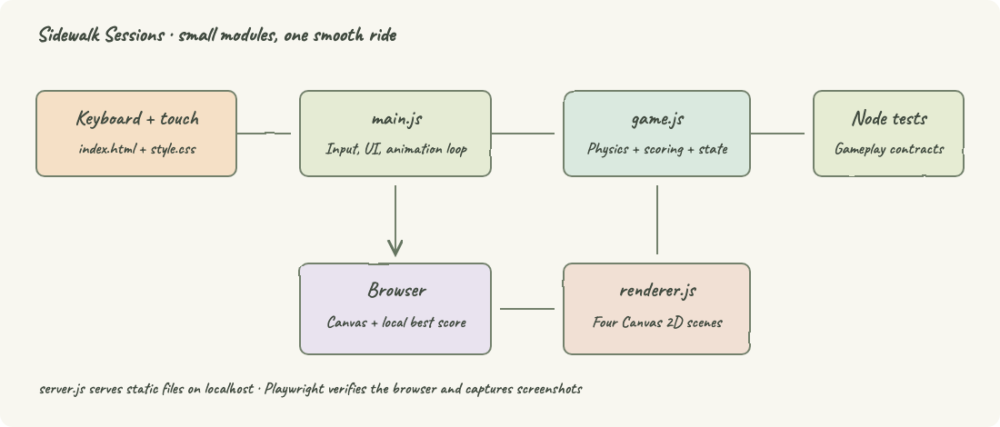
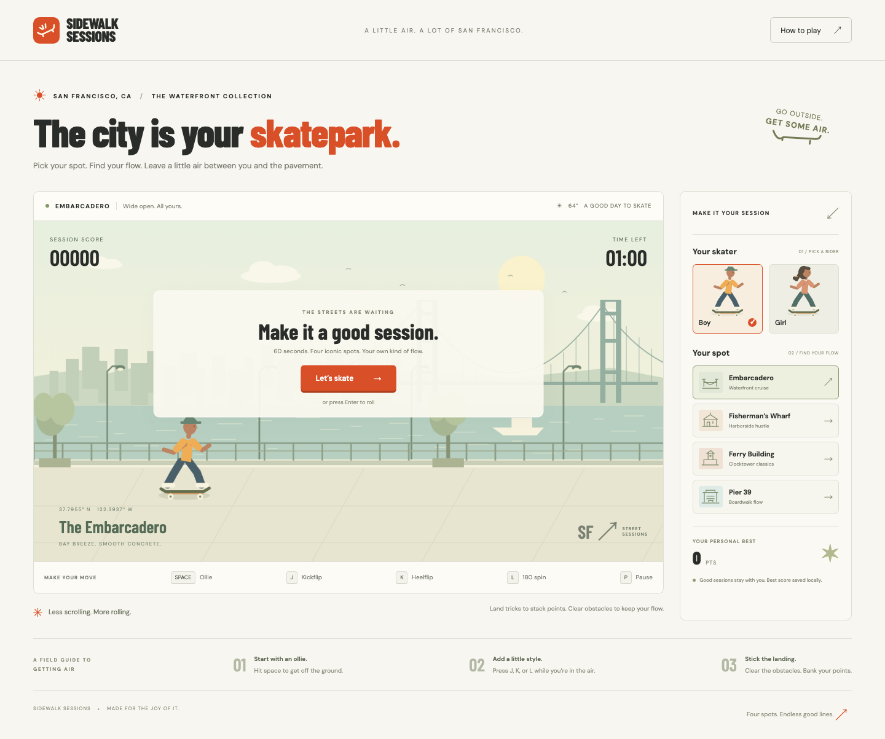
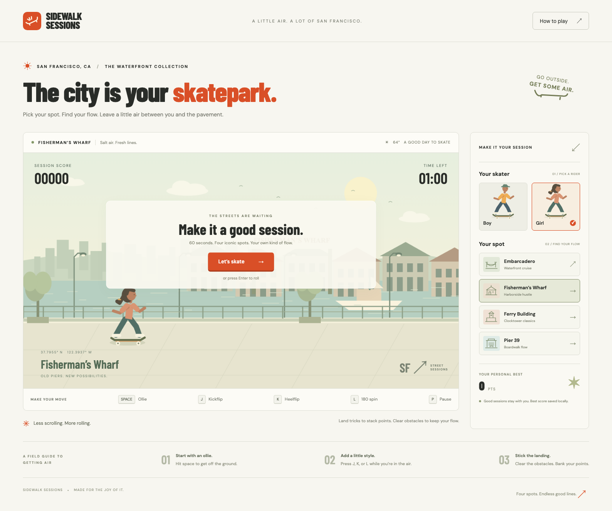
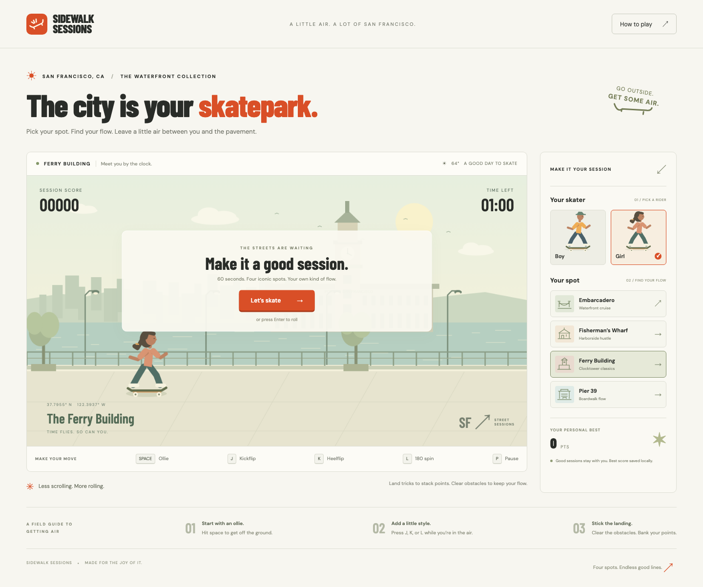
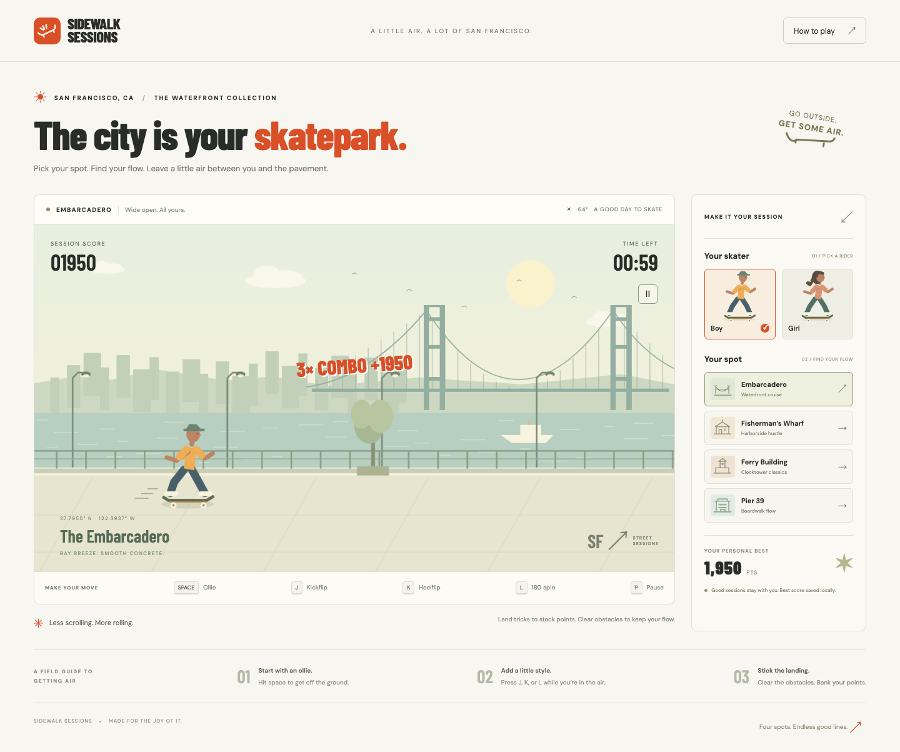
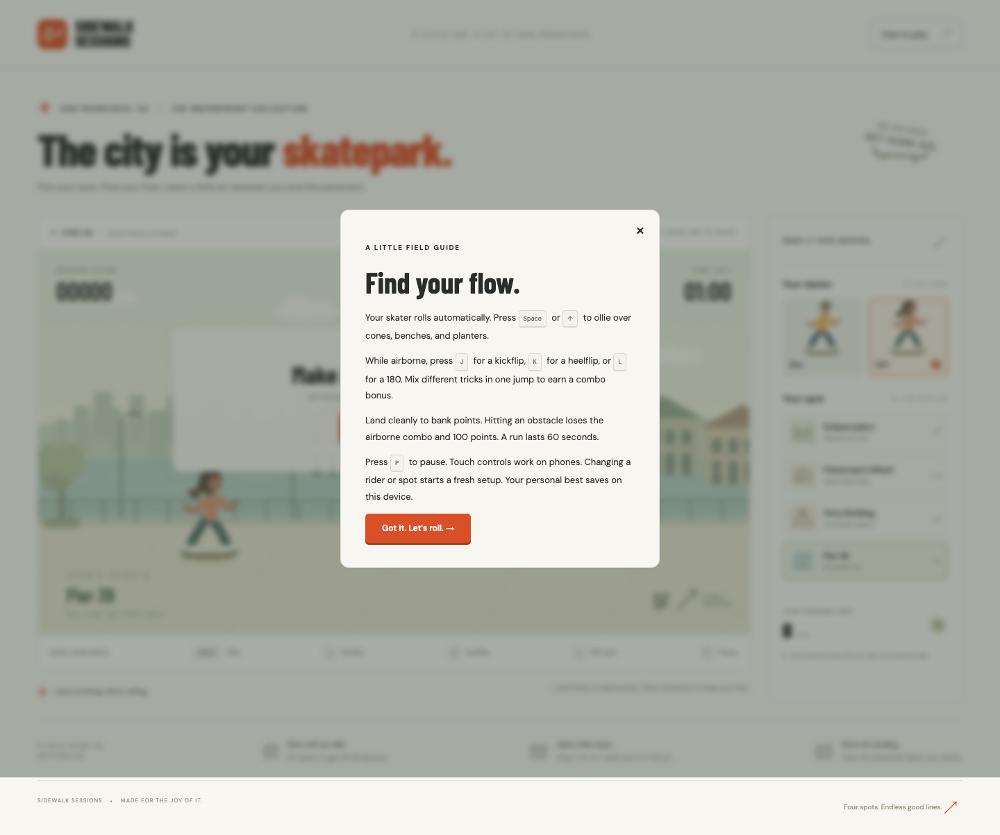
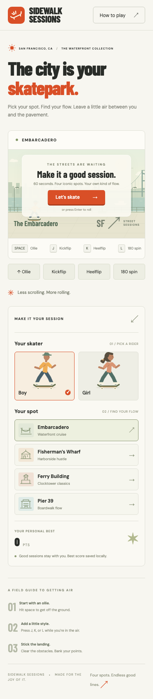

# Sidewalk Sessions

A light-themed San Francisco skate game built with HTML, CSS, and modular JavaScript. Choose a boy or girl, ride the Embarcadero, Fisherman’s Wharf, Ferry Building, or Pier 39, and land tricks during a 60-second session.

## How it Works?

Your skater rolls automatically through an illustrated waterfront scene.
Press Space or Arrow Up to jump; use J, K, and L in the air for kickflips, heelflips, and 180 spins.
Combine distinct tricks during one jump, then land to bank the combo.
Clear cones, benches, and planters for extra points; collisions cost 100 points and cancel the airborne combo.
Press P to pause, or use the on-screen buttons on a phone.
Choose a new location or rider to reset the session. Personal best scores persist on your device.

## Architecture



The interface sends actions to a plain JavaScript game state. The animation loop advances physics and passes the state to the Canvas renderer. The static server uses Node’s built-in HTTP and filesystem modules. No backend gameplay service is needed.

## Features

- Four waterfront spots with distinct landmarks, palettes, and rolling speeds.
- Boy and girl skaters with equal abilities and distinct artwork.
- Ollies, kickflips, heelflips, 180 spins, and multi-trick combos reward timing.
- Obstacle collisions, clean landings, and a 60-second timer make each run playable.
- Keyboard and touch controls support desktop and mobile play.
- Pause, automatic pause when the tab is hidden, and restart preserve control over the session.
- Local personal best scores survive page reloads when browser storage is available.

## Stack

- HTML: semantic page structure, native buttons, and an accessible instructions dialog.
- CSS: responsive light theme, editorial typography, and mobile controls.
- JavaScript ES modules: separate game rules, rendering, and UI without a runtime framework.
- Canvas 2D: original procedural scenery and animated skaters without downloaded game assets.
- Node.js: static serving and game-logic tests using built-in modules.
- Playwright: browser interaction tests and screenshots; the only development dependency.
- Google Fonts: Barlow Condensed, DM Sans, and Caveat, with local fallback fonts when offline.

## Contracts/APIs

The server exposes static files through HTTP GET at `http://localhost:3000`. `/` returns `index.html`; `/js/`, `/assets/`, and `/style.css` return application files. Missing files return 404. There is no REST gameplay API and no account system.

| Module contract | Purpose |
| --- | --- |
| `createGame(spot, rider, random)` | Creates a ready session; injectable randomness supports deterministic tests. |
| `startGame(game)` | Starts a ready session. |
| `jump(game)` | Starts an ollie only when playing and grounded. |
| `performTrick(game, trick)` | Adds a distinct airborne trick to the current combo. |
| `togglePause(game)` | Toggles playing and paused states. |
| `updateGame(game, delta)` | Advances seconds, physics, obstacles, collisions, and scoring. |
| `drawScene(ctx, game, elapsed)` | Renders the selected waterfront and skater. |
| `localStorage['sidewalk-best']` | Stores the highest banked score as a numeric string. |

## Key data structures and design decisions

`spots` is a four-entry configuration array containing identity, display text, icon paths, and movement speed. A session is one plain object holding status, timer, score, jump position and velocity, current tricks, and obstacles. Each obstacle stores its position, dimensions, kind, and whether it has already been resolved.

Rules live independently of the browser, so tests can verify scoring and collisions without rendering. Each animation step is capped at 50 milliseconds to avoid physics tunneling after a delayed frame. Switching spots or riders creates a fresh session. Storage failures leave gameplay usable. The modular-file requirement takes precedence over a single-file website layout.

An ollie is worth 50 points; kickflip, heelflip, and spin add 150, 200, and 250 points. The total is multiplied by the number of distinct tricks, with a minimum multiplier of one. Clearing an obstacle adds 75 points. A collision removes 100 points, with a zero-point floor, and clears the airborne combo.

## Run the app

Requires Node.js 20 or newer, npm, Bash, and curl. No dependency installation is needed to build or play.

```sh
./start-all.sh
./status.sh
./stop-all.sh
```

`start-all.sh` builds the static files into `dist/`, starts the server in the background, and waits for HTTP readiness. Open [Sidewalk Sessions](http://localhost:3000). Logs and the managed server PID are stored in `.runtime/`. Repeated starts and stops are safe; stop only targets the server recorded for this project.

| Script | Purpose |
| --- | --- |
| `./setup.sh` | Install locked development dependencies and Playwright Chromium. |
| `./build.sh` | Check JavaScript syntax and copy application files into `dist/`. |
| `./start-all.sh` | Build and start the server in the background. |
| `./stop-all.sh` | Stop the managed server. |
| `./restart-all.sh` | Stop, rebuild, and start the server. |
| `./status.sh` | Show server status; exit with status 1 when stopped. |
| `./test.sh` | Run unit tests and browser tests against a fresh build. |

The same commands are available through `npm run setup`, `npm run build`, `npm run start-all`, `npm run stop-all`, `npm run restart-all`, `npm run status`, and `npm run test:all`. Scripts work from any working directory. Use `PORT=3001 ./start-all.sh` to select another port; supply the same setting when restarting.

For foreground development against the source files:

```sh
npm start
```

Open [Sidewalk Sessions](http://localhost:3000). To use another port:

```sh
PORT=3001 npm start
```

## Run tests

```sh
npm test
./setup.sh
./test.sh
```

`npm test` runs unit tests only. `./test.sh` runs both suites; `npm run test:browser` runs browser tests only. Playwright builds the app and manages a separate server on port 3100, which must be free. It stops that server when testing ends. Browser tests cover all four locations, character selection, instructions, trick scoring, pause, best-score persistence, a complete run, restart, and mobile touch controls. Screenshots are written to `printscreens/`.

## UI screenshots

### Embarcadero

The initial session screen has the Bay Bridge, boy/girl selection, all four spots, keyboard hints, and personal best.



### Fisherman’s Wharf

The girl skater is selected beside the harborside buildings and fishing boat.



### Ferry Building

The clocktower scene uses the same controls and a different rolling speed.



### Pier 39

The boardwalk location includes the pier entrance and sea lions.


### Active session

A landed three-trick combo banks 1,950 points while the session timer runs.



### Instructions

The native dialog explains jumps, tricks, scoring, and pause controls.



### Mobile

The narrow layout stacks the session controls and exposes large touch buttons.



## Original prompt and model

Model: GPT-6 Astra, high reasoning, through Codex.

Original prompt:

> run a light themed skate game in embargadero, fishermanwhaft, ferrynbuilding, pier 39 of sf, make the game work on html with css and js, make the game modular and code well eight, malke the player jump and do tricks, allow choose boy or girl, use my readme skill, add this prompt and the model there.

README follows `/Users/diegopacheco/.claude/skills/readme-skill/SKILL.md`. Screenshots are captured through `npx playwright`, following the project’s browser-use instruction.

## Verification

- `./setup.sh`: locked dependency installation and Chromium setup succeeded.
- `./build.sh`: JavaScript syntax checks and static build succeeded.
- Lifecycle checks passed for HTTP readiness, a custom port, repeated starts/stops, restart, stale PID recovery, and preserving unrelated processes.
- `npm test`: 7 passed, 0 failed, 0 skipped.
- `npx playwright test`: 4 passed, 0 failed, 0 skipped.
- Browser coverage includes all locations, both riders, keyboard and touch tricks, score persistence, pause/resume, session completion, restart, instructions, and mobile overflow.
- Captured screenshots are visually reviewed and embedded above.
