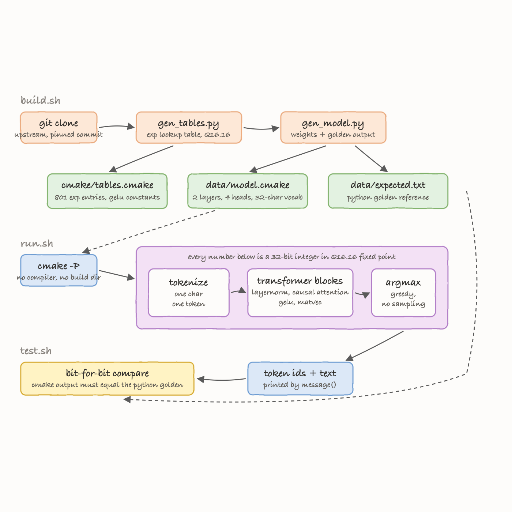

# gpt2-fun-poc

A POC that runs GPT-2 inference inside the CMake language itself, on top of
[AlpinDale/gpt2.cmake](https://github.com/AlpinDale/gpt2.cmake).

No compiler runs. No build directory is created. `cmake -P` interprets a script
that does layernorm, causal self-attention, GELU and matrix-vector products
using nothing but `math(EXPR)`, `list()` and `string()`.

## How it Works

CMake has no floating point, so every weight and activation is a 32-bit integer
in Q16.16 fixed point: the value `x` is stored as `round(x * 65536)`.
Multiplication is `(a * b + 32768) >> 16`, evaluated in CMake's 64-bit integer
expression parser so the intermediate product does not overflow.

`exp` has no closed form here either, so `gen_tables.py` precomputes an 801-entry
lookup table of `exp(-t)` in Q16.16 and softmax and GELU interpolate into it.
The weights are emitted the same way: `gen_model.py` writes each matrix row as a
`set()` of a CMake string, then a matvec is a single `math(EXPR)` over that row.

The interesting part is verification. `gen_model.py` also contains a Python
reference that replicates the CMake kernels exactly, including truncating
division, floor sqrt, saturating adds and the same lookup table. Its output is
the golden file, and `test.sh` asserts the CMake run reproduces it bit-for-bit.
If the two disagree, one of the two implementations is wrong.

## Architecture



`build.sh` clones upstream at a pinned commit and runs the two generators.
`run.sh` feeds a prompt to `cmake -P`. `test.sh` diffs the result against the
Python golden reference. `run-full.sh` swaps the toy weights for the real
124M checkpoint through the same kernels.

## Features

- **Inference with no compiler.** The whole forward pass is CMake script, so the
  only dependency at run time is the `cmake` binary already on the machine.
- **Bit-exact golden test.** The CMake output is compared against an independent
  Python reference, not against itself, so a broken kernel cannot pass.
- **Platform assumptions are asserted, not assumed.** `test.sh` probes that this
  CMake really has 64-bit ints, arithmetic right shift and truncating division
  before trusting any Q16.16 result.
- **Pinned upstream.** `build.sh` checks out one commit, so a change upstream
  cannot silently change the golden output.
- **Guarded input.** `run.sh` rejects out-of-vocabulary characters and prompts
  that overflow the context window instead of letting CMake fail mid-matvec.
- **No checked-in weights.** Everything under `vendor/` is generated, so the POC
  stays a few kilobytes of scripts.
- **The real 124M checkpoint runs too.** `run-full.sh` swaps in pretrained GPT-2
  weights and the BPE tokenizer, and the same integer kernels produce English.

## Stack

- **CMake 4.2** — the runtime; `cmake -P` is the inference engine.
- **Python 3 (stdlib only)** — weight quantization and the reference forward
  pass; no numpy, no torch.
- **Bash** — build, run and test entry points.
- **git** — pins the upstream project instead of vendoring a copy.

## CLI

```sh
./build.sh                  # clone upstream at the pinned commit, generate tables + weights
./run.sh [prompt] [n]       # toy model: n tokens from prompt (defaults: "hi", 6)
./test.sh                   # 10 assertions, exits non-zero on any failure
./run-full.sh [prompt] [n]  # real 124M GPT-2, downloads and converts on first use
```

`run.sh` takes lowercase letters, space and `. , ' ! ?` only, and requires
`len(prompt) + n <= 16`. `run-full.sh` has the real BPE tokenizer and a
1024-token context, but needs 3 GB of disk and a few minutes per invocation.

## Key Data Structures and Design Decisions

**Q16.16 in a 64-bit expression parser.** Values are `int32`, but CMake's
`math(EXPR)` evaluates in `int64`. A Q16.16 product needs 64 bits before the
shift, which is exactly the headroom available, so `mul` is a single expression
with no manual splitting.

**Matrix rows as CMake expression strings.** A weight row is emitted as
`"${X0} * 1234 + ${X1} * -567 + ..."`. Setting `X0..Xn` and expanding the string
turns a dot product into one `math(EXPR)` call instead of a loop, which is what
makes this fast enough to finish.

**Lookup table instead of a series.** `exp` is a 801-entry Q16.16 table over
`t in [0, 50]` with linear interpolation. A Taylor series would need division
and would drift away from the Python reference; a table is reproducible on both
sides by construction.

**Pin, do not vendor.** Upstream is BSD-3 and evolving. Cloning a fixed commit
into a gitignored `vendor/` keeps this repo small and keeps the golden output
stable, while making it obvious which upstream revision was tested.

**Toy model as the default target.** The upstream toy config (2 layers, 4 heads,
16 embedding dims, 32-character vocabulary, random seeded weights) exercises
every kernel the 124M model uses, but runs in under a second, so `test.sh` is a
real test rather than a multi-minute job. The same kernels then run the real
checkpoint unchanged, see [Full GPT-2](#full-gpt-2-124m).

## How to Run

```sh
./build.sh
./run.sh "hi" 6
```

```
prompt   hi
tokens   6
context  2/16 used by the prompt
engine   cmake -P, Q16.16 integer math, no compiler involved

ids:  8;9;13;13;13;13;13;13
text: himmmmmm
```

The text is gibberish on purpose: the toy weights are random, seeded numbers, so
what is being demonstrated is the arithmetic, not the language modelling. Greedy
decoding over untrained weights settles on one repeated token. For output that
means something, use `run-full.sh`.

## How to Run the Tests

```sh
./test.sh
```

```
=== CMake integer semantics the Q16.16 kernels rely on ===
PASS  64-bit signed integers
PASS  right shift is arithmetic, not logical
PASS  division truncates toward zero
PASS  bitwise and is supported

=== forward pass matches the Python reference bit-for-bit ===
PASS  token ids match golden
PASS  decoded text matches golden

=== greedy decoding is deterministic ===
PASS  two runs of the same prompt agree

=== generation length is prompt plus N ===
PASS  7 prompt chars plus 5 generated

=== run.sh rejects input the toy model cannot represent ===
PASS  characters outside the 32-char vocab are refused
PASS  overflowing the context window is refused

passed 10, failed 0
```

## Full GPT-2 (124M)

`run-full.sh` runs the actual pretrained checkpoint, and it produces real
English. Greedy decoding from `"Hello"` gives `","`, which is what GPT-2 does:

```
prompt   Hello
tokens   1
weights  2.4G of CMake source, 124M parameters
engine   cmake -P, Q16.16 integer math, no compiler involved

generated token 1/1 (id 11)
ids:  15496;11
text: Hello,
```

Measured on an M-series Mac, cold start:

| step | measured |
| --- | --- |
| download `model.safetensors` | 548 MB, ~50 s |
| `gen_full.py` quantize and emit | ~50 s, writes 2.4 GB of CMake source |
| `cmake -P` parse plus one token | ~110-150 s, 5.4 GB resident |
| **end to end** | **3 m 31 s** |

The download and the conversion are cached, so later runs pay only the parse and
the token, and the parse dominates. This path is deliberately not part of
`test.sh`, which stays under a second. Reclaim the disk with:

```sh
rm -rf vendor/gpt2.cmake/checkpoint vendor/gpt2.cmake/data/gpt2_full.cmake
```

## Notes

There is no UI, so there are no screenshots. Everything is stdout.

Upstream is BSD 3-Clause; see `vendor/gpt2.cmake/LICENSE` after building.
