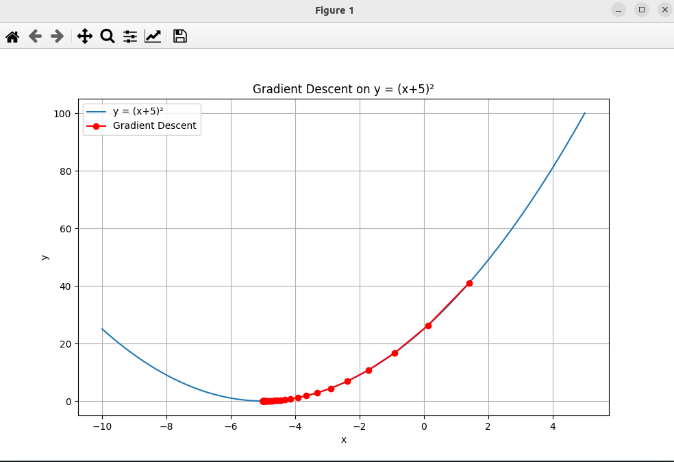

### Result
* Gradient Descent
* Gradient descent is an optimization algorithm used to minimize some function by iteratively moving in the direction of steepest descent as defined by the negative of the gradient.
* Gradient descent is used in:
  * Linear Regression
  * Logistic Regression
  * Neural Networks
  * Support Vector Machines
  * Deep Learning Models (CNN)
  * Boosting Algorithms

