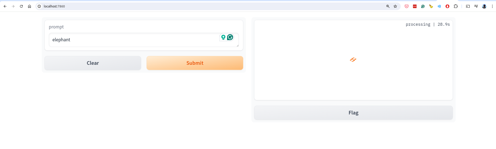
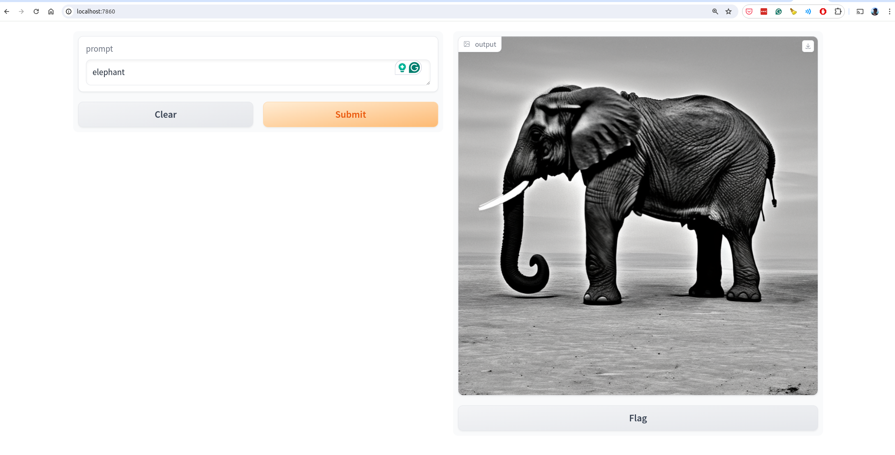

### Result
* Uses LLM model Stable Difussion 2 - pretrained model.
* Generates UI with gradio
* User types a prompt and the model generates a image based on the prompt.

Application UI:


Result:


```
Loading pipeline components...: 100%|████████████████████████████████████████████████████████████████████████████████████████████████████| 6/6 [00:01<00:00,  5.52it/s]
Running on local URL:  http://127.0.0.1:7860

To create a public link, set `share=True` in `launch()`.
/home/diego/.local/lib/python3.10/site-packages/matplotlib/projections/__init__.py:63: UserWarning: Unable to import Axes3D. This may be due to multiple versions of Matplotlib being installed (e.g. as a system package and as a pip package). As a result, the 3D projection is not available.
  warnings.warn("Unable to import Axes3D. This may be due to multiple versions of "
100%|████████████████████████████████████████████████████████████████████████████████████████████████████████████████████████████████| 50/50 [1:00:15<00:00, 72.30s/it]
```


