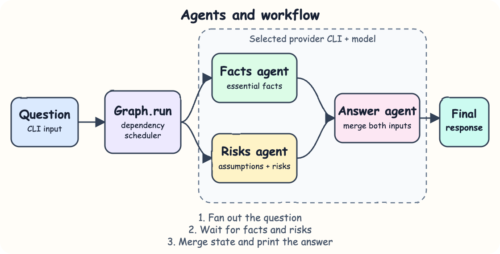

# Graph Engineering in Python

A small, dependency-free Python 3.14.6 proof of concept that coordinates multiple LLM calls as a directed graph.

## What is graph engineering?

Graph engineering models an AI workflow as nodes connected by directed edges. Each node performs one focused task, while each edge controls which outputs become inputs to later tasks. This makes branching, dependencies, shared state, and execution order explicit instead of hiding them inside one large prompt.

## What this PoC does

The input question fans out into two LLM calls:

- `facts` identifies the essential facts.
- `risks` identifies assumptions and risks.

Both outputs flow into `answer`, which makes a third LLM call and returns the final response. The LLM is invoked through the same shell-free CLI argument-array pattern used by the referenced agent SDK.

## Architecture



The question enters `Graph.run`, which schedules nodes only when their dependencies are complete. It sends the original question to the `facts` and `risks` agents through the selected provider CLI. Their outputs become state for the `answer` agent, which creates the final response. The graph expresses a fan-out, but the current runner invokes ready agents sequentially.

## Stack

- Python 3.14.6 — provides data classes, process execution, and the CLI with no third-party packages.
- unittest — verifies graph ordering, state flow, cycle handling, and provider commands.
- Local LLM CLIs — keeps authentication and provider configuration outside this project.

## Contracts/APIs

`Agent.call(model, prompt, args=None) -> str` invokes the selected local CLI and returns its text output.

`Graph.run(question) -> dict[str, str]` executes every node after its dependencies complete and returns outputs keyed by node name.

`build_graph(llm) -> Graph` creates the facts-and-risks workflow.

Supported providers are `claude`, `codex`, `agy`, and `ollama`.

## Key data structures and design decisions

`Node` is an immutable data class containing a name and instruction. `Graph` stores nodes, directed edges, and one callable LLM boundary. A node runs only after all of its incoming dependencies have produced output. Invalid edges, duplicate names, empty questions, failed CLI calls, and cycles raise errors immediately.

The graph runner is intentionally sequential. The graph expresses dependency structure without adding concurrency or a framework.

## How to run the app/tests

Install Python 3.14.6 and authenticate at least one supported local CLI. The `.python-version` file pins the runtime and `run.sh` verifies the exact patch version.

Check the runtime:

```bash
python3.14 --version
```

Run with Ollama:

```bash
./run.sh "Should we use graph engineering for an AI workflow?" --provider ollama --model llama3.2
```

Run with Codex:

```bash
./run.sh "Should we use graph engineering for an AI workflow?" --provider codex --model gpt-5.6-sol
```

Run all tests:

```python
python3.14 -m unittest -v
```
```
test_invalid_provider_fails_loudly (test_graph.AgentTest.test_invalid_provider_fails_loudly) ... ok
test_provider_commands_are_argument_arrays (test_graph.AgentTest.test_provider_commands_are_argument_arrays) ... ok
test_success_excludes_provider_diagnostics (test_graph.AgentTest.test_success_excludes_provider_diagnostics) ... ok
test_cycle_prevents_partial_execution (test_graph.GraphTest.test_cycle_prevents_partial_execution) ... ok
test_fan_out_results_feed_the_final_node (test_graph.GraphTest.test_fan_out_results_feed_the_final_node) ... ok

----------------------------------------------------------------------
Ran 5 tests in 0.001s

OK
```

## How It Works?

The CLI creates the selected provider adapter.
It injects the adapter call into the graph.
The graph finds nodes whose incoming dependencies are complete.
`facts` and `risks` each receive the original question.
Their results are added to the `answer` prompt.
The final node response is printed.
A nonzero provider exit or invalid graph stops execution with a clear error.
