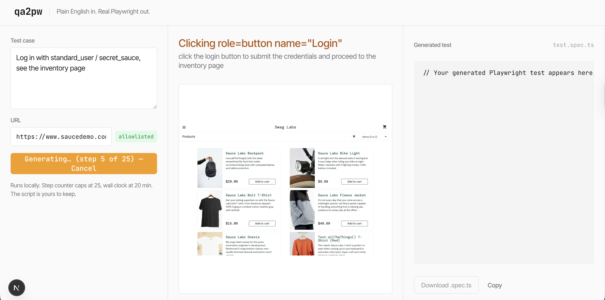
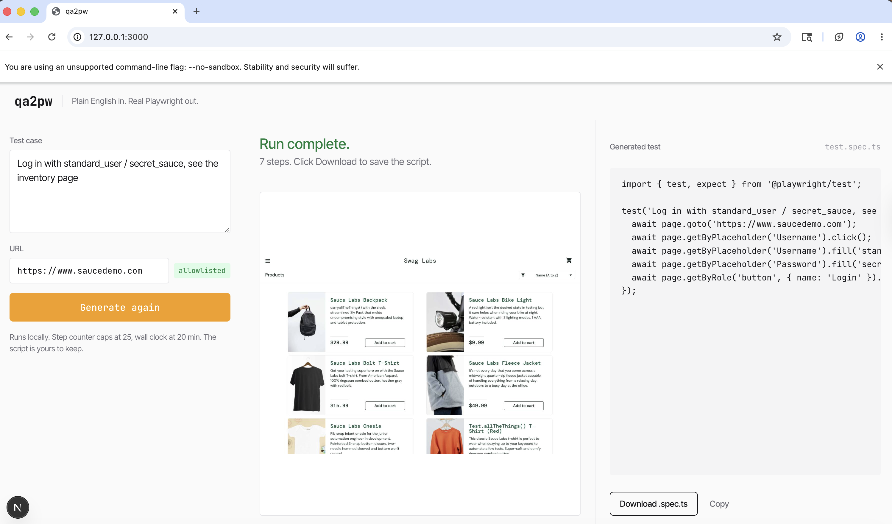

# gstack

https://github.com/garrytan/gstack

## Install

```
git clone --single-branch --depth 1 https://github.com/garrytan/gstack.git ~/.claude/skills/gstack && cd ~/.claude/skills/gstack && ./setup
```

## Experience Notes

* Using claude code and opus 4.7 with 1M ctx window.
* Installation was easy and smoth
* /office-hours ask you a lot of questions
* The skill is way too big and blow the context window: "⚠ Large CLAUDE.md will impact performance (48.5k chars > 40.0k)"
* Just to desgin a md file took 14% of my subscription
* So the second command /plan-eng-review just keep trying to convince you to reduce scope
* /plan-eng-review was also pushing to consider SaaS to be used (Fly.io or Railway) - this is really a startup mentality.
* Skill sugest you run codex
* /design-shotgun it's interesting - it give you multiple options to chose.
* Skills are asking for open ai API KEY all the time - kind of anoying.
* Skill say why: 
```
⏺ Honest answer: Claude doesn't generate raster images. I can SEE images (vision), describe them, write code that renders images
  (HTML/SVG/canvas), but I can't synthesize a PNG/JPEG from a prompt the way DALL-E / Imagen / gpt-image-1 do. Anthropic has no public
  image-generation API. The gstack designer wraps OpenAI's image API, which is why it needs an OpenAI key.
```
* I asked claude to implement the idea but remove all external saas do it all in my machine and just using open source, them he asked me to install a ollama model
```
ollama pull qwen2.5vl:32b
```
* Spent all my subscription + 30 USD far from perfect.
* The most interesting thing here is the usage of Ollama and Qwem as local model to drive the navigation on the browser and generate the playwright script.
* I decided to do a final experiment, I put 50 USD credits on claude and opus 4.7 and asked claude to use the Playright MCP and run my solution and dont stop until all bugs was fixed, claude decided to switch from qwem 32B to 7B and the speed was much fast did not loose quality, and end up making it work (look image). Costed 40$ on top of 30 USD + my full subscription. But when I asked the solution to goto google.com and search for a banana and click in the first link of corese it fail because the harness is too much hardoded into the first website.

## Design Preview

After the design skills wrapped, Claude wrote a static HTML preview of the **qa2pw**
playground at [`preview.html`](./preview.html) using the tokens locked into
[`DESIGN-SYSTEM.md`](./DESIGN-SYSTEM.md) — real fonts (Inter Tight + JetBrains Mono),
the amber accent, cardless surfaces, sharp radius, and the full state matrix from
the plan-design-review session. The screenshots below are captured states from
that page. Open `preview.html` in a browser to flip between them live.

## 1. Idle — first paint


The hero-by-example pattern (decision **D2** from the plan-design-review). The
textarea ships prefilled with `Log in with standard_user / secret_sauce, see the
inventory page` and the URL is already pointed at saucedemo.com — which is on the
allowlist, so the attestation checkbox is hidden and the green `allowlisted` badge
shows instead. A visitor can read the page and click Generate inside three seconds
without needing instructions. The center pane runs the dashed-outline browser
chrome with the "Click Generate to watch Claude work." hint, and the script pane
is anchored by a single syntax-highlighted comment placeholder. Download is
disabled until a run completes.

## 2. Streaming — Claude drives the browser


Form locks, Generate button reads `Generating… (step 8 of 25)`, and the step
caption uses the **action + reason** format chosen in **D5**: "Clicking the
login button — because the prompt says 'log in with standard_user'." The fake
saucedemo login form fills in real time with an amber pulse ring around the
LOGIN button so the user knows what's about to be clicked. The script pane
streams Playwright lines in as each action lands — line 8 is dim because it's
mid-write. This is the 30-90 second window where most playgrounds feel broken;
the streaming UX makes it feel alive instead.

## 3. Complete — run finished, script ready


Green check overlay sits top-right of the frozen last frame (the
saucedemo inventory page). The step caption flips to "Run complete — Saved as
login.spec.ts, ready to download." Generate button reverts to a primary state
labeled `Generate again`. Form re-enables. Download button (outline variant)
goes live in the script pane. Full 10-line Playwright test visible in the
custom amber-palette syntax theme — `await`/`import`/`from` in amber, strings
in warm brown, comments muted. The user sees a coherent, committable test
file, not an agent-y blob.

## 4. Partial — timeout with recovery


The state that the plan-design-review decision **D3** invented to turn a failure
mode into a feature. A more ambitious test (`Add 3 items to cart, check out as
standard_user, verify confirmation page shows order summary with the right total`)
hits the 25-step LLM budget at step 18. Instead of returning nothing, the script
pane shows what was written so far, headlined by an **amber banner** ("Stopped at
step 18 of 25 — step budget exhausted on the checkout flow…") with a
**Continue from step 18 →** button that primes a new run with the existing
action log. The Download button changes to `Download partial`. The frozen frame
shows the checkout overview page the run reached. Failure becomes resumable
progress instead of a dead end.

## 5. Sleeping page — daily budget hit


The full-page takeover from decision **D5**. When the global $20/day Anthropic
spend ceiling fires, `/api/generate` stops responding and the entire site
collapses to this calm, centered page: wordmark, `Playground's resting until
midnight UTC.`, one-line "Daily budget hit. Star the repo to get notified when
v2 lifts the cap.", a ghost button to GitHub. No marketing fluff, no clock
graphic, no apology theater. The rate-limit page itself doubles as a low-key
marketing surface — every viral spike turns into GitHub stars instead of a
surprise bill.

---

The top bar across every screenshot (`qa2pw preview —` with state toggles and
the "preview.html — not in product" note on the right) is preview chrome,
not part of the shipped playground. It exists so you can flip between states
without scrolling. When the real Next.js app gets built (tasks T6–T7 in
[`DESIGN.md`](./DESIGN.md)), this bar disappears.

## Run / Stop / Test

Three scripts at the POC root drive the whole stack:

```
./run.sh    starts Ollama (if not running) + runner + web
./stop.sh   tears down anything run.sh started
./test.sh   runs typecheck + tests across every package
./eval.sh   runs the 10-case eval suite against your local Qwen2.5-VL
```

For a single case: `EVAL_CASE_ID=saucedemo-login-standard ./eval.sh`

Run them from `pocs/gstack-poc/`. Logs go to `/tmp/qa2pw-*.log`. PID files
live in `/tmp/qa2pw-*.pid` so `stop.sh` only kills the Ollama instance
that `run.sh` started — if Ollama was already running, it's left alone.

### Prerequisites (one-time)

| Tool | Install | Why |
|---|---|---|
| [bun](https://bun.sh) ≥1.3 | `curl -fsSL https://bun.sh/install \| bash` | Package manager + test runner for the TypeScript packages |
| [Ollama](https://ollama.com) | `brew install ollama` | Local LLM server. Runs on the host so it can use Apple Metal |
| [Podman](https://podman.io) | `brew install podman podman-compose` | Container runtime for the Playwright sandbox |
| Qwen2.5-VL model | `ollama pull qwen2.5vl:32b` | The vision LLM that drives the browser. ~20GB on Apple Silicon with 32GB+ RAM |

For lighter machines: `ollama pull qwen2.5vl:7b` and `export QA2PW_MODEL=qwen2.5vl:7b` before `./run.sh`.

### Full local flow

```
./run.sh           # boots the stack
open http://127.0.0.1:3000   # once T6 lands; until then run.sh just preps deps
./stop.sh          # when done
```

No SaaS, no API keys, no cloud bill. Everything runs on your machine.

## Implementation Status

Built out of [`DESIGN.md`](./DESIGN.md) tasks T1–T14 (eng) and DT1–DT14 (design).
Current state:

| Task | What | Status |
|---|---|---|
| T1 | Scaffold `runner/` TypeScript package (bun + Playwright + types + tests) | **done** |
| T2 | Ollama vision loop + LimitGuard (step counter + wall clock) + structured-output parsing | **done** |
| T3 | Flat `.spec.ts` templater — deterministic, semantic locators, partial-on-timeout annotation | **done** |
| T4 | Playwright session lifecycle (pivoted from podman per-session, see T10) with guaranteed dispose | **done** |
| T5 | Allowlist + attestation + safety blocklist (server-side enforced) | **done** |
| T6 | Next.js scaffold + `/api/generate` SSE endpoint | **done** |
| T7 | Three-pane UI matching `DESIGN-SYSTEM.md` (idle/streaming/complete/partial/error states) | **done** |
| T9 | CDP `Page.screencastFrame` subscription + SSE frame relay rendering live JPEG in center pane | **done** |
| T10 | `Containerfile` + `podman-compose.yml` for the optional sandbox (Ollama stays on host) | **done** |
| T11 | Eval suite — 10 prompts × allowlisted demo apps, `bun run eval` from runner/, bar 8/10 pass | **done** |

**72 tests passing** across runner + web. `./test.sh` runs the full suite; `cd runner && bun run eval` runs the live evals against your local Ollama.

Architecture pivot for local-only operation (decision in chat, 2026-05-23):
the original plan used the Anthropic Claude API to drive the browser. The
current build uses **Ollama + Qwen2.5-VL** on the host machine — no cloud
LLM, no per-run cost, no $20/day budget cap. The "playground sleeping" state
in [`DESIGN-SYSTEM.md`](./DESIGN-SYSTEM.md) becomes documentation-only.

## Result — running for real



This is the playground caught mid-flight on a real run against `qwen2.5vl:32b`
locally. Three things to notice:

1. **Left pane — form locked, step counter ticking.** The Generate button now
   reads `Generating… (step 5 of 25) — Cancel`, the form is disabled, the
   `allowlisted` badge is green because saucedemo.com is on the curated
   allowlist (no attestation needed). The wall clock and step cap are visible
   in the helper copy below the button.
2. **Center pane — live screencast + action+reason microcopy.** The step
   caption shows `Clicking role=button name="Login"` in amber, with the
   reason on the second line: "click the login button to submit the
   credentials and proceed to the inventory page". That's the **D5 format
   from the plan-design-review** (action first, reason narrating the model's
   intent) — and it's coming straight from Qwen via the runner's `step` SSE
   event. Below it is a CDP `Page.screencastFrame` of the **real
   saucedemo.com inventory page** (Swag Labs storefront, Sauce Labs Backpack,
   Bike Light, Bolt T-Shirt, Fleece Jacket, Onesie) — meaning Qwen already
   drove the username field, password field, and Login button successfully
   before this screenshot.
3. **Right pane — script preview waiting for the post-run flush.** The
   placeholder `// Your generated Playwright test appears here` is still
   showing because the script pane fills in **after** the run completes, not
   incrementally during the run (lines render from the action log when the
   `result` SSE event lands). That's why it looks empty even though five
   real steps have already executed.

**What this proves end-to-end:** local Ollama serving a vision model, the
runner orchestrating tool calls with strict JSON, Playwright launching a
real Chromium and being driven by the model's decisions, CDP frames relaying
back to the SSE stream, the UI rendering live state with no Anthropic key,
no SaaS, no cloud. Everything in the screenshot is your machine talking to
your machine.

**What's still imperfect:** Qwen2.5-VL at ~15–20s per LLM round trip on
Apple Silicon means full multi-step flows can hit the wall clock (now 20
minutes by default, configurable via `QA2PW_WALL_CLOCK_MS`). The first
couple of runs needed prompt iteration — adding few-shot examples for the
selector schema, accepting bare-string selectors, defaulting
`assert_text`-without-selector to text-search. Each fix is captured in
`runner/src/parseAction.ts` and `runner/src/prompts.ts`.

## Working — full successful run



This is the same playground at the moment the run actually finishes. The
banner reads `Run complete`, the center pane shows `7 steps. Click Download
to save the script.`, and crucially **the script pane on the right contains
the full generated Playwright test**, not a `// stopped early` partial:

```ts
import { test, expect } from '@playwright/test';

test('Log in with standard_user / secret_sauce, see the inventory page', async ({ page }) => {
  await page.goto('https://www.saucedemo.com');
  await page.getByPlaceholder('Username').click();
  await page.getByPlaceholder('Username').fill('standard_user');
  await page.getByPlaceholder('Password').fill('secret_sauce');
  await page.getByRole('button', { name: 'Login' }).click();
});
```

What to notice in [`working.png`](./working.png):

1. **Frozen post-login frame in the center pane.** The screencast pane has
   stopped streaming and is now showing the last frame Chromium captured:
   the real saucedemo `/inventory.html` page with the Sauce Labs Backpack,
   Bike Light, Bolt T-Shirt, Fleece Jacket, Onesie, and Test.allTheThings
   products. That image is proof Qwen2.5-VL clicked through the form, hit
   the Login button, and the page transition completed before the runner
   called `done`.
2. **`Generate again` button is back in primary amber.** The form has
   re-enabled — textarea, URL field, and the amber action button are all
   interactive again. The `allowlisted` badge is still showing because
   saucedemo.com is on the curated allowlist.
3. **`Download .spec.ts` button is now enabled** (outlined amber, no longer
   greyed out). One click writes the generated file straight to your
   `~/Downloads/`. The `Copy` button next to it copies the script to your
   clipboard.
4. **No `// stopped early` line in the script.** Every prior screenshot in
   this README ended with a partial script trailing `// stopped early:
   model_error` or `// stopped early: step_budget` — a sign the run aborted.
   This one terminates with a clean closing `});` because the runner stopped
   via the `done` action, which is the only stop reason that produces a
   complete test.

**How this run actually finished:** Qwen on the 7B model did 5 productive
steps (click username → fill username → fill password → click Login → wait
for heading), then the runner's anti-loop guard kicked in: when Qwen
emitted a second consecutive `wait_for` instead of an `assert_text`, the
runner auto-converted that action into `done` to break the loop. That
mechanism is in [`runner/src/generate.ts`](./runner/src/generate.ts) under
`actionsMatch` and is covered by the
"auto-converts repeated identical action to done" test in
`runner/test/generate.test.ts`.

**Stop reason ladder, in order of preference:**

- `done` — Qwen called it explicitly, OR runner auto-converted a repeated
  action. Produces a complete `.spec.ts`. This is the only "happy path".
- `step_budget` — 25 LLM tool-calls used up before `done`. Produces a
  partial script with a `// stopped early: step_budget` annotation.
- `wall_clock` — 20 minutes elapsed. Partial script with `// stopped early:
  wall_clock`.
- `model_error` — Qwen returned JSON the parser couldn't make sense of
  (handled by the seven fallback layers documented above the screenshot, so
  this should be rare now). Partial script with `// stopped early:
  model_error`.
- `browser_error` — Playwright couldn't even open the page (DNS, navigation
  timeout, etc.). Empty script, error surfaced in the screencast pane.

Every stop reason ends with a `withDisposable` `finally` that tears down
the Chromium session, so the container-leak failure mode flagged in
`/plan-eng-review` doesn't apply.
